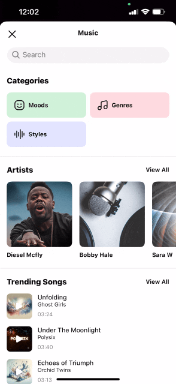

[](https://www.banuba.com/video-editor-sdk)

# Banuba AI Video Editor SDK. Integration sample for iOS.
Banuba [AI Video Editor SDK](https://www.banuba.com/video-editor-sdk) allows you to quickly integrate short video functionality into your mobile app. On this page, we will explain how to do so on iOS.

<p align="center">
&nbsp;
&nbsp;
&nbsp;
&nbsp;
</p>

- [Requirements](#Requirements)
- [Dependencies](#Dependencies)
- [SDKs size](#SDKs-size)
- [Starting a free trial](#Starting-a-free-trial)
- [Supported media formats](#Supported-media-formats)
- [Token](#Token)
- [Connecting with AR cloud](#Connecting-with-AR-cloud)
- [What can you customize?](#What-can-you-customize)
- [Configure AR cloud](#Configure-AR-cloud)
- [Getting Started](#Getting-Started)
    + [CocoaPods](#CocoaPods)
    + [Start Video Editor from ViewController](#Start-Video-Editor-from-ViewController)  
    + [Disable Face AR](#Disable-Face-AR)
    + [Configure export flow](#Configure-export-flow)
    + [Configure audio content](#Configure-audio-content)
    + [Configure screens](#Configure-screens)
    + [Configure watermark](#Configure-watermark)
    + [Configure stickers content](#Configure-stickers-content)
    + [Icons](#Icons)
    + [Localization](#Localization)
- [FAQ](#FAQ)
- [Third party libraries](#Third-party-libraries)

## Requirements
This is what you need to run the AI Video Editor SDK

- iPhone devices 6+
- Swift 5+
- Xcode 12.4+
- iOS 11.0+
Unfortunately, It isn't optimized for iPads.

## Dependencies

To use the face masks, you will also need the [Face AR SDK](https://www.banuba.com/facear-sdk/face-filters). It is optional, however, the other features will work without it. 

## SDKs size

| Options | Mb      | Note |
| -------- | --------- | ----- |
| :white_check_mark: Face AR SDK + bitcode enabled  | 42 | AR effect sizes are not included. AR effect takes 1-3 MB in average.
| :x: Face AR SDK + bitcode enabled | 19 | no AR effects  |  

You can either include the filters in the app or have users download them from the [AR cloud](https://www.banuba.com/facear-sdk/face-filters) to decrease the app size. 

## Supported media formats
| Audio      | Video      | Images      |
| ---------- | ---------  | ----------- |
|.mp3, .aac, .wav, <br>.m4a, .flac, .aiff |.mp4, .mov, .m4v| .bmp, .gif, .heic, <br>.jpeg, .jpg, .png, .tiff 

## Camera recording video quality params
To be able to use your own quality parametrs please follow this [guide](https://github.com/Banuba/ve-sdk-ios-integration-sample/blob/main/mdDocs/video_resolution_configuration.md).

| Recording speed | 360p(360 x 640) | 480p(480 x 854) | 540p(540 x 960) |  HD(720 x 1280) | FHD(1080 x 1920) |
| --------------- | --------------- | --------------- | --------------- | --------------- | ---------------- |
| 1x(Default)     | 800             | 2000            | 2000            | 4000            | 6400             |
| 0.5x            | 800             | 2000            | 2000            | 4000            | 6400             |
| 2x              | 800             | 2000            | 2000            | 4000            | 6400             |
| 3x              | 800             | 2000            | 2000            | 4000            | 6400             |  

## Export video quality params
Video Editor SDK classifies every device by its performance capabilities and uses the most suitable quality params for the exported video.

Nevertheless it is possible to customize it with `ExportVideoConfiguration`. Just put a required video quality into `ExportVideoInfo(resolution)` constructor. To be able to use your own quality parametrs please follow this [guide](https://github.com/Banuba/ve-sdk-ios-integration-sample/blob/main/mdDocs/video_resolution_configuration.md).

See the **default bitrate (kbps)** for exported video (without audio) in the table below:
| 360p(360 x 640) | 480p(480 x 854) | 540p(540 x 960) | HD(720 x 1280) | FHD(1080 x 1920) |
| --------------- | --------------- | ---------------- | -------------- | ---------------- |
|              800|             2000|              2000|            4000|              6400|

## Starting a free trial

You should start with getting a trial token. It will grant you **14 days** to freely play around with the AI Video Editor SDK and test its entire functionality the way you see fit.

There is nothing complicated about it - [contact us](https://www.banuba.com/video-editor-sdk) or send an email to sales@banuba.com and we will send it to you. We can also send you a sample app so you can see how it works “under the hood”.

## Token 
We offer а free 14-days trial for you could thoroughly test and assess Video Editor SDK functionality in your app. To get access to your trial, please, get in touch with us by [filling a form](https://www.banuba.com/video-editor-sdk) on our website. Our sales managers will send you the trial token.

Video Editor token should be put [here](https://github.com/Banuba/ve-sdk-ios-integration-sample/blob/main/Example/Example/ViewController.swift#L29).  

Also you can load token from [Firebase](https://firebase.google.com/docs/database/android/start). [Check](mdDocs/token_on_firebase.md) to configure firebase

## Connecting with AR cloud

To decrease the app size, you can connect with our servers and pull AR filters from there. The effects will be downloaded whenever a user needs them. Please check out [step-by-step guide](https://github.com/Banuba/ve-sdk-ios-integration-sample/blob/main/mdDocs/ar_cloud.md) guide to configure AR Cloud in the Video Editor SDK.

## What can you customize?

We understand that the client should have options to brand video editor to bring its own experience to the market. Therefore we provide list of options to customize:

:white_check_mark: Use your branded icons. [See details](#Configure-screens)  
:white_check_mark: Use you branded colors. [See details](#Configure-screens)  
:white_check_mark: Change text styles i.e. font, color. [See details](#Configure-screens)    
:white_check_mark: Localize and change text resources. Default locale is :us:  
:white_check_mark: Make content you want i.e. a number of video with different resolutions and durations, an audio file. [See details](#Configure-export-flow)  
:white_check_mark: Customize video recording duration behavior. [See details](https://github.com/Banuba/ve-sdk-ios-integration-sample/blob/main/mdDocs/video_duration_configuration.md)   
:white_check_mark: Settings for the camera. [See details](https://github.com/Banuba/ve-sdk-ios-integration-sample/blob/Add_description_configs_for_camera/mdDocs/config_camera.md#camera-config)   
:x: Change layout **except** [Camera and Postprocessing screens](https://github.com/Banuba/ve-sdk-ios-integration-sample/blob/main/mdDocs/faq.md#10-i-want-to-change-screens-layout)

:x: Change screen order

:exclamation: We do custom UX/UI changes as a separate contract. Please contact our sales@banuba.com.

### Disable Face AR 

Face AR SDK is optional for the video editor SDK and can be disabled. Please make the following changes in ```Podfile``` to disable it:

```diff
-  pod 'BanubaEffectPlayer', '1.0.15'
-  pod 'BanubaSDK', '1.0.15.2'
+  pod 'BanubaSDKSimple', '1.0.15.4'
```

Change 'isFaceAREnabled' to 'false' when creating an instance of BanubaVideoEditor.

Example:

```
 videoEditorSDK = BanubaVideoEditor(
   token: YourClientToken,
   effectsToken: YourEffectsToken,
   isFaceAREnabled: false, // CHANGE to 'false' here
   cloudMasksToken: YourCloudMasksToken,
   configuration: YourConfig,
   analytics: YourAnalyticsExample,
   externalViewControllerFactory: YourExternalViewControllerFactory
)
```

## Getting Started
### CocoaPods

The easiest way to integrate the Video Editor SDK in your mobile app is through [CocoaPods](https://cocoapods.org). If you haven’t used this dependency manager before, see the [Getting Started Guide](https://guides.cocoapods.org/using/getting-started.html).

Important: Make sure that you have CocoaPods version >= 1.9.0 installed. Check your CocoaPods version using this command [pod --version]

Please, refer to the example of [Podfile](https://github.com/Banuba/ve-sdk-ios-integration-sample/blob/main/Example/Podfile) lines which you need to add.

1. Make sure to have CocoaPods installed, e.g. via Homebrew:
   ```sh
   brew install cocoapods 
   ```
2. Initialize pods in your project folder (if you didn't do it before).
   ```sh
   pod init
   ```
3. Install the Video Editor SDK for the provided Xcode workspace with:
```sh
pod install
```
4. Open Example.xcworkspace with Xcode and run the project.

### Start Video Editor from ViewController

``` swift
import BanubaVideoEditorSDK

class ViewController: UIViewController {

  private var videoEditorSDK: BanubaVideoEditorSDK?

  override func viewDidLoad() {
    super.viewDidLoad()
    
    initVideoEditor()
  }

  override func viewDidAppear(_ animated: Bool) {
    super.viewDidAppear(animated)

    videoEditorSDK?.presentVideoEditor(
      from: self,
      animated: true,
      musicTrack: nil,
      completion: nil
    )
  }
  
  private func initVideoEditor() {
    let configuration = VideoEditorConfig()
    videoEditorSDK = BanubaVideoEditorSDK(
      token: "place client token here",
      effectsToken: "place effects token here",
      configuration: configuration,
      analytics: nil,
      externalViewControllerFactory: nil
    )
    videoEditorSDK?.delegate = self
  }
  ...
}

// MARK: - Handle Video Editor lifecycle
extension ViewController: BanubaVideoEditorSDKDelegate {
  func videoEditorDidCancel(_ videoEditor: BanubaVideoEditorSDK) {
    videoEditor.dismissVideoEditor(animated: true, completion: nil)
  }
  
  func videoEditorDone(_ videoEditor: BanubaVideoEditorSDK) {
    videoEditor.dismissVideoEditor(animated: true, completion: nil)
  }
}

```  

The Video Editor has several entry points. It can be launched on the camera screen and on the trimmer screen with predefined videos:

``` swift
/// Modally presents Video editor's root view controller
/// - Parameters:
///   - hostController: The view controller to display over.
///   - animated: Pass true to animate the presentation.
///   - musicTrack: Music track which will be played on camera recording.
///   - completion: The block to execute after the presentation finishes.
public func presentVideoEditor(
  from hostController: UIViewController,
  animated: Bool,
  musicTrack: MediaTrack? = nil,
  completion: (() -> Void)?
)
          
/// Modally presents Video editor's trim view controller with pre-defined videos
/// - Parameters:
///   - videoItems: An array with urls to videos located on a phone.
///   - hostController: The view controller to display over.
///   - animated: Pass true to animate the presentation.
///   - musicTrack: Music track which will be played on camera recording.
///   - completion: The block to execute after the presentation finishes.
public func presentVideoEditor(
  withVideoItems videoItems: [URL],
  from hostController: UIViewController,
  animated: Bool,
  musicTrack: MediaTrack? = nil, 
  completion: (() -> Void)?
)
```  


### Configure export flow

To export video after the editing is complete use these methods:

``` swift
/// Export video with default 1280x720 (or 1920x1080 on required devices) resolution
/// - Parameters:
///   - fileUrl: url where exported video should be stored.
///   - completion: completion: (success, error), execute on background thread.
func exportVideo(fileUrl: URL, completion: @escaping (Bool, Error?) -> Void)
  
/// Export video with default 1280x720 (or 1920x1080 on required devices) resolution and cover image
/// - Parameters:
///   - fileUrl: url where exported video should be stored.
///   - completion: completion: (success, error, image), execute on background thread.
/// Preconfigue WatermarkConfiguration in configuration file otherwise will be used default configuration. Default cover image video indent is 0.5 second.
func exportVideoWithCoverImage(fileUrl: URL, completion: @escaping (Bool, Error?, UIImage) -> Void)
  
/// Export several configurable video
/// - Parameters:
///   - configurations: contains configurations for exporting videos such as file url,
///    watermark and video quality
///   - completion: completion: (success, error), execute on the background thread.
func exportVideos(using configurations: [ExportVideoConfiguration], completion: (Bool,Error?)->Void)
  
/// Export several configurable video with cover image
/// - Parameters:
///   - configurations: contains configurations for exporting videos such as file url,
///    watermark and video quality
///   - completion: completion: (success, error, image), execute on the background thread.
func exportVideosWithCoverImage(using configurations: [ExportVideoConfiguration], completion: (_Bool, Error?, UIImage)->Void)
```  
See the sample export video flow [here](/Example/Example/ViewController.swift#L628). You can find the detailed video export features [here](export_flow.md).

### Configure audio content

Banuba Video Editor SDK can trim audio tracks, merge them, and apply them to a video. It doesn’t include music or sounds. However, it can be integrated with [Mubert](https://mubert.com/) and get music from it (requires additional contract with them). Moreover, the users can add audio files from internal memory (downloaded library) from the phone. 

Integrating audio content is simple. See this [guide](https://github.com/Banuba/ve-sdk-ios-integration-sample/blob/main/mdDocs/audio_content.md#step-1).

### Configure screens  

Each screen can be modified to your liking. You can change icons, colors, text and its font, button titles, and much more. 

Note that layouts and screen order can’t be changed. You can, however, [ask](https://www.banuba.com/video-editor-sdk#form) us to customize the mobile video editor UI as a separate contract. 

Below see the list of screens with links to their detailed description and notes on modifying them

1. [Camera screen](mdDocs/camera_styles.md)
1. [Editor screen](mdDocs/editor_styles.md)
1. [Trim screens](mdDocs/trim_styles.md)
1. [Overlay screens](mdDocs/overlayEditor_styles.md)
1. [Music editor screen](mdDocs/musicEditor_styles.md)
1. [Gallery screen](mdDocs/gallery_styles.md)
1. [Alert screens](mdDocs/alert_styles.md)
1. [Cover screen](mdDocs/cover_style.md)
1. [Hands Free screen](mdDocs/handsFree_styles.md)
1. [Audio Browser screen](mdDocs/audioBrowser.md)

The SDK allows overriding icons, colors, typefaces and many more configuration entities. Every SDK screen has its own set of styles.

### Configure watermark

You can add a branded image that would appear on videos that users export. 

To do so, create and configure the WatermarkConfiguration structure, then add it to the ExportVideoConfiguration entity. 

See this [example](/Example/Example/ViewController.swift#L629) for details.

### Configure stickers content

Stickers are interactive objects (gif images) that can be added to the video recording to add more fun for users. 

By default [**Giphy API**](https://developers.giphy.com/docs/api/) is used to load stickers. All you need is just to pass your personal Giphy Api Key into **giphyAPIKey** parameter in GifPickerConfiguration entity.

### Configure the record button
The record button is a main control on the camera screen which you can fully customize along with animations playing on tap.

First of all look at [RecordButtonConfiguration](mdDocs/record_button_configuration.md) entity which you can customize in [Camera screen configuration quide](mdDocs/camera_styles.md). If it still not suits your needs you can create your own view for more information look [here](mdDocs/record_button_provider.md)

### Configure media content

AI Video Editor SDK is provided with its own solution for media content (i.e. images and videos) selection - the gallery screen. To use it as a part of SDK just add the ```BanubaVideoEditorGallerySDK``` pod to your podfile:
```diff
target 'Example' do
  pod 'BanubaVideoEditorSDK'
  ...
+  pod 'BanubaVideoEditorGallerySDK'
}
```
The gallery provided by the SDK is fully customizable according to [this guide](mdDocs/gallery_styles.md). 

Also there is an option to use **your own implementation of the gallery**. This is available according to this [step-by-step guide](mddocs/configure_external_gallery.md). 

### Icons

Any icon in the mobile video editor SDK can be replaced. This is how:

1. Load custom images to the Assets catalog
2. Locate the screen with an icon you want to change in the [VideoEditorConfig](https://github.com/Banuba/ve-sdk-ios-integration-sample/blob/main/Example/Example/ViewController.swift#L70) entity
3. Find the specific element and override it with the resource name or use UIImage, if available.

For [example](/Example/Example/ViewController.swift#L123), this is how you change a mask icon on the camera screen.

### Localization

Any text in the mobile video editor SDK can be changed. To edit text resources, download the file with strings [here](https://github.com/Banuba/ve-sdk-ios-integration-sample/blob/main/Example/Example/en.lproj/Localizable.strings), change whatever you need, and put the new file into your app.

Don’t change the keys (values on the left), only the values on the right. Otherwise, the button names and other texts will not show.

## FAQ  
Please visit our [FAQ page](mdDocs/faq.md) to find more technical answers to your questions.

## Third party libraries
[View](https://github.com/Banuba/ve-sdk-ios-integration-sample/blob/main/mdDocs/3rd_party_licences.md) information about third party libraries.

## Migration guides

[1.0.15](mdDocs/releases/1.0.15.md)  
[1.0.16](mdDocs/releases/1.0.16.md)
