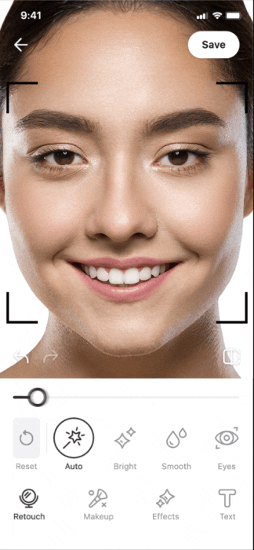
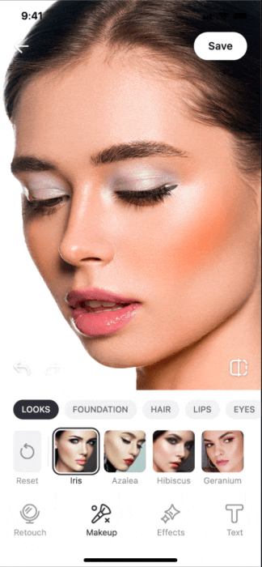
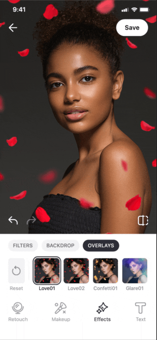
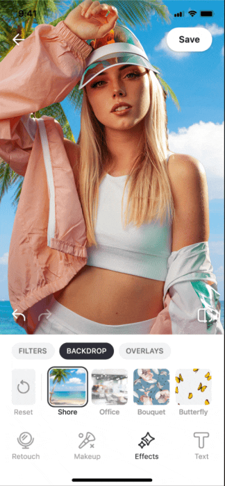
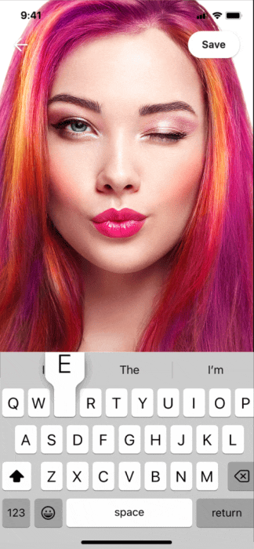

[](https://www.banuba.com/video-editor-sdk)
# Banuba Video & Photo Editor SDKs - iOS integration sample
<p align="center">
&nbsp;
&nbsp;
&nbsp;
&nbsp;
&nbsp;
</p>
<p align="center">
&nbsp;
&nbsp;
&nbsp;
&nbsp;
&nbsp;
</p>

## Overview
[Banuba Video Editor SDK](https://www.banuba.com/video-editor-sdk) allows you to quickly add short video functionality and possibly AR filters and effects into your mobile app.

[Banuba AR Photo Editor SDK](https://www.banuba.com/photo-editor-sdk) allows you to quickly add the photo editing capabilities to your app. 
## Usage
### License
Before you commit to a license, you are free to test all the features of the SDK for free. The trial period lasts 14 days. 

Send us a message to start the [Video Editor SDK trial](https://www.banuba.com/video-editor-sdk#form) | [Photo Editor SDK trial](https://www.banuba.com/photo-editor-sdk#form). We will get back to you with the trial token.

Feel free to contact us if you have any questions regarding [Video Editor SDK](https://www.banuba.com/faq/kb-tickets/new) and [Photo Editor SDK](https://www.banuba.com/support).
### Installation
1. Clone the repository
2. Install CocoaPods dependencies. Open **Example** directory ```cd Example``` and run ```pod install``` in terminal.
3. Open the project in XCode
4. Open **Signing & Capabilities** tab in Target settings and select your Development Team.
5. Add the license token [within the app](/Example/Example/AppDelegate.swift#L9)
6. Run sample application in XCode
### Quickstart Guide
Our [Quickstart Guide](https://docs.banuba.com/ve-pe-sdk/docs/ios/requirements) will help you to quickly integrate and customize **Video Editor SDK** into your iOS project.

For **Photo Editor SDK** please check out the [following document](https://docs.banuba.com/ve-pe-sdk/docs/ios/pe-requirements).
## Requirements
This is what you need to run the AI Video Editor SDK or AR Photo Editor SDK.
- iPhone devices 6s+
- Swift 5.9+
- Xcode 15.2+
- iOS 15.0+
  Unfortunately, the GUI isn't adapted for iPads.
## Supported media formats
| Audio      | Video      | Images      |
| ---------- | ---------  | ----------- |
|.mp3, .aac, .wav, <br>.m4a, .flac, .aiff |.mp4, .mov, .m4v| .bmp, .gif, .heic, <br>.jpeg, .jpg, .png, .tiff
