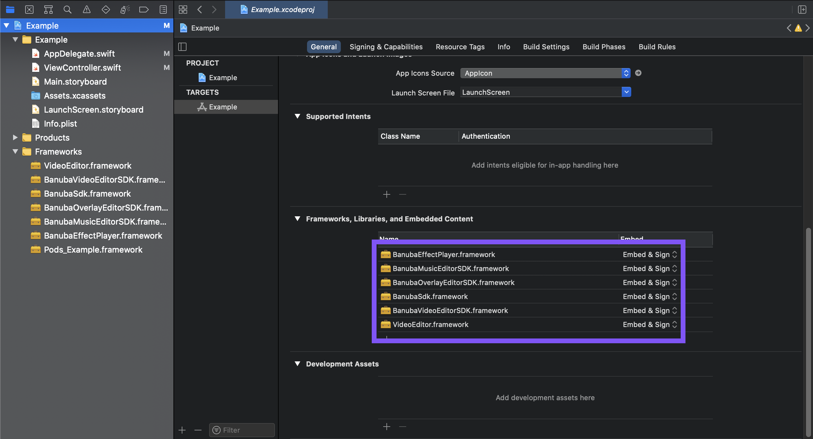

# Banuba Video Editor SDK Integration sample for iOS
[Banuba VE SDK](https://www.banuba.com/video-editor-sdk)
The Most Powerful Augmented Reality Video Editor SDK for Mobile

## Requirements
- Swift 5+
- Xcode 12+
- iOS 11.0+

## Dependencies
- [Banuba Face AR SDK](https://www.banuba.com/facear-sdk/face-filters). *Optional*

## Free Trial
Before purchasing the license cost you have 1-month free trial period.  
1. Sign NDA. [Contact Us](https://www.banuba.com/video-editor-sdk#form)
1. Clone this repository
1. Request [tokens](##Tokens)
1. Put tokens in the app
1. Start the sample
1. Follow [integration guide](##Getting-Started) to bring your customizations

## Tokens  
Banuba uses tokens for [Face AR SDK](https://www.banuba.com/facear-sdk/face-filters) and VE SDK products to differentiate our clients, protects features and technology. SDK requires up to date tokens, otherwise SDK will crash the app.  
Since Banuba VE SDK includes Face AR SDK it is required to specify Face AR token for applying AR effects. Please, put the token [here](/Example/Example/ViewController.swift#L19)


## Getting Started
### CocoaPods
VideoEditorSDK is available via CocoaPods. If you're new to CocoaPods, [this Getting Started Guide will help you](https://guides.cocoapods.org/using/getting-started.html). CocoaPods is the preferred and simpliest way to use the VE SDK.

The example of Podfile lines whitch you have to add you can find [here](Example/Podfile)

1. Make sure to have CocoaPods installed, e.g., via [Homebrew](https://brew.sh):
   ```sh
   brew install cocoapods 
   ```
2. Install VideoEditorSDK for the provided Xcode workspace with:
   ```sh
   pod install
   ```
3. Open `Example.xcworkspace` with Xcode and run the project.

### Manually
If you are not using any dependency manager you can intagrate Video Editor SDK manually via a dynamic framework.

1) Download the SDK [here](), then simply drag all frameworks required by VideoEditorSDK into the *Frameworks, Libraries, and Embedded Content* section of your target and make sure that the *Embed* settings are set to *Embed & Sign*:

 


### Start Video Editor from ViewController
``` swift
import BanubaVideoEditorSDK

class ViewController: UIViewController {

    private var videoEditorSDK: BanubaVideoEditorSDK?

    override func viewDidLoad() {
        super.viewDidLoad()
    
        initVideoEditor()
    }

    override func viewDidAppear(animated: Bool) {
        super.viewDidLoad()
    
        initVideoEditor()
    }

    override func viewDidAppear(_ animated: Bool) {
        super.viewDidAppear(animated)

        videoEditorSDK?.presentVideoEditor(
            from: self,
            animated: true,
            completion: nil
        )
    }
  
    private func initVideoEditor() {
        let configuration = VideoEditorConfig()
        videoEditorSDK = BanubaVideoEditorSDK(
            token: "place client token here",
            effectsToken: "place effects token here",
            configuration: configuration,
            analytics: nil,
            externalViewControllerFactory: nil
        )
        videoEditorSDK?.delegate = self
    }
    ...
}

// MARK: - Handle Video Editor lifecycle
extension ViewController: BanubaVideoEditorSDKDelegate {
  func videoEditorDidCancel(_ videoEditor: BanubaVideoEditorSDK) {
    videoEditor.dismissVideoEditor(animated: true, completion: nil)
  }
  
  func videoEditorDone(_ videoEditor: BanubaVideoEditorSDK) {
    videoEditor.dismissVideoEditor(animated: true, completion: nil)
  }
}

```  

### Configure export flow

### Configure screens  
The SDK allows to override icons, colors, typefaces and many more configuration entities. Every SDK screen has its own set of styles.
Below you can find how to customize VE SDK to bring your experience.
