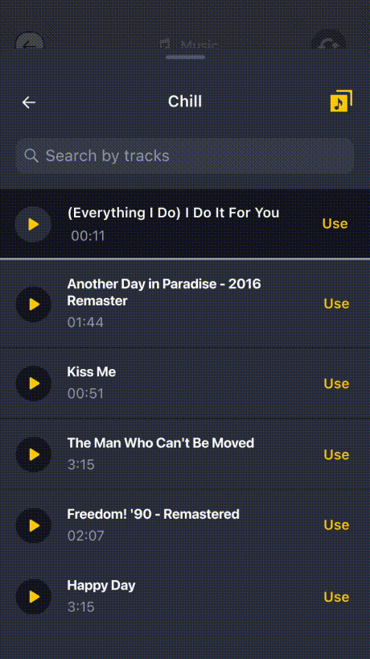
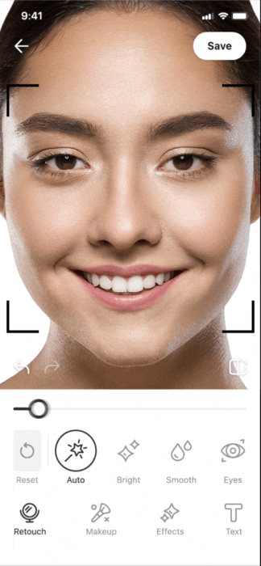
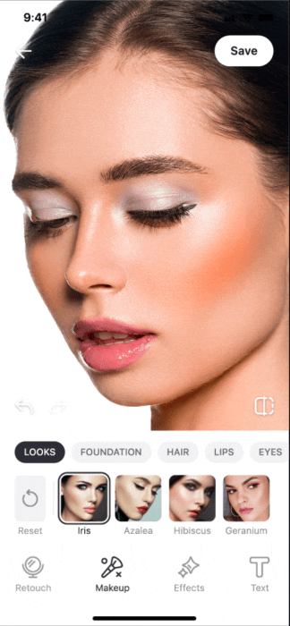
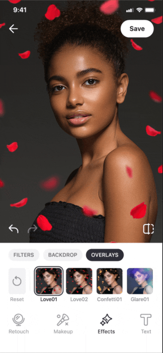
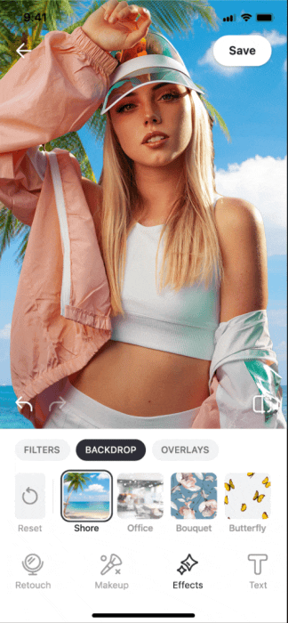
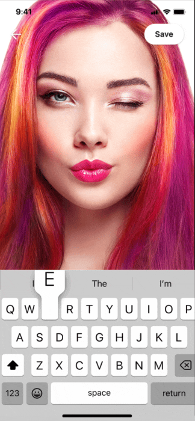

# Banuba Video & Photo Editor SDKs - iOS integration sample

&nbsp;
&nbsp;
&nbsp;
&nbsp;

&nbsp;
&nbsp;
&nbsp;
&nbsp;
&nbsp;

## Overview
[Banuba Video Editor SDK](https://www.banuba.com/video-editor-sdk) allows you to quickly add short video functionality and possibly AR filters and effects into your mobile app.

[Banuba AR Photo Editor SDK](https://www.banuba.com/photo-editor-sdk) allows you to quickly add the photo editing capabilities to your app. 

## Usage

### License
Before you commit to a license, you are free to test all the features of the SDK for free.  
**The trial period lasts 14 days**.

Send us a message to start the [Video Editor SDK trial](https://www.banuba.com/video-editor-sdk#form) | [Photo Editor SDK trial](https://www.banuba.com/photo-editor-sdk#form). We will get back to you with the trial token.

### Quickstart Integration Guide
See the [Quickstart Guide](mdDocs/quickstart.md) for complete integration steps, including:

1. Repository setup

2. License token [configuration](Example/Example/AppDelegate.swift#L9)

3. Running the sample app

### Documentation
Explore the full capabilities of our SDKs:
- [Video Editor SDK](https://docs.banuba.com/ve-pe-sdk/docs/ios/requirements)
- [Photo Editor SDK](https://docs.banuba.com/ve-pe-sdk/docs/ios/pe-requirements)

### Support
For questions about Video Editor or Photo Editor SDK, reach out to Banuba support service
- [Video Editor SDK](https://www.banuba.com/faq/kb-tickets/new) 
- [Photo Editor SDK](https://www.banuba.com/support)

## Requirements

- iPhone devices 6s+
- Swift 5.9+
- Xcode 16.0+
- iOS 15.0+
   Unfortunately, the GUI isn't adapted for iPads.
## Supported media formats
| Audio      | Video      | Images      |
| ---------- | ---------  | ----------- |
|.mp3, .aac, .wav,  .m4a, .flac, .aiff |.mp4, .mov, .m4v| .bmp, .gif, .heic,  .jpeg, .jpg, .png, .tiff
