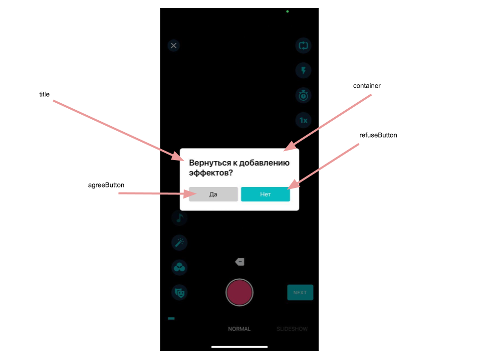

# Banuba VideoEditor SDK
## AlertViewConfiguration

- [cornerRadius: CGFloat](/Example/Example/Extension/AlertViewConfiguration.swift#L4)

Container corner radius

- [buttonRadius: CGFloat](/Example/Example/Extension/AlertViewConfiguration.swift#L5)

Buttons' radius

- [refuseButtonBackgroundColor: UIColor](/Example/Example/Extension/AlertViewConfiguration.swift#L6)

Refuse button background color

- [refuseButtonTextColor: UIColor](/Example/Example/Extension/AlertViewConfiguration.swift#L7)

Refuse button text color

- [agreeButtonBackgroundColor: UIColor](/Example/Example/Extension/AlertViewConfiguration.swift#L8)

Agree button background color

- [agreeButtonTextColor: UIColor](/Example/Example/Extension/AlertViewConfiguration.swift#L9)

Agree button text color

- [titleAligment: NSTextAlignment](/Example/Example/Extension/AlertViewConfiguration.swift#L10)

Main title aligment

- [titleFont: UIFont](/Example/Example/Extension/AlertViewConfiguration.swift#L11)

Main title font

- [buttonsFont: UIFont](/Example/Example/Extension/AlertViewConfiguration.swift#L12)

Buttons' font

