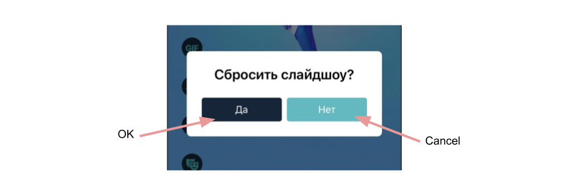

# Banuba VideoEditor SDK
## AlertViewConfiguration

The AlertController entity displays a message to the user.
In addition to displaying a message to the user, you can associate actions that can be used. In the application AlertController is used when you want to cancel some action, or reset progress.

Please use the properties below to configure the AlertController.

- [cornerRadius: CGFloat](/Example/Example/Extension/AlertViewConfiguration.swift#L7)

Container corner radius

- [buttonRadius: CGFloat](/Example/Example/Extension/AlertViewConfiguration.swift#L8)

Buttons' radius

- [refuseButtonBackgroundColor: UIColor](/Example/Example/Extension/AlertViewConfiguration.swift#L9)

Refuse button background color

- [refuseButtonTextColor: UIColor](/Example/Example/Extension/AlertViewConfiguration.swift#L10)

Refuse button text color

- [agreeButtonBackgroundColor: UIColor](/Example/Example/Extension/AlertViewConfiguration.swift#L11)

Agree button background color

- [agreeButtonTextColor: UIColor](/Example/Example/Extension/AlertViewConfiguration.swift#L12)

Agree button text color

- [titleAligment: NSTextAlignment](/Example/Example/Extension/AlertViewConfiguration.swift#L13)

Main title aligment

- [titleFont: UIFont](/Example/Example/Extension/AlertViewConfiguration.swift#L14)

Main title font

- [buttonsFont: UIFont](/Example/Example/Extension/AlertViewConfiguration.swift#L15)

Buttons' font

## String resources

| Key        |      Value      |   Description |
| ------------- | :----------- | :------------- |
| OK | OK | OK button title in alert
| Cancel | Cancel | Ability to cancel
