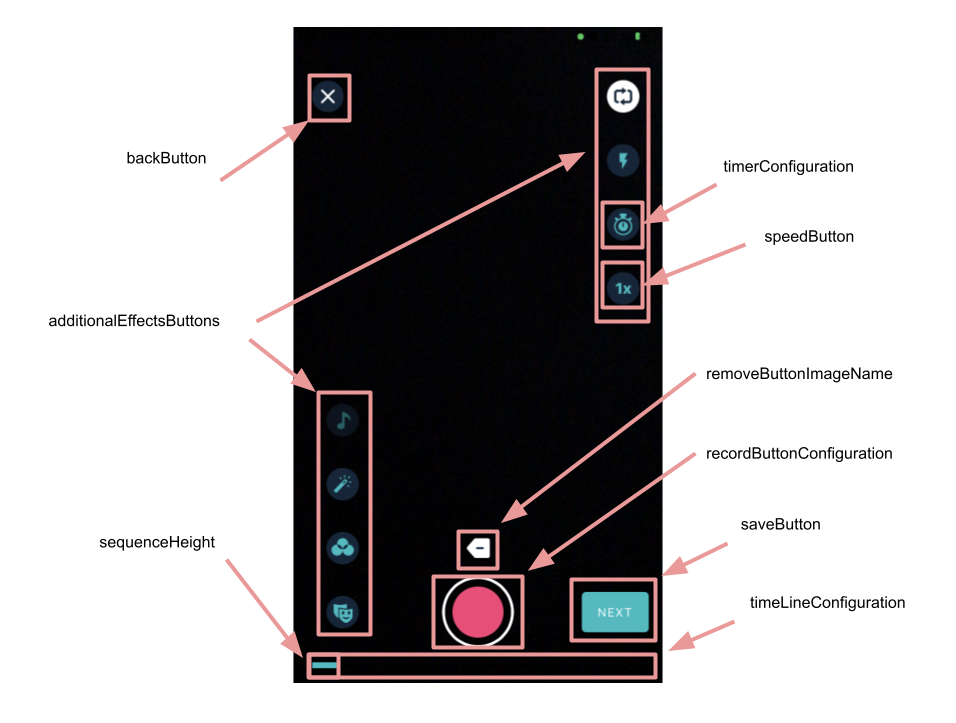
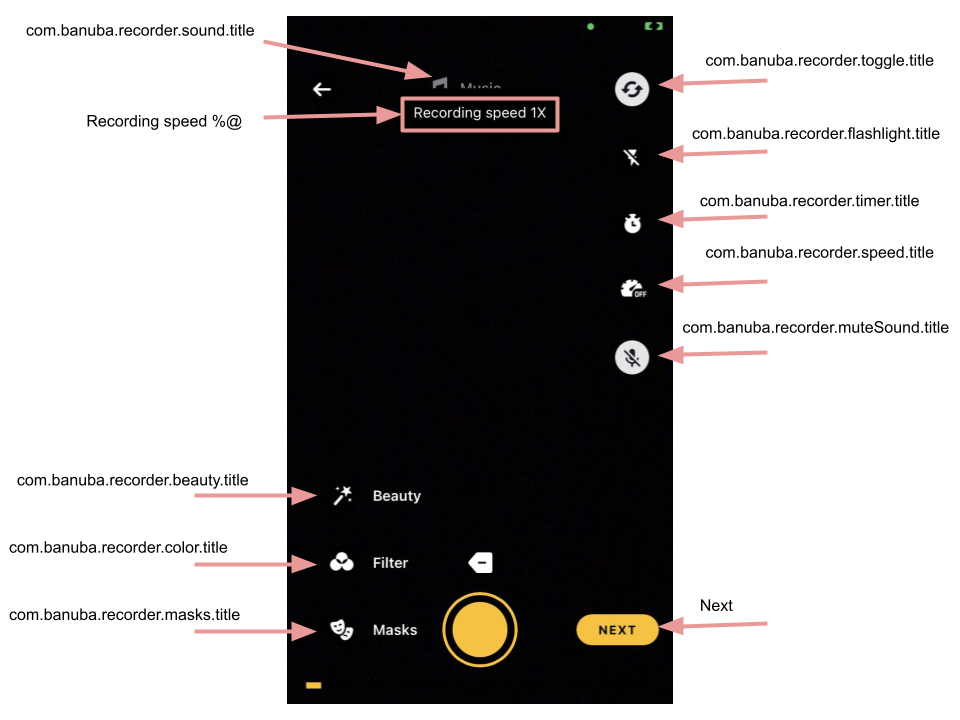

# Banuba VideoEditor SDK
## Camera screen styles 

Here we set up the styles for the recording screen. These configs are for customizing action button icons, adjusting relative position and appearance of music, gallery, switching camera icons. Icons configurable using this style's custom attributes (for example, [icon_mask_on](/Example/Example/Extension/RecorderConfiguration.swift#L82) and [icon_mask_off](/Example/Example/Extension/RecorderConfiguration.swift#L81) setup drawings for icons associated with the applied AR mask effect)

   - [videoResolution: VideoResolutionConfiguration](/Example/Example/Extension/RecorderConfiguration.swift#L9)
   
  VideoResolutionConfiguration sets up the camera options for capturing and rendering video
  
  - [saveButton: SaveButtonConfiguration?](/Example/Example/Extension/RecorderConfiguration.swift#L41)
  
  SaveButtonConfiguration sets up the save button style

  - [backButton: BackButtonConfiguration](/Example/Example/Extension/RecorderConfiguration.swift#L52)
  
  BackButtonConfiguration sets up the back button style
  
  - [backToDraftsButton: BanubaButtonConfiguration](/Example/Example/Extension/RecorderConfiguration.swift#L7)
  
  BanubaButtonConfiguration sets up the back to drafts button
  
  - [removeButtonImageName: String](/Example/Example/Extension/RecorderConfiguration.swift#L53)
  
  ImageName sets up the remove button UIImage
  
  - [progressLabelConfiguration: TextConfiguration?](/Example/Example/Extension/RecorderConfiguration.swift#L7)
  
  Sets up the top progress label style. Only for horizontal recorder.
  
  - [floatingLineViewConfiguration: TextConfiguration?](/Example/Example/Extension/RecorderConfiguration.swift#L7)
  
  Sets up the top floating line view style.
  
  - [floatingLineViewWidth: CGFloat?](/Example/Example/Extension/RecorderConfiguration.swift#L7)
  
  Sets up the width for floatingLineView. Default is 150.
  
  - [сaptureButtonMode: CaptureButtonMode](/Example/Example/Extension/RecorderConfiguration.swift#L7)
  
  CaptureButtonMode contains two varieties:
  1. Mixed. Photo and video camera functionality.
  2. Video. Only photo camera functionality.
  
  - [recordButtonConfiguration: RecordButtonConfiguration](/Example/Example/Extension/RecorderConfiguration.swift#L55)
  
  RecordButtonConfiguration sets up the capture button style
  
  - [recordButtonProvider: RecordButtonProvider?](/Example/Example/Extension/RecorderConfiguration.swift#L7)
  
  RecordButtonProvider provides access to the possibility for creating a custom capture button
  
  - [additionalEffectsButtons: [AdditionalEffectsButtonConfiguration]](/Example/Example/Extension/RecorderConfiguration.swift#L62)
  
  AdditionalEffectsButtonConfiguration array sets up all of the camera screen control buttons' styles
  
  - [speedBarButtons: [SpeedBarButtonsConfiguration]](/Example/Example/Extension/RecorderConfiguration.swift#L62)
  
  SpeedButtonConfiguration sets up the speed button style
 
  - [galleryButton: RoundedButtonConfiguration](/Example/Example/Extension/RecorderConfiguration.swift#L129)
  
  RoundedButtonConfiguration sets up the gallery button style
  
  - [emptyGalleryImageName: String](/Example/Example/Extension/RecorderConfiguration.swift#L130)
 
  Image name sets up the gallery button image for empty gallery state
 
  - [timerConfiguration: TimerConfiguration](/Example/Example/Extension/RecorderConfiguration.swift#L132)
  
  TimerConfiguration sets up the timer functionality options
  
  - [timeLineConfiguration: TimeLineConfiguration](/Example/Example/Extension/RecorderConfiguration.swift#L141)
  
  TimeLineConfiguration sets up the progress bar style for sequences
  
  - [regularRecordButtonPosition: CGFloat](/Example/Example/Extension/RecorderConfiguration.swift#L144)
  
  This value sets up the capture button posttion according to the screen bottom
  
  - [recorderEffectsConfiguration: RecorderEffectsConfiguration](/Example/Example/Extension/RecorderConfiguration.swift#L145)
  
  RecorderEffectsConfiguration sets up the effects list style
  
  - [leftControlsBottomOffsetFromCaptureButton: CGFloat](/Example/Example/Extension/RecorderConfiguration.swift#L146)
  
  This value sets up the left controls position according to the capture button bottom
  
  - [leftControlsLeftOffset: CGFloat](/Example/Example/Extension/RecorderConfiguration.swift#L147)
  
  This value sets up the left controls position according to the capture button leading edge
  
  - [sequenceHeight: CGFloat](/Example/Example/Extension/RecorderConfiguration.swift#L148)
  
  Sequence bar height
  
  - [useHorizontalVersion: Bool](/Example/Example/Extension/RecorderConfiguration.swift#L149)
  
  How the buttons appears on the screen
  
  - [loopAudioWhileRecording: Bool](/Example/Example/Extension/RecorderConfiguration.swift#L150)
  
  Loop audio while recording video if music is selected
  
  - [takeAudioDurationAsMaximum: Bool](/Example/Example/Extension/RecorderConfiguration.swift#L151)
  
  This flag suggests that the given audio duration determines the maximum recording length
  
  - [isDynamicMusicTitle: Bool](/Example/Example/Extension/RecorderConfiguration.swift#L152)

   Spacing between button and circular timeline
   
  - [isDefaultFrontCamera: Bool](/Example/Example/Extension/RecorderConfiguration.swift#L7)

  This value provides the ability to open the front camera by default
  
  - [isMusicTitleFloatingLineEnabled: Bool](/Example/Example/Extension/RecorderConfiguration.swift#L7)

  This value sets up whether the music title floating view is enabled
    
  - [useHEVCCodecIfPossible: Bool](/Example/Example/Extension/RecorderConfiguration.swift#L7)

  The intermediate video will encoded with HEVC (H.265) encoder if it is available on the current device. Better quality, smaller size, better performance
    
  - [isPhotoSequenceAnimationEnabled: Bool](/Example/Example/Extension/RecorderConfiguration.swift#L7)

  Should use animation for photo sequences
    
  - [progressBarPosition: ProgressBarPosition](/Example/Example/Extension/RecorderConfiguration.swift#L7)
  
  Presentation of progress bar. Default is bottom
  
  - [muteMicrophoneForPIP: Bool](/Example/Example/Extension/RecorderConfiguration.swift#L7)
  
  Mute microphone on PIP screen. Default is false.
  
  
  
  You can change the position for the music button, for this you need:
  
  In the array with additionalEffectsButtons, for the button with the identifier **.sound**, set up the [position](/Example/Example/Extension/RecorderConfiguration.swift#L72) property
  
   - bottom
   - center
   - top
   
       

## String resources

| Key        |      Value      |   Description |
| ------------- | :----------- | :------------- |
| Music | Music | Music selection screen title
| Delete | Delete | Audio track delete action
| Voice | Voice | Title on the screen of the voice recorder
| Yes | Yes | Used when the question is answered yes
| No | No | Used when answering a negative question
| Error | Error | Title of the message if an error occurs
| Next | Next | Move to next screen
| Publish | Publish | Publish video
| Back | Back | Return to the previous screen
| Cancel | Cancel | Ability to cancel
| BanubaVideoEditor.Settings.Later| Later | Alert action button title
| BanubaVideoEditor.Settings.Discard | Discard | Alert action button title
| Do you want to stop capturing and editing the video? | Do you want to stop capturing and editing the video? | Used in alert with Yes and No options when resetting filters.
| Do you want to reset all? | Do you want to reset all? | Used in alert with Yes and No options when resetting filters.
| Do you want to reset slideshow? | Do you want to reset slideshow? | Used in alert with Yes and No options when resetting slideshow.
| Do you want to delete the last clip? | Do you want to delete the last clip? | Used in alert with Yes and No options
| BanubaVideoEditor.NotFinishedVideoSequenceAlertQuestion | You have a new draft. Continue editing it? | Asking about continuing editing session
| First part not recorded | First part not recorded | Error message that appears when clicking the Next button in the camera when the first part of split mode is not recorded
| Mask not loaded | Mask not loaded | Error message received when trying to load a mask
| Second part is too short | Second part is too short | An error message that appears when you click the Next button in the camera, when the second part of the video in split mode is not equal in length to the first part
| Beautifier on/Beautifier off | Beautifier on/Beautifier off | Second part is too short
| Flash | Light | The light (flashlight) in the camera is on
| Too short. Please capture at least %d seconds | Too short. Please capture at least %d seconds | An error message that appears in the camera when the length of the recorded video is less than the minimum allowed duration
| Maximum %d seconds. | Maximum %d seconds. | An error message that appears in the camera if the recorded video is longer than the maximum allowed length
| Timer is off | Timer is off | Turning off the camera's auto timer
| Max length %d sec | Max length %d sec | 'Seconds' for maximum
| %d sec | %d sec | 'Seconds' for short
| Choose video | Choose video | Screen title when multi-select mode is enabled on the video gallery screen
| Choose | Choose | Name of the button in multi-select mode, which confirms the selection of user files and continues the process further
| Sound | Sound | Built-in track volume description
| Add | Add | Add extra audio track action
| %i seconds timer is on | %i seconds timer is on | Enabling the countdown timer to automatically start shooting in the camera
| Recording speed %@ | Recording speed %@ | Speed screen info
| com.banuba.recorder.sound.title | Music | Music button title
| com.banuba.recorder.beauty.title | Beauty | Beauty button title
| com.banuba.recorder.color.title | Filter | Filter button title
| com.banuba.recorder.masks.title | Masks | Masks button title
| com.banuba.recorder.toggle.title | Toggle | Toggle button title
| com.banuba.recorder.flashlight.title | Flashlight button title
| com.banuba.recorder.timer.title | Timer | Timer button title
| com.banuba.recorder.speed.title | Speed | Speed button title
| com.banuba.recorder.muteSound.title | Sound | Sound button title
