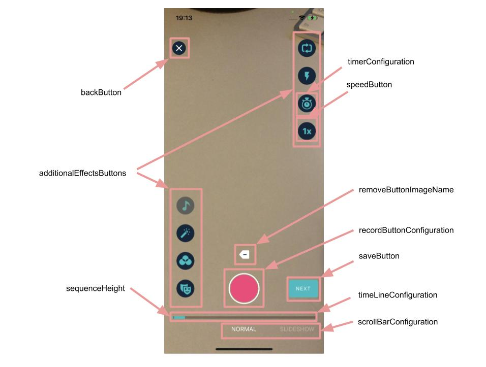
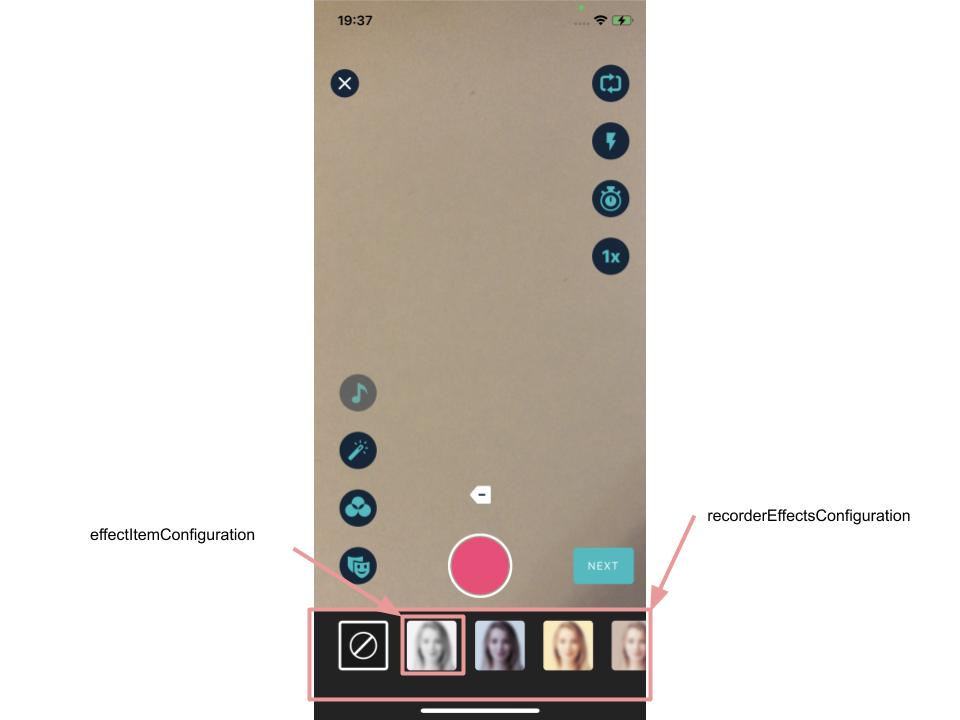

# Banuba VideoEditor SDK
## Camera screen styles  

   - [videoResolution: VideoResolutionConfiguration](/Example/Example/Extension/RecorderConfiguration.swift#L5)
   
  VideoResolutionConfiguration setups camera options for capturing and rendering video
  
  - [saveButton: SaveButtonConfiguration?](/Example/Example/Extension/RecorderConfiguration.swift#L37)
  
  SaveButtonConfiguration setups save button style

  - [backButton: BackButtonConfiguration](/Example/Example/Extension/RecorderConfiguration.swift#L48)
  
  BackButtonConfiguration setups back button style

  - [removeButtonImageName: String](/Example/Example/Extension/RecorderConfiguration.swift#L49)
  
  ImageName setups remove button UIImage
  
  - [сaptureButtonMode: CaptureButtonMode](/Example/Example/Extension/RecorderConfiguration.swift#L50)
  
  CaptureButtonMode contains two varieties:
  1. Mixed. Photo and video camera functionality.
  2. Video. Only photo camera functionality.
  
  - [recordButtonConfiguration: RecordButtonConfiguration](/Example/Example/Extension/RecorderConfiguration.swift#L51)
  
  RecordButtonConfiguration setups capture button style
  
  - [recordButtonProvider: VideoEditorCaptureButtonProvider?](/Example/Example/Extension/RecorderConfiguration.swift#L56)
  
  VideoEditorCaptureButtonProvider provides access to the possibility for creating capture button
  
  - [additionalEffectsButtons: [AdditionalEffectsButtonConfiguration]](/Example/Example/Extension/RecorderConfiguration.swift#L58)
  
   AdditionalEffectsButtonConfiguration array setups all of the camera screen control buttons' styles
  
  - [speedButton: SpeedButtonConfiguration](/Example/Example/Extension/RecorderConfiguration.swift#L107)
  
  SpeedButtonConfiguration setups speed button style
 
  - [galleryButton: RoundedButtonConfiguration](/Example/Example/Extension/RecorderConfiguration.swift#L125)
  
  RoundedButtonConfiguration setups gallery button style
  
  - [emptyGalleryImageName: String](/Example/Example/Extension/RecorderConfiguration.swift#L126)
 
  Image name setups gallery button image for empty gallery state
 
  - [timerConfiguration: TimerConfiguration](/Example/Example/Extension/RecorderConfiguration.swift#L128)
  
  TimerConfiguration setups timer functionality options
  
  - [timeLineConfiguration: TimeLineConfiguration](/Example/Example/Extension/RecorderConfiguration.swift#L137)
  
  TimeLineConfiguration setups progress bar style for sequences
  
  - [regularRecordButtonPosition: CGFloat](/Example/Example/Extension/RecorderConfiguration.swift#L140)
  
  Value setups capture button posttion according to the screen bottom
  
  - [recorderEffectsConfiguration: RecorderEffectsConfiguration](/Example/Example/Extension/RecorderConfiguration.swift#L141)
  
  RecorderEffectsConfiguration setups effects list style
  
  - [leftControlsBottomOffsetFromCaptureButton: CGFloat](/Example/Example/Extension/RecorderConfiguration.swift#L142)
  
  Value setups left controls posttions according to the capture button bottom
  
  - [leftControlsLeftOffset: CGFloat](/Example/Example/Extension/RecorderConfiguration.swift#L143)
  
  Value setups left controls posttions according to the capture button leading
  
  - [sequenceHeight: CGFloat](/Example/Example/Extension/RecorderConfiguration.swift#L144)
  
  Sequence bar height
  
  - [useHorizontalVersion: Bool](/Example/Example/Extension/RecorderConfiguration.swift#L145)
  
  How the buttons appears on the screen
  
  - [loopAudioWhileRecording: Bool](/Example/Example/Extension/RecorderConfiguration.swift#L146)
  
  Loop audio while recording video if music is selected
  
  - [takeAudioDurationAsMaximum: Bool](/Example/Example/Extension/RecorderConfiguration.swift#L147)
  
  This flag suggests that given audio duration setups maximum recording length
  
  - [isDynamicMusicTitle: Bool](/Example/Example/Extension/RecorderConfiguration.swift#L148)
  
  Value provides the ability to dynamically changing the title of the song when new audio is adding
  
  
  
  
