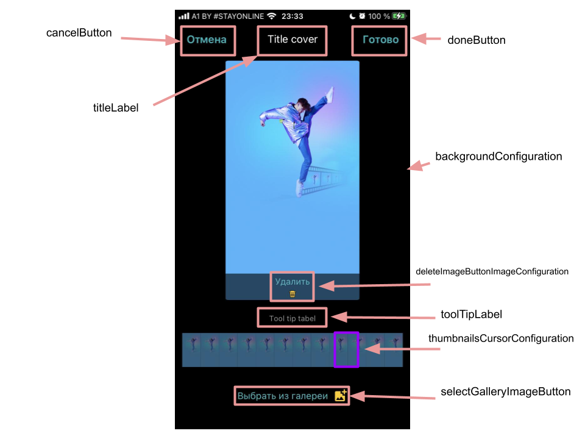
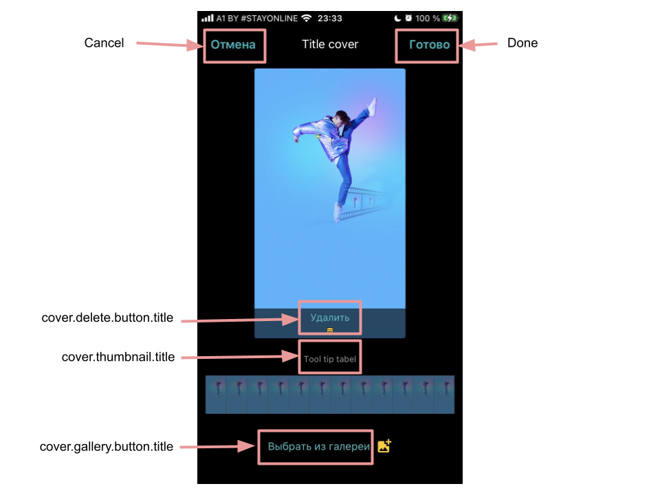

# Banuba VideoEditor SDK
##  VideoCoverSelectionConfiguration

- [cancelButton: RoundedButtonConfiguration](/Example/Example/Extension/CoverConfiguration.swift#L42)

The cancel button configuration

- [doneButton: RoundedButtonConfiguration](/Example/Example/Extension/CoverConfiguration.swift#L46)

The done button configuration

- [titleLabel: TextConfiguration?](/Example/Example/Extension/CoverConfiguration.swift#L50)

The title laber configuration

- [toolTipLabel: TextConfiguration](/Example/Example/Extension/CoverConfiguration.swift#L51)

The tooltip label configuration

- [selectorColor: UIColor](/Example/Example/Extension/CoverConfiguration.swift#L52)

The selector view color
  
- [selectGalleryImageButton: BanubaButtonConfiguration](/Example/Example/Extension/CoverConfiguration.swift#L53)

Select cover from gallery button configuration

- [deleteImageButtonImageConfiguration: BanubaButtonConfiguration](/Example/Example/Extension/CoverConfiguration.swift#L54)

Delete cover from gallery button configuration

- [backgroundConfiguration: BackgroundConfiguration](/Example/Example/Extension/CoverConfiguration.swift#L55)
  
The background configuration 

- [previewBackgroundConfiguration: BackgroundConfiguration](/Example/Example/Extension/CoverConfiguration.swift#L56)

The preview view background configuration

- [thumbnailsCursorConfiguration: ImageButtonConfiguration](/Example/Example/Extension/CoverConfiguration.swift#L57)

The thumbnails Curosr Configuration

- [numberOfThumbnails: Int](/Example/Example/Extension/CoverConfiguration.swift#L58)

The number of thumbnails

- [galleryImageCompressionQuality: CGFloat](/Example/Example/Extension/CoverConfiguration.swift#L58)

Gallery image compression quality. Default is 0.6

- [preferredStatusBarStyle: UIStatusBarStyle](/Example/Example/Extension/CoverConfiguration.swift#L23)

The style of the status bar.
  

## String resources

| Key        |      Value      |   Description |
| ------------- | :----------- | :------------- |
| cover.thumbnail.title | Choose a frame from your video or an image from Gallery | Choose image from Gallery label text
| cover.gallery.button.title | Choose from Gallery | Choose image from Gallery button title
| cover.delete.button.title | Delete | Delete button title
| Cancel | Cancel | Ability to cancel
| Done | Done | Finish button title
