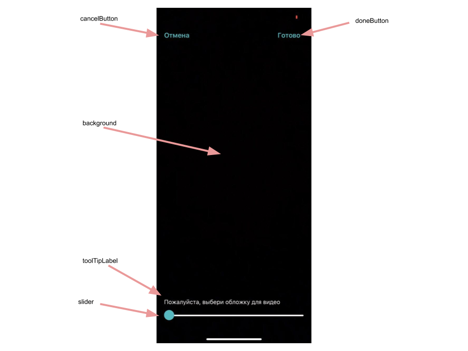

# Banuba VideoEditor SDK
##  SimpleVideoCoverSelectionConfiguration

- [cancelButton: TextButtonConfiguration](/Example/Example/Extension/CoverConfiguration.swift#L8)

TextButtonConfiguration setups cancel button style

- [doneButton: RoundedButtonConfiguration](/Example/Example/Extension/CoverConfiguration.swift#L9)

RoundedButtonConfiguration setups done button style

- [toolTipLabel: TextConfiguration](/Example/Example/Extension/CoverConfiguration.swift#L25)

TextConfiguration setups tool tip label

- [sliderColor: UIColor](/Example/Example/Extension/CoverConfiguration.swift#L32)

Slider color

- [sliderMinTrackTintColor: UIColor](/Example/Example/Extension/CoverConfiguration.swift#L33)

Slider min state color

- [sliderMaxTrackTintColor: UIColor](/Example/Example/Extension/CoverConfiguration.swift#L34)

Slider max state color

- [backgroundConfiguration: BackgroundConfiguration](/Example/Example/Extension/CoverConfiguration.swift#L35)

BackgroundConfiguration setups background view configuration

##  VideoCoverSelectionConfiguration

- [cancelButton: RoundedButtonConfiguration](/Example/Example/Extension/CoverConfiguration.swift#L42)

The cancel button configuration

- [doneButton: RoundedButtonConfiguration](/Example/Example/Extension/CoverConfiguration.swift#L46)

The done button configuration

- [titleLabel: TextConfiguration?](/Example/Example/Extension/CoverConfiguration.swift#L50)

The title laber configuration

- [toolTipLabel: TextConfiguration](/Example/Example/Extension/CoverConfiguration.swift#L51)

The tooltip label configuration

- [selectorColor: UIColor](/Example/Example/Extension/CoverConfiguration.swift#L52)

The selector view color
  
- [selectGalleryImageButton: BanubaButtonConfiguration](/Example/Example/Extension/CoverConfiguration.swift#L53)

Select cover from gallery button configuration

- [deleteImageButtonImageConfiguration: BanubaButtonConfiguration](/Example/Example/Extension/CoverConfiguration.swift#L54)

Delete cover from gallery button configuration

- [backgroundConfiguration: BackgroundConfiguration](/Example/Example/Extension/CoverConfiguration.swift#L55)
  
The background configuration 

- [previewBackgroundConfiguration: BackgroundConfiguration](/Example/Example/Extension/CoverConfiguration.swift#L56)

The preview view background configuration

- [thumbnailsCursorConfiguration: ImageButtonConfiguration](/Example/Example/Extension/CoverConfiguration.swift#L57)

The thumbnails Curosr Configuration

- [numberOfThumbnails: Int](/Example/Example/Extension/CoverConfiguration.swift#L58)

The number of thumbnails
  
