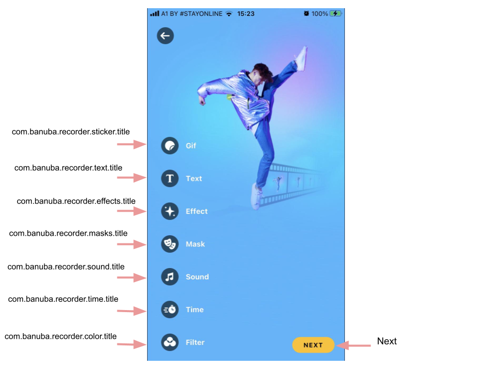

# Banuba VideoEditor SDK
## Editor screen styles

In the application, the Editor screen displays buttons with functionality that is available for video editing.

Use the properties below to customize the Editor screen.

- [additionalEffectsButtons: [AdditionalEffectsButtonConfiguration]](/Example/Example/Extension/EditorConfiguration.swift#L8)

AdditionalEffectsButtonConfiguration array setups all of the editor screen control buttons' styles

- [additionalEffectsButtonsBottomOffset: CGFloat](/Example/Example/Extension/EditorConfiguration.swift#L46)

Setups all of the camera screen control buttons' bottom offset

- [videoResolution: VideoResolutionConfiguration](/Example/Example/Extension/EditorConfiguration.swift#L47)

VideoResolutionConfiguration setups editor options for rendering video

- [saveButton: BanubaButtonConfiguration](/Example/Example/Extension/EditorConfiguration.swift#L68)

SaveButtonConfiguration setups save button style

- [backButton: BackButtonConfiguration](/Example/Example/Extension/EditorConfiguration.swift#L74)

BackButtonConfiguration setups back button style

- [isVideoCoverSelectionEnabled: Bool](/Example/Example/Extension/EditorConfiguration.swift#L76)

Indicates whether there will be a preview selection screen after the editor screen

- [useHorizontalVersion: Bool](/Example/Example/Extension/EditorConfiguration.swift#L77)

How the buttons appears on the screen

- [useHEVCCodecIfPossible: Bool](/Example/Example/Extension/EditorConfiguration.swift#L6)

Enables using HEVC codec on export if .auto export configuration is used

- [isVideoAspectFillEnabled: Bool](/Example/Example/Extension/EditorConfiguration.swift#L6)

Enables filling screen with aspected video. If this property is false the video will be fully displayed with black lines at the corners. Default value is true

- [backgroundColor: UIColor](/Example/Example/Extension/EditorConfiguration.swift#L6)

Setups background color. Default is black

  
  
  
## String resources

| Key        |      Value      |   Description |
| ------------- | :----------- | :------------- |
| com.banuba.recorder.sticker.title | Gif | Gif button title
| com.banuba.recorder.text.title | Text | Text button title
| com.banuba.recorder.effects.title |Effects | Effects button title
| com.banuba.recorder.masks.title | Masks | Masks button title
| com.banuba.recorder.sound.title | Music | Music button title
| com.banuba.recorder.time.title | Time | Time button title
| com.banuba.recorder.color.title | Filter | Filter button title
| Next | Next | Next button title
