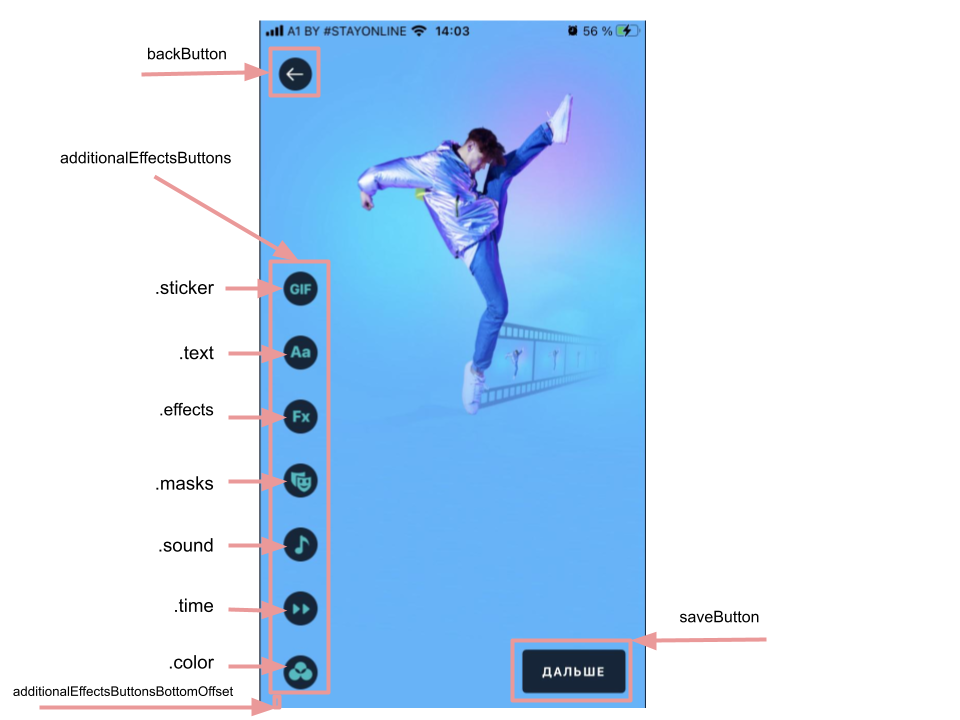

# Banuba VideoEditor SDK
## Editor screen styles  

- additionalEffectsButtons: [AdditionalEffectsButtonConfiguration]

AdditionalEffectsButtonConfiguration array setups all of the camera screen control buttons' styles

- additionalEffectsButtonsBottomOffset: CGFloat

Setups all of the camera screen control buttons' bottom offset

- videoResolution: VideoResolutionConfiguration

VideoResolutionConfiguration setups editor options for rendering video

- saveButton: BanubaButtonConfiguration

SaveButtonConfiguration setups save button style

- backButton: BackButtonConfiguration

BackButtonConfiguration setups back button style

- isVideoCoverSelectionEnabled: Bool

Indicates whether there will be a preview selection screen after the editor screen

- useHorizontalVersion: Bool

How the buttons appears on the screen

- playButtonImageName: String

ImageName setups play button UIImage

  
