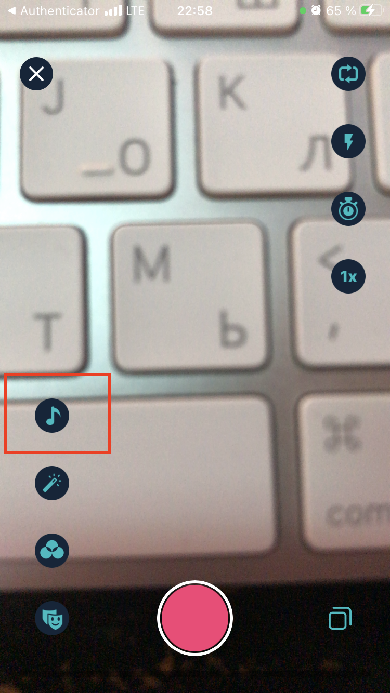
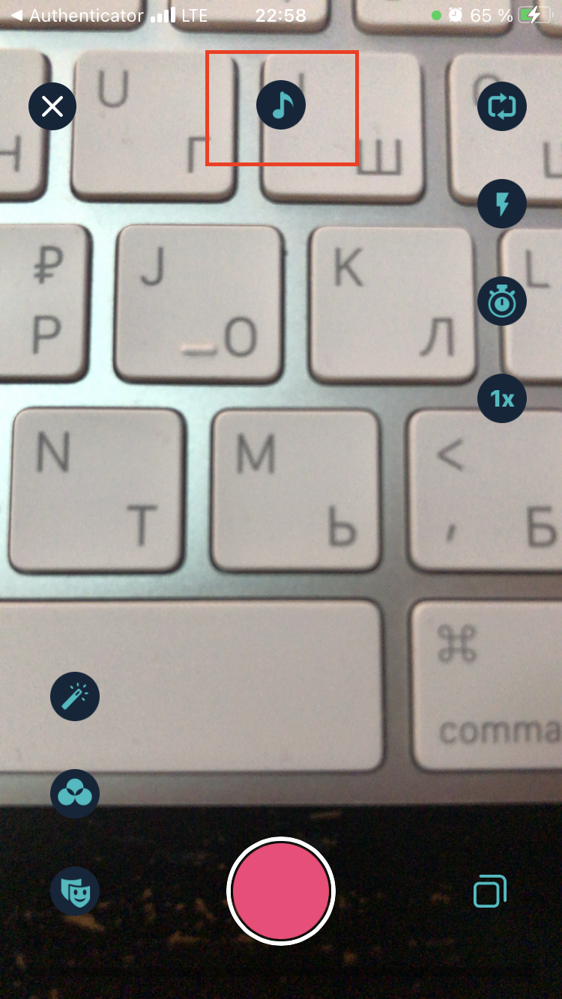
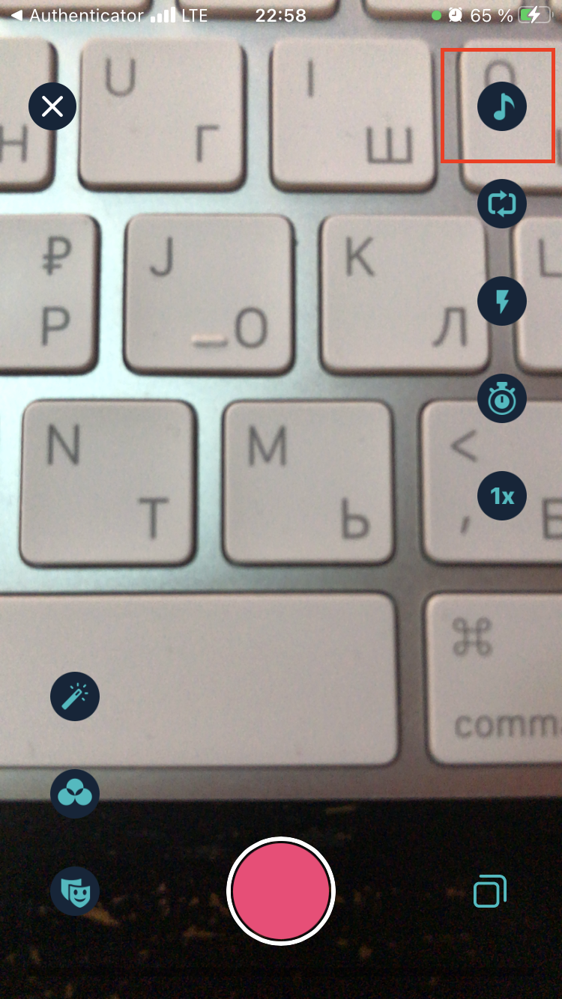
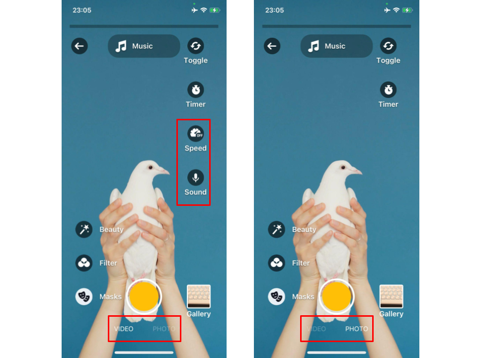

# FAQ  
These are the answers to the most common questions asked about our SDK.

1. [How do I start/stop recording with a tap?](#1-how-do-i-startstop-recording-with-a-tap)
2. [How do I add an AR mask to the app (without AR cloud).](#2how-do-i-add-an-ar-mask-to-the-app-without-ar-cloud)
3. [How do I start the Video Editor with a preselected audio track?](#3-how-do-i-start-the-video-editor-with-a-preselected-audio-track)
4. [How do I use the Video Editor several times from different entry points?](#4-how-do-i-use-the-video-editor-several-times-from-different-entry-points)
5. [How do I add a color filter (LUT)?](#5-how-do-i-add-a-color-filter-lut)
6. [I want to enabled slideshow animation.](#6-i-want-to-enable-slideshow-animation)
7. [I want to change cursor color.](#7-i-want-to-change-cursor-color)
8. [I want to change progress bar position.](#8-i-want-to-change-progress-bar-position)
9. [How does video editor work when token expires?](#9-how-does-video-editor-work-when-token-expires)
10. [Which buttons available if Face AR disabled?](#10-which-buttons-available-if-face-ar-disabled)
11. [I want to change music button position.](#11-i-want-to-change-music-button-position)
12. [How can I get a track name of the audio used in my video after export?](#12-how-can-i-get-a-track-name-of-the-audio-used-in-my-video-after-export)
13. [I want to change the font.](#13-i-want-to-change-the-font)
14. [I want to check whether my token is expired.](#14-i-want-to-check-whether-my-token-is-expired)
15. [The file “luts” couldn’t be opened because there is no such file.](#15-the-file-luts-couldnt-be-opened-because-there-is-no-such-file)
16. [I want to add audio filters.](#16-i-want-to-add-audio-filters)
17. [I want to change icons and name for effects.](#17-i-want-to-change-icons-and-name-for-effects)
18. [I want to turn off Drafts feature.](#18-i-want-to-turn-off-drafts-feature)
19. [I want to turn off Cover screen.](#19-i-want-to-turn-off-cover-screen)
20. [I want to change visible tabs in gallery.](#20-i-want-to-change-visible-tabs-in-gallery)
21. [I want to get exported video metadata.](#21-i-want-to-get-exported-video-metadata)
22. [I want to change codec type from h264 to h265.](#22-i-want-to-change-codec-type-from-h264-to-h265)
23. [How do I specify the video file saving directory?](#23-how-do-i-specify-the-video-file-saving-directory)
24. [How do I change the video duration?](#24-how-do-i-change-the-video-duration)
25. [The problem of using optional frameworks and bitcode together.](#25-the-problem-of-using-optional-frameworks-and-bitcode-together)
26. [How do I change the launguage (how do I add new locale support)?](#26-how-do-i-change-the-launguage-how-do-i-add-new-locale-support)
27. [How can I change the extension of the exported video?](#27-how-can-i-change-the-extension-of-the-exported-video)
28. [How to set buttons for video modes?](#28-how-to-set-buttons-for-video-modes)

### 1. How do I start/stop recording with a tap?
  
By default, the user must hold the “record” button to film and release it to stop filming. 

To change that, set the **captureButtonMode** property of the RecorderConfiguration entity to .video.

```swift
 var config = VideoEditorConfig()
 
 config.recorderConfiguration.captureButtonMode = .video
```

### 2.How do I add an AR mask to the app (without AR cloud)

If you don’t want to pull the masks from the backend, you can include them in the app itself. 

A mask is a bundle of files within a specific folder in the YourProject/bundleEffects/ directory. The preview.png file in the filter folder is used as an icon within the app, and the name of the directory is also the name of the mask.  

 **Note** Please, don’t change the name of the bundleEffects folder, otherwise, the app will not work. If it doesn’t exist already, create it manually.

### 3. How do I start the Video Editor with a preselected audio track?

To do so, add the MediaTrack instance as a parameter to the  `VideoEditorLaunchConfig` which used for starting video editor method.

```swift
let cameraLaunchConfig = VideoEditorLaunchConfig(
  entryPoint: .camera,
  hostController: self,
  musicTrack: MediaTrack(...),
  animated: true
)

videoEditorSDK?.presentVideoEditor(
  withLaunchConfiguration: cameraLaunchConfig,
  completion: nil
)
```

### 4. How do I use the Video Editor several times from different entry points?

Before you want to use VideoEditor again, you need to deinitialize your current editor instance in your [entry point class scope](https://github.com/Banuba/ve-sdk-ios-integration-sample/blob/d9733e78a6a752dd8fad849f6aa6d5553eb07f56/Example/Example/ViewController.swift#L675). You need to set 'yourVideoEditorSdkInstance' = nil after following funcs called([done](https://github.com/Banuba/ve-sdk-ios-integration-sample/blob/d9733e78a6a752dd8fad849f6aa6d5553eb07f56/Example/Example/ViewController.swift#L660) and [cancel](https://github.com/Banuba/ve-sdk-ios-integration-sample/blob/d9733e78a6a752dd8fad849f6aa6d5553eb07f56/Example/Example/ViewController.swift#L678)).

```swift
// Video Editor Delegate implementation example
extension ViewController: BanubaVideoEditorDelegate {
  func videoEditorDone(_ videoEditor: BanubaVideoEditor) {
    // User finished editing sessoin, need to dismiss video editor and export video
    videoEditorSDK?.dismissVideoEditor(
      animated: true
    ) { [weak self] in
      self?.exportVideo(...) { ... in
         self?.'yourVideoEditorSdkInstance' = nil
      }
    }
  }
  
  func videoEditorDidCancel(
    _ videoEditor: BanubaVideoEditor
  ) {
    // User canceled editing sessoin, need to dismiss video editor
    videoEditorSDK?.dismissVideoEditor(
      animated: true,
      completion: {
        self?.'yourVideoEditorSdkInstance' = nil
      }
    )
  }
}
```

Use the following approach if you want to [create BanubaVideoEditor instance](https://github.com/Banuba/ve-sdk-ios-integration-sample/blob/d9733e78a6a752dd8fad849f6aa6d5553eb07f56/Example/Example/ViewController.swift#L42) again. 

For example on your tap button action:

```swift
@IBAction func videoEditorButtonTapped(_ sender: UIButton) {
   if 'yourVideoEditorSdkInstance' = nil {
      'yourVideoEditorSdkInstance' = BanubaVideoEditor(...)
   }
}
```

### 5. How do I add a color filter (LUT)?

Color Filters (LUTs) are special graphics files that are placed in the / [luts directory](https://github.com/Banuba/ve-sdk-ios-integration-sample/tree/main/Example/Example/luts) inside the main project folder.

To add your own icon to be used to represent that specific effect in the list, you must place it in the / [assets folder](https://github.com/Banuba/ve-sdk-ios-integration-sample/tree/main/Example/Example/Assets.xcassets/Filters%20Preview).

The icon resource name must match the image file name in the / luts directory and end with ```_preview```.

The display name for the resource is set in the [localization files](https://github.com/Banuba/ve-sdk-ios-integration-sample/blob/main/Example/Example/en.lproj/Localizable.strings#L353).

The key for the translation string must start with ```com.banuba.filter.name.{lut file name}``` and end with the name of the lut file.


### 6. I want to enable slideshow animation 

To be able to turn off slideshow animation use following property of ```RecorderConfiguration``` and ```CombinedGalleryConfiguration``` entities.

```swift
let config = VideoEditorConfig()

config.combinedGalleryConfiguration.isPhotoSequenceAnimationEnabled = true
config.recorderConfiguration.isPhotoSequenceAnimationEnabled = true
```
### 7. I want to change cursor color

All you need is just to set your color into ```cursorColor``` parameter in ```MainOverlayViewControllerConfig``` entity.

```swift
let config = VideoEditorConfig()

config.overlayEditorConfiguration.mainOverlayViewControllerConfig.cursorColor = .white
```

### 8. I want to change progress bar position

Progress bar position contains two types of layout:
- top
- bottom (**by default**)

To change progress bar position you need to modify ```progressBarPosition``` property of ```RecorderConfiguration``` entity.

```swift
let config = VideoEditorConfig()

config.recorderConfiguration.progressBarPosition = .top
```

### 9. How does video editor work when token expires?

[Token](https://github.com/Banuba/ve-sdk-android-integration-sample#token) provided by sales managers has an expiration term to protect Video Editor SDK from malicious access. When the token expires the following happens:
 - video resolution will be lowered to 360p on camera, after trimmer and after export
 - Banuba watermark is applied to every exported video

 Also [FaceAR SDK](https://docs.banuba.com/face-ar-sdk/overview/token_management) you may expect the following actions if the token expires:
 - on the first expired month a watermark with "Powered by Banuba" label will be added on the top of both recorded and exported videos
 - after the first month the camera screen will be blurred and a full-screen watermark will be displayed

 Please keep your licence up to date to avoid unwanted behavior.
 
 ### 10. Which buttons available if Face AR disabled?
 
 AdditionalEffectsButtons contains options set which describes buttons identifiers. 
 
 Without Face AR you could use buttons with following identifiers. 
 
 **Camera Screen**:
 - sound
 - toggle
 - flashlight
 - timer
 - speed
 - muteSound
 
 **Postprocessing Screen**:
 - sticker
 - sound
 - text
 - effects
 - time
 - color

### 11. I want to change music button position.

The music button consists of three positions:

  - bottom
  - center
  - top

  

To be able to change the location of the button, you need to set the desired value in the array with additionalEffectsButtons, for the button with the identifier ```.sound```, set up the ```position``` property.

```swift
let config = VideoEditorConfig()

config.recorderConfiguration.additionalEffectsButtons = [
  AdditionalEffectsButtonConfiguration(
    identifier: .sound,
    imageConfiguration: ImageConfiguration(imageName: ""),
    selectedImageConfiguration: ImageConfiguration(imageName: ""),
    titlePosition: .bottom,
    position: .top
  ),
] 
```

### 12. How can I get a track name of the audio used in my video after export?
```swift
/// Video Editor main entity and entry point.
/// Can present and hide root view controller.
/// Has default export method.
public class BanubaVideoEditor {
/// Simple metadata of music composition settings
public var musicMetadata: MusicEditorMetadata? { get }
...
}
```
`MusicEditorMetadata` contains the array of `MusicEditorTrack` which contains the following fields: 

```swift
// MARK: - MusicEditorTrack
public struct MusicEditorTrack: Codable {
///Track URL
public var url: URL
///Track original URL
public var originalURL: URL
///Track title
public var title: String
///Track id
public var id: Int32
/// Track volume
public var volume: Float
...
}
```
or if you want to know what track was played on the camera screen you can use:

```swift
/// Video Editor main entity and entry point.
/// Can present and hide root view controller.
/// Has default export method.
public class BanubaVideoEditor {
/// Music track which will be played on camera recording
public var musicTrack: MediaTrack? { get }
...
}
```
### 13. I want to change the font

You can change the font for the whole video editor by calling in `VideoEditorConfig` this method:
 
```swift
  func applyFont(_ font: UIFont)
```
or change for each screen separately by calling the appropriate methods:
```swift
  func updateFullScreenActivityFonts(_ font: UIFont)
  
  func updateRecorderFonts(_ font: UIFont)
  
  func updateAlbumsFonts(_ font: UIFont)
  
  func updateEditorFonts(_ font: UIFont)
  
  func updateToastFonts(_ font: UIFont)
  
  func updateTextEditorFonts(_ font: UIFont)
  
  func updateSlideShowFonts(_ font: UIFont)
  
  func updateTrimVideoFonts(_ font: UIFont)
  
  func updateTrimVideosFonts(_ font: UIFont)
  
  func updateFilterFonts(_ font: UIFont)
  
  func updateExtendedVideoCoverSelectionFonts(_ font: UIFont)
  
  func updateAlertFonts(_ font: UIFont)
```

Changing the font does not affect its size. The font size will be taken by default or specified by you in the entity configuration.

### 14. I want to check whether my token is expired.

Starting from '1.0.18' version it is available to check if token is expired.

```swift
  /// Check whether token is expired
  /// - Parameters:
  ///   - token: your token that you want to verify.
  public static func isTokenExpired(
    token: String
  ) -> Bool 
```
You need to import `BanubaLicenseServicingSDK`.

Then call the static method `isTokenExpired(token: String)` on the `License` entity. 

For example:
```swift
    let token: String = "Put token"
    let result: Bool = License.isTokenExpired(token: token)
```

if you are using `BanubaTokenStorageSDK` here is a usage example:

```swift
self.loadToken { token in
     let result = License.isTokenExpired(token: token)
}
```

### 15. The file “luts” couldn’t be opened because there is no such file.

This error occurs because your application bundle doesn't contains required luts folder.

You need to copy [luts](https://github.com/Banuba/ve-sdk-ios-integration-sample/tree/main/Example/Example/luts) folder to your project.

### 16. I want to add audio filters 

Filters availability depends on the token. However, in order for them to be available, you need to add an implementation of the ```VoiceFilterProvider``` entity.

Example how to inherit ```VoiceFilterProvider``` to your own entity:

```swift
import BanubaMusicEditorSDK
import UIKit

/// Example voice filter provider
struct ExampleVoiceFilterProvider: VoiceFilterProvider {
  private let filters: [VoiceFilter]
  
  // MARK: - VoiceFilterProvider
  
  func provideFilters() -> [VoiceFilter] {
    return filters
  }
  
  init() {
    filters = [
      VoiceFilter(
        type: .elf,
        title: NSLocalizedString("com.banuba.musicEditor.elf", comment: "Elf filter title"),
        image: UIImage(named:"elf")
      ),
      VoiceFilter(
        type: .baritone,
        title: NSLocalizedString("com.banuba.musicEditor.baritone", comment: "Baritone filter title"),
        image: UIImage(named:"baritone")
      ),
      VoiceFilter(
        type: .echo,
        title: NSLocalizedString("com.banuba.musicEditor.echo", comment: "Echo filter title"),
        image: UIImage(named:"echo")
      ),
      VoiceFilter(
        type: .giant,
        title: NSLocalizedString("com.banuba.musicEditor.giant", comment: "Giant filter title"),
        image: UIImage(named:"giant")
      ),
      VoiceFilter(
        type: .robot,
        title: NSLocalizedString("com.banuba.musicEditor.robot", comment: "Robot filter title"),
        image: UIImage(named:"robot")
      ),
      VoiceFilter(
        type: .squirrel,
        title: NSLocalizedString("com.banuba.musicEditor.squirrel", comment: "Squirrel filter title"),
        image: UIImage(named:"squirrel")
      )
    ]
  }
}
```

Then the instance of the ExampleVoiceFilterProvider needs to be passed to the configuration.

```swift
  var config = VideoEditorConfig()
  
  config.musicEditorConfiguration.audioTrackLineEditControllerConfig.voiceFilterProvider = ExampleVoiceFilterProvider()
```

### 17. I want to change icons and name for effects.

The name of the icon for the effect must match the identifier of the effect.
Below is a table with the name, ID and icon of the default effect.

| Default image effect | Name      | ID      |
| ---------- | ---------  | ----------- |
|  | Acid whip | 102000
|  | Cathode | 102001
|  | DV Cam | 102002
|  | Flash | 102003
|  | Glitch | 102004
|  | Glitch 2 | 102005
|  | Heat Map | 102006
|  | Lumiere | 102007
|  | Mirror | 102008
|  | Mirror 2 | 102009
|  | Pixel Dynamic | 102010
|  | Pixel Static | 102011
|  | Polaroid | 102012
|  | Rave | 102013
|  | Soul | 102014
|  | Stars | 102015
|  | TV-Foam | 102016
|  | Transition | 102017
|  | Transition 2 | 102018
|  | VHS | 102019
|  | VHS 2 | 102020
|  | Zoom | 102021
|  | Zoom 2 | 102022
|  | 0.5x | 104000
|  | 2x | 104001

In order to change the name of the effect, you need to do it in the [localization file](https://github.com/Banuba/ve-sdk-ios-integration-sample/blob/main/Example/Example/en.lproj/Localizable.strings#L254).

### 18. I want to turn off Drafts feature.

To turn off Drafts feature just disable it in ```FeatureConfiguration``` entity:

```swift
  var config = VideoEditorConfig()
  
  config.featureConfiguration.draftsConfig = .disabled
```

### 19. I want to turn off Cover screen.

To turn off Cover screen just disable it in ```FeatureConfiguration``` entity:

```swift
  var config = VideoEditorConfig()
  
  config.featureConfiguration.isVideoCoverSelectionEnabled = false
```

### 20. I want to change visible tabs in gallery

To setup visible tabs for gallery just configure it in ```CombinedGalleryConfiguration``` entity:

```swift
  var config = VideoEditorConfig()
  
  config.combinedGalleryConfiguration.visibleTabsInGallery = [.video, .photo]
```

### 21. I want to get exported video metadata

In order to find out which filter, effects, masks and music was applied to the video, you need to refer to the instance of the entity ```BanubaVideoEditor```.

Instance:
```swift

let videoEditorSDK = BanubaVideoEditor(
  ...
)

// to get color filter
let videoFilter = videoEditorSDK?.metadata?.colorOnVideoMetadata
// to get effects
let videoEffects = videoEditorSDK?.metadata?.effectsOnVideoMetadata
// to get gifs
let videoGif = videoEditorSDK?.metadata?.gifOnVideoMetadata
// to get texts
let videoText = videoEditorSDK?.metadata?.textOnVideoMetadata
// to get music track from record screen
let videoMusicTrack = videoEditorSDK?.musicTrack
// to get music tracks from editor screen
let videoTracks = videoEditorSDK?.musicMetadata?.tracks
```
### 22. I want to change codec type from h264 to h265.

All you need is just to set ```useHEVCCodecIfPossible``` to ```true``` in ```VideoEditorConfig, ExportVideoInfo or ExportVideoConfiguration ``` entity.
The first one you need when you create ```BanubaVideoEditor```, two last ones - when you prepare a video to export.

```swift
  var config = VideoEditorConfig()
  config.recorderConfiguration.useHEVCCodecIfPossible = true

  let videoEditorSDK = BanubaVideoEditor(
    token: ...,
    configuration: config
  )

  let exportVideoInfo = ExportVideoInfo(
    resolution: ...,
    useHEVCCodecIfPossible: true
  )

  let configuration = ExportVideoConfiguration(
    fileURL: ...,
    quality: ...,
    useHEVCCodecIfPossible: true,
    watermarkConfiguration: ...
  )
```

### 23. How do I specify the video file saving directory?

In ```ExportVideoConfiguration``` set the desired path in fileURL parameter.

```swift
  let exportVideoConfigurations: [ExportVideoConfiguration] = [
    ExportVideoConfiguration(
      fileURL: fileURL,
      quality: .auto,
      useHEVCCodecIfPossible: true,
      watermarkConfiguration: watermarkConfiguration
  )
]
```

### 24. How do I change the video duration?

To setup video duration just configure it in ```VideoEditorDurationConfig``` entity:

```swift
  public struct VideoEditorDurationConfig {
  /// The video maximum duration
  /// Default is 60.0.
  public var maximumVideoDuration: TimeInterval
  /// The video minimum duration captured from a camera
  /// Default is 3.0.
  public var minimumDurationFromCamera: TimeInterval
  /// The video minimum duration from a gallery
  /// Default is 0.3.
  public var minimumDurationFromGallery: TimeInterval
  /// The video minimum duration
  /// Default is 1.0.
  public var minimumVideoDuration: TimeInterval
  /// The video part minimum duration at trimmer
  /// Default is 0.3.
  public var minimumTrimmedPartDuration: TimeInterval
  /// The video duration created from photo at camera and gallery
  /// Default is 3.0
  public var slideshowDuration: TimeInterval
}
```

### 25. The problem of using optional frameworks and bitcode together.

Now you can enable bitcode in your project only if it includes all VideoEditor frameworks(optional and required). 

These are restrictions on the use of bitcode by Apple and at the moment it cannot be bypassed from our side.

If you don't use optional frameworks, you should disable bitcode in order to successfully upload your app to the Apple Connect.

### 26. How do I change the launguage (how do I add new locale support)?

There is no special language switching mechanism in the Video Editor SDK (VE SDK).

Out of the box, the VE SDK includes support for two locales: English (default) and Russian. If you need to support any other locales, you can do it according to the standard iOS way. See how [Create locale directories and resource files](https://developer.apple.com/documentation/xcode/localization) for more details. After adding a new locale resource file into your application with integrated VE SDK, you need to re-define the VE SDK strings keys with new locale string values.
To do that you need to add all needed string keys in the new locale `Localizable.strings` file. You can find the main VE SDK string keys you need in the [Configure screens](https://github.com/Banuba/ve-sdk-ios-integration-sample#Configure-screens) doc page. E.g. string keys of the Overlay screen you can find [here](https://github.com/Banuba/ve-sdk-ios-integration-sample/blob/main/mdDocs/overlayEditor_styles.md#string-resources).
The newly added locale will be applied after the device language is changed by system settings.

### 27. How can I change the extension of the exported video?

To save the video in the format you want, you just need to add the appropriate ```PathComponent``` when creating the video URL.
```swift
let videoURL = manager.temporaryDirectory.appendingPathComponent("tmp.mov")
```

See example in [sample](https://github.com/Banuba/ve-sdk-ios-integration-sample/blob/main/Example/Example/ViewController.swift#L171).

See all formats supported for video export [here](https://github.com/Banuba/ve-sdk-ios-integration-sample#supported-media-formats).

### 28. How to set buttons for video modes?

Necessary modes for shooting must be specified in the array ```captureButtonModes```.
```swift
  config.recorderConfiguration.captureButtonModes = [.photo, .video]
```
You can set both modes or any of them to choose from.
If two video recording modes are set, a switch will appear under the record button.



Please note that in photo mode, the speed and sound recording buttons will be absent.

In video mode, press once to start video recording, press again to end video recording. If you long press the button, the video will be recorded until you release the record button.

In photo mode, a photo is taken when you stop touching the record button.
