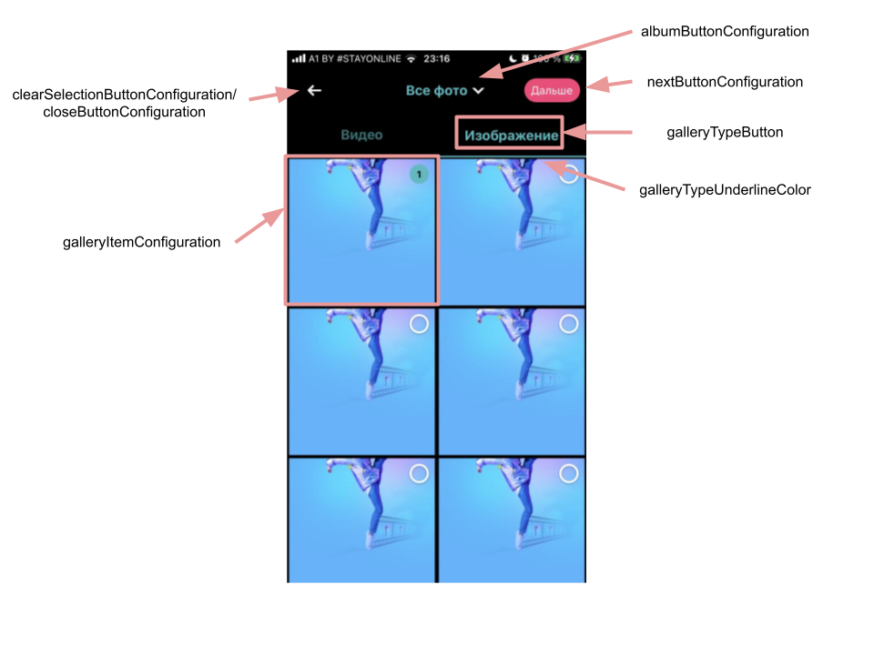

# Banuba VideoEditor SDK
## GalleryConfiguration

The CombinedGallery is used in app when you want to select a photo or video stored on your phone.

Use the properties below to customize the CombinedGallery.

- [videoResolution: VideoResolution](/Example/Example/Extension/CombinedGalleryConfiguration.swift#L7)

VideoResolution setups editor options for rendering video

- [galleryItemConfiguration: GalleryItemConfiguration](/Example/Example/Extension/CombinedGalleryConfiguration.swift#L8)

GalleryItemConfiguration setups gallery item style for collection view cell

- [visibleTabsInGallery: GalleryMediaType](/Example/Example/Extension/CombinedGalleryConfiguration.swift#L25)

GalleryMediaType setups visible tabs for gallery

- [closeButtonConfiguration: ImageButtonConfiguration](/Example/Example/Extension/CombinedGalleryConfiguration.swift#L16)

ImageButtonConfiguration setups close button style

- [albumButtonConfiguration: TextButtonConfiguration](/Example/Example/Extension/CombinedGalleryConfiguration.swift#L16)

TextButtonConfiguration setups album button style

- [collectionInfoHeaderConfiguration: CollectionInfoHeaderConfiguration](/Example/Example/Extension/CombinedGalleryConfiguration.swift#L16)

CollectionInfoHeaderConfiguration setups gallery header view

- [nextButtonConfiguration: SaveButtonConfiguration](/Example/Example/Extension/CombinedGalleryConfiguration.swift#L18)

SaveButtonConfiguration setups next button style

- [draftsButtonConfiguration: SaveButtonConfiguration](/Example/Example/Extension/CombinedGalleryConfiguration.swift#L7)
  
SaveButtonConfiguration setups drafts button style

- [noItemsLabelConfiguration: TextConfiguration](/Example/Example/Extension/CombinedGalleryConfiguration.swift#L19)
  
TextConfiguration setups 'no photos' and 'no videos' label title style

- [layoutConfiguration: GalleryLayoutConfiguration](/Example/Example/Extension/CombinedGalleryConfiguration.swift#L20)
  
GalleryLayoutConfiguration setups collection view layout for gallery items

- [topBarBlurColor: UIColor](/Example/Example/Extension/CombinedGalleryConfiguration.swift#L21)
 
Top bar blur color

- [clearSelectionButtonConfiguration: ImageButtonConfiguration](/Example/Example/Extension/CombinedGalleryConfiguration.swift#L22)
  
ImageButtonConfiguration setups clear selection button style

- [galleryTypeButton: TextButtonConfiguration](/Example/Example/Extension/CombinedGalleryConfiguration.swift#L23)
  
TextButtonConfiguration setups gallery type buttons' style

- [galleryTypeUnderlineColor: UIColor](/Example/Example/Extension/CombinedGalleryConfiguration.swift#L24)
  
Color for underline view

- [isPhotoSequenceAnimationEnabled: Bool](/Example/Example/Extension/CombinedGalleryConfiguration.swift#L7)
  
Should use animation for photo sequences

- [importItemsLabelConfiguration: TextConfiguration](/Example/Example/Extension/CombinedGalleryConfiguration.swift#L7)
  
TextConfiguration setups import items label style

- [bottomViewConfiguration: BackgroundConfiguration](/Example/Example/Extension/CombinedGalleryConfiguration.swift#L7)
  
BackgroundConfiguration setups configuration of bottom view

- [isDraftsHidden: Bool](/Example/Example/Extension/CombinedGalleryConfiguration.swift#L7)
  
Setups drafts button visibility. VE SDK setups this field to true for picker mode displaying and etc

- [visibleTabsInGallery: GalleryMediaType](/Example/Example/Extension/CombinedGalleryConfiguration.swift#L7)
  
Setup visible tabs for gallery
  
- [isCloseButtonHidden: Bool](/Example/Example/Extension/CombinedGalleryConfiguration.swift#L7)
  
Describes if close button hidden
  
- [backgroundColor: UIColor](/Example/Example/Extension/CombinedGalleryConfiguration.swift#L7)
  
Setups view background color

- [maximumSelectedCountFromGallery: Int](/Example/Example/Extension/CombinedGalleryConfiguration.swift#L7)
  
The maximum number of items can be selected from gallery. Default is 50.

## String resources

| Key        |      Value      |   Description |
| ------------- | :----------- | :------------- |
| No matching files found in gallery | No matching files found in gallery | No photo in the combined gallery
| No matching photos found in gallery | No photos found | No photo in gallery
| No matching video found in gallery | No videos found | No video in gallery
| Too much, %d - max number of photos | Too much, %d - max number of photos | User selected too many photos in the gallery
| You can choose %i videos | You can choose %i videos | Shown when the user tries to add a file to import beyond what is possible
| Error loading images | Error loading images | Failed to download photos for slideshow
| Failed to create video | Failed to create video | Failed to export a video
| BanubaVideoEditor.Gallery.ImageTabTitle | Image | Gallery image tab title
| BanubaVideoEditor.Gallery.VideoTabTitle | Video | Gallery video tab title
| BanubaVideoEditor.Gallery.AllPhotosTitle | All Photos | Gallery custom All Photos title
| BanubaVideoEditor.Gallery.RecentPhotosTitle | Recent | Gallery Recent Photos title
| BanubaVideoEditor.Gallery.SelectItems | Select items | Gallery selection hint
| BanubaVideoEditor.Gallery.ImportSingleVideo | Import 1 video | Import single video template
| BanubaVideoEditor.Gallery.ImportMultipleVideos | Import %d videos | Import multiple videos template
| BanubaVideoEditor.Gallery.ImportSingleImage | Import 1 image | Import single image template
| BanubaVideoEditor.Gallery.ImportMultipleImages | Import %d images | Import multiple images template
