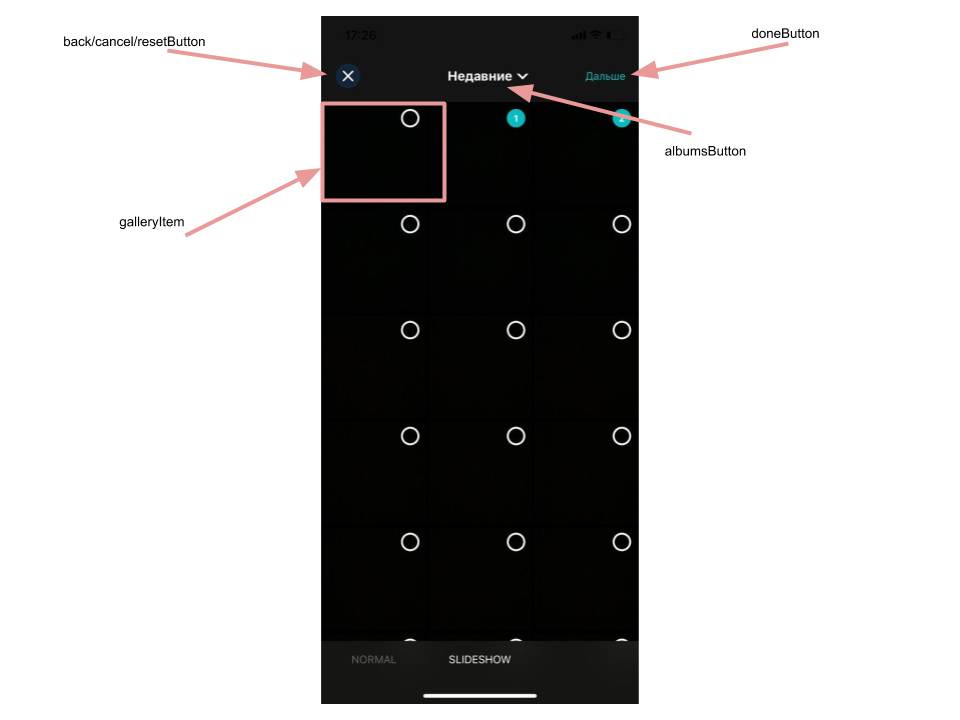

# Banuba VideoEditor SDK
## GalleryConfiguration

- backButtonConfiguration: BackButtonConfiguration

BackButtonConfiguration setups back button style

- titleConfiguration: TextConfiguration

TextConfiguration setups title style

- noVideoFoundTitleConfiguration: TextConfiguration

TextConfiguration setups 'no video' title style

- noVideoFoundSubtitleConfiguration: TextConfiguration

TextConfiguration setups 'no video' subtitle style

- multiselectButtonConfiguration: ImageButtonConfiguration

ImageButtonConfiguration setups multiselect button style

- cancelMultiselectButtonConfiguration: ImageButtonConfiguration

ImageButtonConfiguration setups

- chooseSelectionButtonConfiguration: SaveButtonConfiguration

SaveButtonConfiguration setups done button style

- galleryItemConfiguration: GalleryItemConfiguration

GalleryItemConfiguration setups gallery item style for collection view cell

- layoutConfiguration: GalleryLayoutConfiguration

GalleryLayoutConfiguration setups collection view layout for gallery items

- shouldUseImageEffect: Bool
  
Value provides the ability for enabling animation for slideshow

## SlideShowConfiguration

- videoResolution: VideoResolutionConfiguration

VideoResolutionConfiguration setups editor options for rendering video

- galleryItemConfiguration: GalleryItemConfiguration

GalleryItemConfiguration setups gallery item style for collection view cell

- closeButtonConfiguration: ImageButtonConfiguration

ImageButtonConfiguration setups close button style

- albumButtonConfiguration: TextButtonConfiguration

TextButtonConfiguration setups album button style

- nextButtonConfiguration: SaveButtonConfiguration

SaveButtonConfiguration setups next button style

- noPhotosLabelConfiguration: TextConfiguration

TextConfiguration setups 'no photos' label title style

- layoutConfiguration: GalleryLayoutConfiguration

GalleryLayoutConfiguration setups collection view layout for gallery items

- topBarBlurColor: UIColor

Top bar blur color

- clearSelectionButtonConfiguration: ImageButtonConfiguration

ImageButtonConfiguration setups clear selection button style

