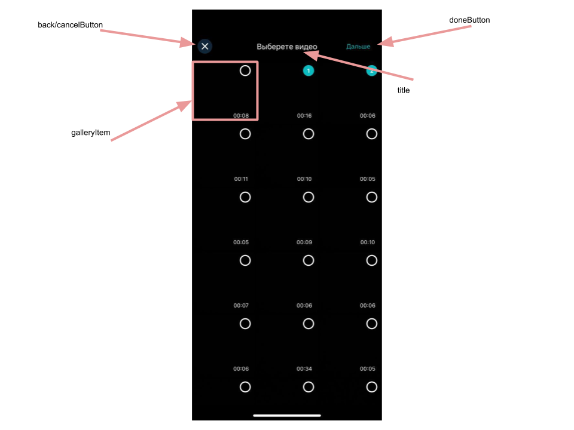

# Banuba VideoEditor SDK
## GalleryConfiguration

- videoResolution: VideoResolution

VideoResolution setups gallery options for fetching video

- galleryItemConfiguration: GalleryItemConfiguration

GalleryItemConfiguration setups gallery item style for collection view cell

- closeButtonConfiguration: ImageButtonConfiguration

ImageButtonConfiguration setups close button style

- albumButtonConfiguration: TextConfiguration

TextButtonConfiguration setups album button style

- nextButtonConfiguration: SaveButtonConfiguration

SaveButtonConfiguration setups next button style

- noItemsLabelConfiguration: TextConfiguration

TextConfiguration setups 'no photos' or 'no videos' label title style

- layoutConfiguration: GalleryLayoutConfiguration

GalleryLayoutConfiguration setups collection view layout for gallery items

- topBarBlurColor: UIColor

Top bar blur color

- clearSelectionButtonConfiguration: ImageButtonConfiguration

ImageButtonConfiguration setups clear selection button style

- galleryTypeButton: TextButtonConfiguration

TextButtonConfiguration setups gallery type buttons' style

- galleryTypeUnderlineColor: UIColor

Color for underline view

- isPhotoSequenceAnimationEnabled: Bool
  
Value provides the ability for enabling animation for slideshow

