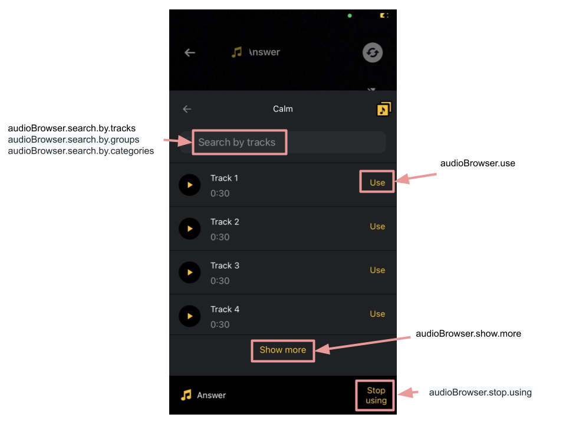
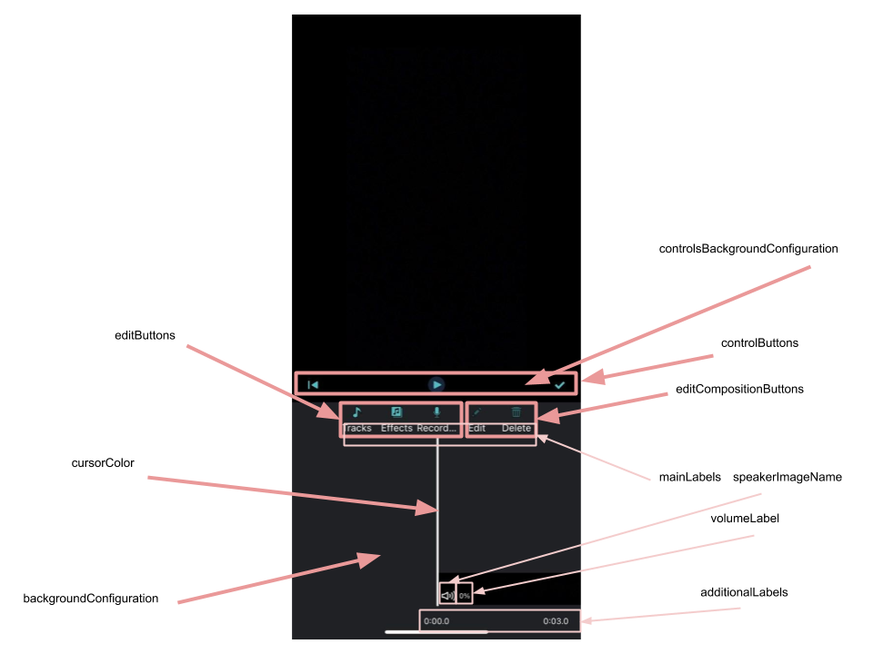
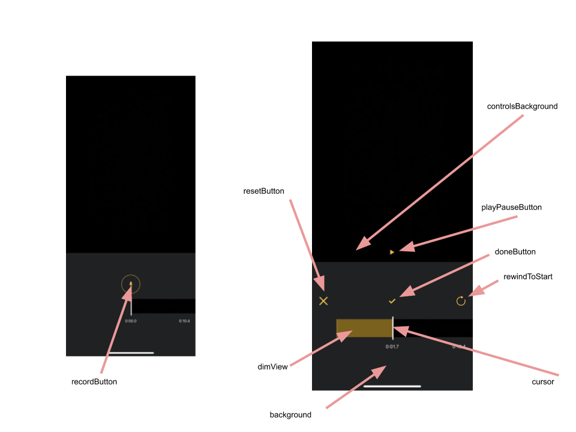
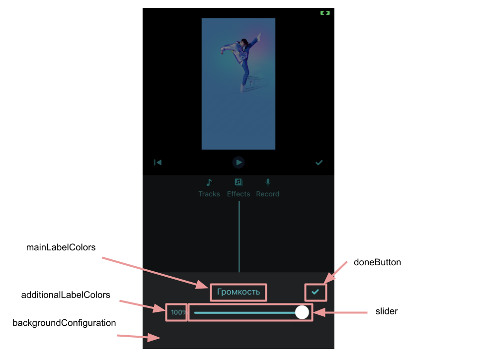
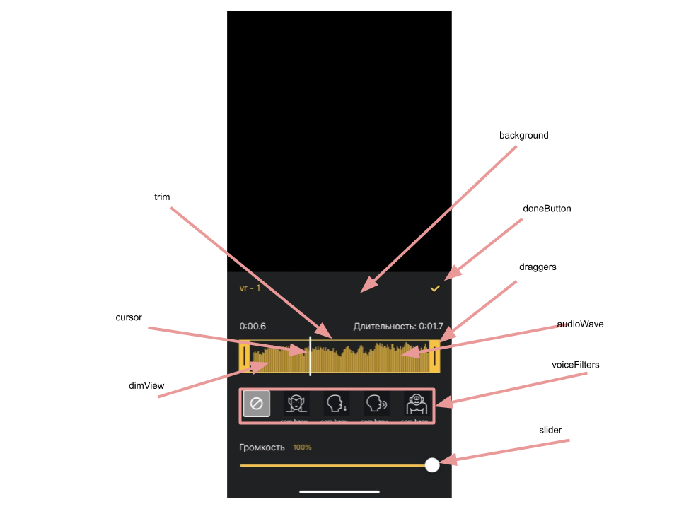
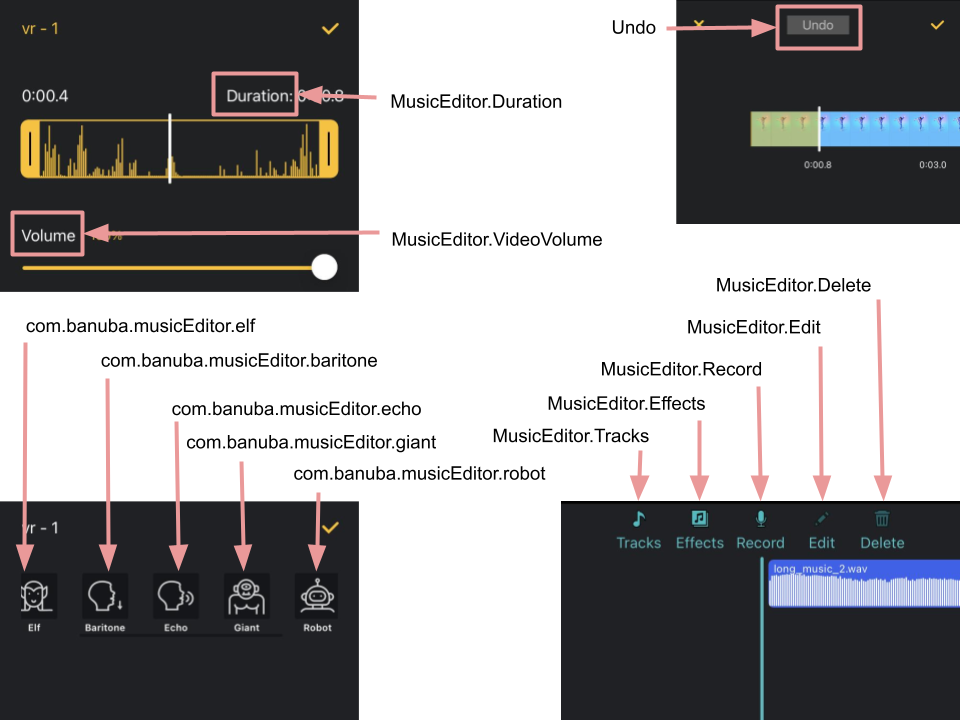

# Audio integration guide

- [Overview](#Overview)
- [Audio Browser](#Audio-Browser)
- [Mubert integration](#Mubert-integration)
- [External API](#External-API)
- [Music Editor screen](#Music-Editor-screen)

## Overview
Audio is a key part of making awesome video content.

Video Editor SDK can play, trim, merge and apply audio content to a video.

:exclamation: Important
1. Banuba does not provide any audio content for Video Editor SDK.
2. Video Editor can apply audio file stored on the device. The SDK is not responsible for downloading audio content except [Mubert](https://mubert.com/)

There are 2 approaches of providing audio content:
1. ```AudioBrowser``` - specific module and a set of screens that includes built in support of browsing and applying audio content within video editor. The user does not leave the sdk while using audio.
2. ```External API``` - the client implements specific API for managing audio content. The user is taken on client's screen when audio is requested.

## Audio Browser
Audio Browser is a specific Android module that allows to browse, play and apply audio content within video editor.  
It supports 2 sources for audio content:
1. ```My Library``` - includes audio content available on the user's device
2. ```Mubert``` - includes built in integration with [Mubert](https://mubert.com/) API.

<p align="center">
&nbsp;
</p>

Add  ```BanubaAudioBrowserSDK``` dependency into your [Podfile](../Example/Podfile#L13)
```swift
pod 'BanubaAudioBrowserSDK', banuba_sdk_version
```



| Key        |      Value      |   Description |
| ------------- | :----------- | :------------- |
| AudioBrowser.noInternetConnection | No internet connection | No internet connection title in alert
| AudioBrowser.checkConnectionMessage | Please, check your connection and try again | Message for user if No internet connection
| AudioBrowser.retry | Retry | Retry button title
| AudioBrowser.allowAccessMessage | To use your own music, allow access to Apple Music library, please. | Allow access message
| AudioBrowser.allowAccess | Allow Access | Allow button title
| AudioBrowser.myFiles | My Files | My files button title
| audioBrowser.search.by.categories | Search by categories | Search by category placeholder text
| audioBrowser.search.by.groups | Search by groups | Search by groups placeholder text
| audioBrowser.search.by.tracks | Search by tracks | Search by tracks placeholder text
| audioBrowser.use | Use | Use button title
| audioBrowser.show.more | Show more | Show more button title
| audioBrowser.stop.using | Stop using | Stop using button title
| audioBrowser.my.library | My library | My library button title
| audioBrowser.no.matches | No matches | No matches placeholder text
| audioBrowser.no.tracks | No tracks | No tracks placeholder text

## Mubert integration
Audio Browser has built in integration with [Mubert](https://mubert.com/) API.  
Please contact Mubert representatives to request API KEY.

Set Mubert API key by using ```BanubaAudioBrowser.setMubertPat``` method. For example in [VideoEditorModule](../Example/Example/VideoEditorModule.swift#L53).
```Swift
BanubaAudioBrowser.setMubertPat("SET MUBERT API KEY")
```

IN PROGRESS... Describe how to change configs for Mubert and customize UI

## External API
Video Editor includes special API for integrating your custom audio content provider and applying this content in video editor.   
The user will be taken to your app specific screen when audio is requested on video editor screen i.e. camera or editor.
Next, once the user picks audio content on your app screen you need to follow API and return the user to video editor.  
Any audio file should stored on the device before applying.

IN PROGRESS...
To pass audio content to Video Editor SDK you have to implement a factory that conforms ```MusicEditorExternalViewControllerFactory``` protocol. And put it to ```musicEditorFactory``` property in [ExternalViewControllerFactory](../Example/Example/ViewController.swift#L24). Your factory should contain the following methods:

```swift
// MARK: - External Audio Browser Factory
protocol MusicEditorExternalViewControllerFactory: AnyObject {
  /// contoller which will be used for presenting otherwise makeTrackSelectionViewController will be used
  var audioBrowserController: TrackSelectionViewController? { get set }

  /// should returns controller which provides audio content for Video Editor SDK
  /// - selectedAudioItem is currently selected audio item
  func makeTrackSelectionViewController(selectedAudioItem: AudioItem?) -> TrackSelectionViewController?
  /// should returns controller which provides effects audio content for Video Editor SDK
  /// Note: MainMusicViewControllerConfig should contains editButton with type .effect
  func makeEffectSelectionViewController(selectedAudioItem: AudioItem?) -> EffectSelectionViewController?
  /// should returns view for countdown animation in record button at music editor
  func makeRecorderCountdownAnimatableView() -> MusicEditorCountdownAnimatableView?
}
```
Where ```AudioItem``` is entity contains information about selected audio item in Video Editor SDK:
```swift
// MARK: - AudioItem protocol
protocol AudioItem {
  var id: Int64 { get }
  var url: URL { get }
  var title: String? { get set }
  /// True - display track with which the video was recorded and allow users to edit it.
  /// False - track will be playing but not displayed.
  var isEditable: Bool { get set }
}
```

Your custom audio browser should conforms the following protocol:
```swift
protocol TrackSelectionViewController: UIViewController {
  var trackSelectionDelegate: TrackSelectionViewControllerDelegate? { get set }
}
```
Using ```trackSelectionDelegate``` you can notify Video Editor SDK about actions at audio browser with following methods:
```swift
// MARK: - TrackSelectionViewController
protocol TrackSelectionViewControllerDelegate: AnyObject {
  func trackSelectionViewController(
    viewController: TrackSelectionViewController,
    didSelectFile url: URL,
    isEditable: Bool,
    title: String,
    /// The id parameter should be a Int32 number from 6 to it's maximum value
    id: Int32
  )
  
  func trackSelectionViewControllerDidCancel(
    viewController: TrackSelectionViewController
  )
  
  func trackSelectionViewController(
    viewController: TrackSelectionViewController,
    didStopUsingTrackWithId trackId: Int32
  )
}
```

**NOTE: The Video Editor SDK is not responsible for providing audio content. The client has to implement an integration with an audio content provider.
The Video Editor SDK can't download music from external storage and import music tracks from Apple Music.**

If you want to pass music from Apple Music to Video Editor SDK you have to export media to temporary directory then pass music url to Video Editor SDK using ```trackSelectionDelegate```. There is example how to export music from Apple Music:
```swift
let asset = AVURLAsset(url: url)
let destination = FileManager.default
  .temporaryDirectory
  .appendingPathComponent("\(NSUUID().uuidString).caf")
let exportSession = AVAssetExportSession(asset: asset, presetName: AVAssetExportPresetPassthrough)
exportSession?.outputURL = destination
exportSession?.outputFileType = AVFileType.caf
exportSession?.exportAsynchronously() {
  if let error = exportSession?.error {
    completion(nil, error as NSError)
  } else {
    completion(destination, nil)
  }
}
```


## Music Editor screen
Video Editor includes Music Editor screens. These are screens where the user can adjust usage of audio in video editor i.e. trim, add new, delete.
Music Editor includes voice recording feature as well. 

Below is a list of styles and attributes you can customize to meet your requirements.

- [mainMusicViewControllerConfig](/Example/Example/VideoEditorModule.swift#L471)

MainMusicViewControllerConfig setups main screen style

- [videoTrackLineEditControllerConfig](/Example/Example/VideoEditorModule.swift#L474)

VideoTrackLineEditViewControllerConfig setups video track line editing screen style

- [audioTrackLineEditControllerConfig](/Example/Example/VideoEditorModule.swift#L473)

VideoTrackLineEditViewControllerConfig setups audio track line editing screen style

- [audioRecorderViewControllerConfig](/Example/Example/VideoEditorModule.swift#L472)

AudioRecorderViewControllerConfig setups audio recorder style

- [editButtons](/Example/Example/VideoEditorModule.swift#L482)

Array of adding buttons

- [editButtonsHeight](/Example/Example/VideoEditorModule.swift#L513)

Adding buttons container height

- [editCompositionButtons](/Example/Example/VideoEditorModule.swift#L515)

Array of edit composition buttons

- [controlButtons](/Example/Example/VideoEditorModule.swift#L164)

Aray of control buttons

- [playerControlsHeight](/Example/Example/VideoEditorModule.swift#L202)

Сontrol buttons container height

- [audioWaveConfiguration](/Example/Example/VideoEditorModule.swift#L207)

AudioWaveConfiguration setups audio wave style

- [mainLabelColors](/Example/Example/VideoEditorModule.swift#L562)

Color for main titles color

- [additionalLabelColors](/Example/Example/VideoEditorModule.swift#L563)

Color for additional titles color

- [tracksLimit](/Example/Example/VideoEditorModule.swift#L566)

Number of maximum tracks

- [cursorColor](/Example/Example/VideoEditorModule.swift#L567)

Cursor color

- [controlsBackgroundConfiguration](/Example/Example/VideoEditorModule.swift#L568)

BackgroundConfiguration setups controls container background style

- [backgroundConfiguration](/Example/Example/VideoEditorModule.swift#L569)

BackgroundConfiguration setups main view background style

- [timelineCornerRadius](/Example/Example/VideoEditorModule.swift#L570)

Time line corner radius

- [previewViewBackgroundConfiguration](/Example/Example/VideoEditorModule.swift#L572)

BackgroundConfiguration setups preview view background style

- [videoControlsViewBackgroundConfiguration](/Example/Example/VideoEditorModule.swift#L572)

BackgroundConfiguration setups video controls view background style

- [alertConfig](/Example/Example/VideoEditorModule.swift#L572)

Configuration for alertView



- [rewindToStartButton?](/Example/Example/VideoEditorModule.swift#L578)

ControlButtonConfig setups rewind to start button

- [playPauseButton](/Example/Example/VideoEditorModule.swift#L584)

ControlButtonConfig setups play pause button

- [playerControlsHeight](/Example/Example/VideoEditorModule.swift#L590)

Player controls height

- [recordButton](/Example/Example/VideoEditorModule.swift#L592)

ControlButtonConfig setups record button

- [backButtonImage](/Example/Example/VideoEditorModule.swift#L598)

Image name setups back button UIImage

- [doneButtonImage](/Example/Example/VideoEditorModule.swift#L599)

 Image name setups done button UIImage

- [dimViewColor](/Example/Example/VideoEditorModule.swift#L600)

Dim view color

- [additionalLabelColors](/Example/Example/VideoEditorModule.swift#L601)

Additional labels color

- [startingRecordingTimerSeconds](/Example/Example/VideoEditorModule.swift#L602)

Countdown to start recording

- [timerColor](/Example/Example/VideoEditorModule.swift#L603)

Timer color

- [cursorColor](/Example/Example/VideoEditorModule.swift#L604)

Cursor color

- [backgroundConfiguration](/Example/Example/VideoEditorModule.swift#L605)

BackgroundConfiguration setups background view

- [playerControlsBackgroundConfiguration](/Example/Example/VideoEditorModule.swift#L606)

BackgroundConfiguration setups player controls background view

- [timelineCornerRadius](/Example/Example/VideoEditorModule.swift#L607)

Time line corner radius

- [resetButton](/Example/Example/VideoEditorModule.swift#L609)

RoundedButtonConfiguration setups reset button style



- [doneButtonImageName](/Example/Example/VideoEditorModule.swift#L615)

Image name setups done button UIImage

- [doneButtonTintColor](/Example/Example/VideoEditorModule.swift#L616)

Done button tint color

- [sliderTintColor](/Example/Example/VideoEditorModule.swift#L617)

Slider tint color

- [mainLabelColors](/Example/Example/VideoEditorModule.swift#L618)

Main labels color

- [additionalLabelColors](/Example/Example/VideoEditorModule.swift#L619)

Additional labels colors

- [backgroundConfiguration](/Example/Example/VideoEditorModule.swift#L620)

BackgroundConfiguration setups background view

- [height](/Example/Example/VideoEditorModule.swift#L621)

Pop-up screen's height



- [audioWaveConfiguration](/Example/Example/VideoEditorModule.swift#L628)

AudioWaveConfiguration setups audio wave style

- [doneButtonImageName](/Example/Example/VideoEditorModule.swift#L630)

Image name setups done buttom UIImage

- [doneButtonTintColor](/Example/Example/VideoEditorModule.swift#L631)

Done button tint color

- [sliderTintColor](/Example/Example/VideoEditorModule.swift#L632)

Slider tint color

- [draggersColor](/Example/Example/VideoEditorModule.swift#L633)

Draggers background color

- [draggerImageName](/Example/Example/VideoEditorModule.swift#L634)

Image name setups draggers additional UIImage

- [trimHeight](/Example/Example/VideoEditorModule.swift#L635)

Trim container heught

- [trimBorderColor](/Example/Example/VideoEditorModule.swift#L636)

Trim container border lines color

- [trimBorderWidth](/Example/Example/VideoEditorModule.swift#L637)

Trim container border lines width

- [cursorHeight](/Example/Example/VideoEditorModule.swift#L638)

Cursor height

- [dimViewColor](/Example/Example/VideoEditorModule.swift#L639)

Dim view background color

- [mainLabelColors](/Example/Example/VideoEditorModule.swift#L163)

Main labels' title color

- [additionalLabelColors](/Example/Example/VideoEditorModule.swift#L640)

Additional labels' title color

- [cursorColor](/Example/Example/VideoEditorModule.swift#L642)

Cursor background color

- [draggersWidth](/Example/Example/VideoEditorModule.swift#L643)

Draggers' view width

- [draggersLineColor](/Example/Example/VideoEditorModule.swift#L167)

Draggers' central line view color

- [draggersCornerRadius](/Example/Example/VideoEditorModule.swift#L644)

Draggers' view corner radius

- [draggersLineWidth](/Example/Example/VideoEditorModule.swift#L646)

Draggers' central line view width

- [draggersLineHeight](/Example/Example/VideoEditorModule.swift#L647)

Draggers' central line view height

- [numberOfLinesInDraggers](/Example/Example/VideoEditorModule.swift#L648)

Number of draggers' central lines

- [draggerLinesSpacing](/Example/Example/VideoEditorModule.swift#L649)

Draggers' central lines spacing

- [draggersLineCornerRadius](/Example/Example/VideoEditorModule.swift#L649)

Draggers' central lines corner radius

- [backgroundConfiguration](/Example/Example/VideoEditorModule.swift#L651)

BackgroundConfiguration setups common container view background style

- [voiceFilterConfiguration](/Example/Example/VideoEditorModule.swift#L652)

VoiceFilterConfiguration seups voice filter container view item style

- [voiceFilterProvider](/Example/Example/VideoEditorModule.swift#L475)

VoiceFilterProvider setups voice filters provider

- [isVoiceFilterHidden](/Example/Example/VideoEditorModule.swift#L476)

Voice Filter will be hidden if voiceFilterProvider is nil
 
- [isRandomWaveColor](/Example/Example/VideoEditorModule.swift#L628)

Is random wave color enabled
  
- [backgroundColor](/Example/Example/VideoEditorModule.swift#L628)
  
Background color view
  
- [waveBorderColor](/Example/Example/VideoEditorModule.swift#L628)

Time line border color
  
- [waveCornerRadius](/Example/Example/VideoEditorModule.swift#L628)

Time lime corner radius
  
- [waveLinesColor](/Example/Example/VideoEditorModule.swift#L628)

Audio wave lines color
 
- [borderWidth](/Example/Example/VideoEditorModule.swift#L628)

Time line border width
  
- [height](/Example/Example/VideoEditorModule.swift#L628)

Time line height
  
- [maxWaveHeight](/Example/Example/VideoEditorModule.swift#L628)
  
Max audio wave height
  
- [audioTitleFont](/Example/Example/VideoEditorModule.swift#L628)

Audio title font
  
- [audioTitleColor](/Example/Example/VideoEditorModule.swift#L628)

Audio title color
  
- [bottomOffset](/Example/Example/VideoEditorModule.swift#L628)

Time line bottom offset



And you can customize string resources as well.



| Key        |      Value      |   Description |
| ------------- | :----------- | :------------- |
| MusicEditor.Delete | Delete | Delete track button title
| MusicEditor.Volume | Volume | Edit track volume button title
| MusicEditor.VoiceEffect | Effect | Voice effect button title
| MusicEditor.Edit | Edit | Edit track button title
| MusicEditor.Tracks | Tracks | Add track button title
| MusicEditor.Effects | Effects | Add effects button title
| MusicEditor.Record | Record | Add voice record button title
| MusicEditor.VideoVolume | Volume | Video volume title
| MusicEditor.Duration | Duration | Audio duration title
| MusicEditor.Cancel | Cancel | Cancel button title
| MusicEditor.Yes | Yes | Confirmation button title
| MusicEditor.No | No | Discarding button title
| com.banuba.musicEditor.mainScreen.resetAll.title | Discard changes? | Confirmation message for discarding changes
| MusicEditor.Max available tracks - %i | Max available tracks - %i | Error message when a user tries to add tracks with reached limit
| com.banuba.musicEditor.elf | Elf | Elf filter title
| com.banuba.musicEditor.baritone | Baritone | Baritone filter title
| com.banuba.musicEditor.echo | Echo | Echo filter title
| com.banuba.musicEditor.giant | Giant | Giant filter title
| com.banuba.musicEditor.robot | Robot | Robot filter title
| com.banuba.musicEditor.squirrel | Squirrel | Squirrel filter title
| Undo | Undo | Undo applied to video in the add sound screen
