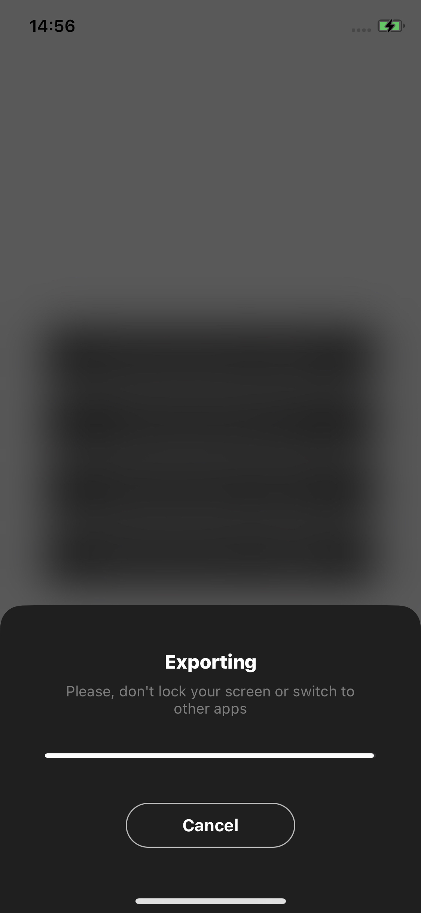
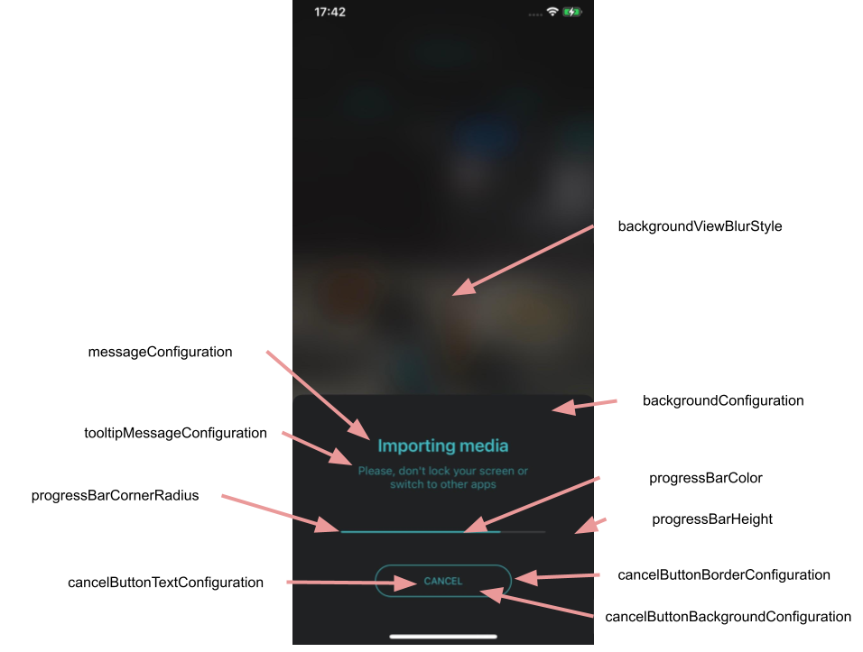

# Export guide

- [Overview](#Overview)
- [Video codecs](#Video-codecs)
- [Video quality](#Video-quality)
- [Export storage](#Export-storage)
- [Implement export flow](#Implement-export-flow)
- [Handle export result](#Handle-export-result)
- [Progress screen](#Progress-screen)
- [Add watermark](#Add-watermark)
- [Export GIF preview](#Export-GIF-preview)
- [Get audio used in export](#Get-audio-used-in-export)
- [Export metadata analytics](#Export-metadata-analytics)

## Overview
You can export a number of media files i.e. video and audio with various resolutions and other configurations.
Video Editor exports video as ```.mp4``` file.

>:exclamation: **Note:**  
Export is a very heavy computational task that takes time and the user has to wait.
Execution time depends on
1. Video duration - the longer video the longer execution time.
2. Number of video sources - the many sources the longer execution time.
3. Number of effects and their usage in video - the more effects and their usage the longer execution time.
4. Number of exported video - the more video and audio you want to export the longer execution time.
5. Device hardware - the most powerful devices can execute export much quicker.

Export only supports ```Foreground``` mode where the user has to wait on progress screen until processing is done.  
```Background``` export is not allowed on iOS due to [iOS Restrictions](https://developer.apple.com/documentation/metal/gpu_devices_and_work_submission/preparing_your_metal_app_to_run_in_the_background)

Here is a screen that is shown in ```Foreground``` mode.
<p align="center">

</p>

## Video codecs
Video Editor supports video codec options:
1. ```HEVC``` - H265 codec. ```Default``` if the device supports this codec
2. ```AVC_PROFILES``` - H264 codec with High Profile

You can change video codec for export by using ```ExportVideoConfiguration.useHEVCCodecIfPossible``` property. 
In this example, the H264 is set in [VideoEditorModule](../Example/Example/VideoEditorModule.swift#L60).

```diff
    let exportConfiguration = ExportVideoConfiguration(
          fileURL: destFile,
          quality: .auto,
+          useHEVCCodecIfPossible: false,
          watermarkConfiguration: watermarkConfiguration
        )
```

## Video quality

| 360p(360x640) | 480p(480x854) | QHD540(540x960) | HD(720x1280) | FHD(1080x1920) | QHD(1440x2560) | UHD(2160x3840) |
|----|---------------|-----------------|--------------|----------------|----------------|----------------|
| 1000  kb/s    | 2500 kb/s     | 3000  kb/s      | 5000   kb/s  | 8000 kb/s      | 16000    kb/s  | 36000  kb/s    |

Video Editor has built-in feature for detecting device performance capabilities and finding optimal video quality params for export.
You can provide custom video resolution for exported video by using ```ExportVideoConfiguration.quality``` property.
```diff
  let hdExportConfiguration = ExportVideoConfiguration(
    fileURL: destFile,
+    quality: .videoConfiguration(ExportVideoInfo(resolution: .hd1280x720, useHEVCCodecIfPossible: true)),
    useHEVCCodecIfPossible: true,
    watermarkConfiguration: watermarkConfiguration
)
```

## Export storage
Video Editor export method requires file destination where exported video will be stored.
First, create destination file
```swift
let manager = FileManager.default
let destFile = manager.temporaryDirectory.appendingPathComponent("tmp.mov")
```
and use it in ```ExportVideoConfiguration```
```diff
  let hdExportConfiguration = ExportVideoConfiguration(
+    fileURL: destFile,
    quality: .videoConfiguration(ExportVideoInfo(resolution: .hd1280x720, useHEVCCodecIfPossible: true)),
    useHEVCCodecIfPossible: true,
    watermarkConfiguration: watermarkConfiguration
)
```

## Implement export flow
You can create your own flow for exporting media files for your application.

Use ```ExportConfiguration``` to create instance with configurations that meet your product requirements.

Below is a sample that export 2 video files:
1. video with auto resolution without watermark
2. video with HD resolution with watermark

```Swift
let watermarkConfiguration = WatermarkConfiguration(
    watermark: ImageConfiguration(imageName: "Common.Banuba.Watermark"),
    size: CGSize(width: 204, height: 52),
    sharedOffset: 20,
    position: .rightBottom
)
        
let autoExportConfiguration = ExportVideoConfiguration(
    fileURL: destFile1,
    quality: .auto,
    useHEVCCodecIfPossible: true,
    watermarkConfiguration: nil
)

let hdExportConfiguration = ExportVideoConfiguration(
    fileURL: destFile2,
    quality: .videoConfiguration(ExportVideoInfo(resolution: .hd1280x720, useHEVCCodecIfPossible: true)),
    useHEVCCodecIfPossible: true,
    watermarkConfiguration: watermarkConfiguration
)
        
let exportConfig = ExportConfiguration(
    videoConfigurations: [autoExportConfiguration, hdExportConfiguration],
    isCoverEnabled: true,
    gifSettings: nil
)
```

Use created ```ExportConfiguration``` to start export by using  ```BanubaVideoEditor.export()``` method
```Swift
public func export(
    using configuration: ExportConfiguration,
    exportProgress: ((TimeInterval) -> Void)?,
    completion: @escaping ((_ error: Error?, _ exportCoverImages: ExportCoverImages?) -> Void)
)
``` 

## Handle export result
Method ```BanubaVideoEditor.export()``` allows either start export and track the result.  
Provide
1. ```ExportConfiguration``` where you set up all required media content you want to make
2. ```exportProgress``` - callback that gets called when export progress changes. Values are 0.0-1.0
3. ```completion```- callback that gets called when export finishes with an error or not.
```swift
videoEditorSDK?.export(
      using: exportConfiguration,
      exportProgress: { progress in
        DispatchQueue.main.async {
          // Export is in progress. You can show progress view. Progress is 0.0 - 1.0
          ...
        }
      },
      completion: { [weak self] error, exportCoverImages in
        DispatchQueue.main.async {
            // Export finishes. Use 'error' value to detect the state of export.
            // Hide progress view
        
            // You can clear exported session if you do no need it anymore
            //self?.videoEditorSDK?.clearSessionData()
        }
```
> :bulb: If export finishes successfully you can use instance of ```ExportConfiguration``` as a result and access media files and its metadata.
## Progress screen

```ProgressViewController``` is shown while exporting media files.



You can change appearance of this screen by overriding these styles and resources.

```ProgressViewConfiguration``` has the following parameters

| Property |           Values           | Description |
| ------------- |:--------------------------:| :------------- |
| messageConfiguration |     TextConfiguration      | Setups configuration for message
| tooltipMessageConfiguration |     TextConfiguration      | Setups configuration for tooltip message
| cancelButtonTextConfiguration |  TextButtonConfiguration   | Setups cancel button text configuration
| cancelButtonBorderConfiguration | BorderButtonConfiguration  | Setups cancel button border configuration
| cancelButtonBackgroundConfiguration |  BackgroundConfiguration   | Setups cancel button background configuration
| backgroundConfiguration |  BackgroundConfiguration   | Background configuration
| backgroundViewBlurStyle |     UIBlurEffect.Style     | Background view blur style. Default is .dark
| progressBarColor |          UIColor           | Setups progress bar color
| progressBarHeight | CGFloat; Default ```4.0``` | Setups progress bar height
| progressBarCornerRadius | CGFloat; Default ```1.0``` | Setups progress bar corner radius
 

The following string resources are used however you can customize them.

| Key        |      Value      |   Description |
| ------------- | :----------- | :------------- |
| com.banuba.alert.progressView.disagreeButtonTitle | Cancel | Ability to cancel
| com.banuba.alert.progressView.exportingVideo | Exporting video | Exporting video message
| com.banuba.alert.progressView.tooltipMessage | Please, don't lock your screen or switch to other apps | Tooltip message for a user
| com.banuba.alert.progressView.exportVideoInterrupted | Export interrupted | Message about error interrupting export process


## Add watermark
:exclamation: Important  
Watermark is not added to exported video by default.

You can use your custom watermark for a video. First, create instance of ```WatermarkConfiguration``` to
```swift
    let watermarkConfiguration = WatermarkConfiguration(
         watermark: ImageConfiguration(imageName: "Common.Banuba.Watermark"),
         size: CGSize(width: 204, height: 52),
         sharedOffset: 20,
         position: .rightBottom)
```
where ```position``` is used where for locating watermark image in a video
```swfit
     public enum WatermarkPosition {
            case leftTop
            case leftBottom
            case rightTop
            case rightBottom
    }
```
Next, set ```watermarkConfiguration``` to every instance of ```ExportVideoConfiguration``` where you want to add watermark 
in [VideoEditorModule](../Example/Example/VideoEditorModule.swift#L61).
```diff
    let hdExportConfiguration = ExportVideoConfiguration(
          fileURL: destFile,
          quality: .hd1280x720,
          useHEVCCodecIfPossible: true,
+          watermarkConfiguration: watermarkConfiguration
    )
```

## Export GIF preview
Video Editor allows to export preview of a video as a GIF file.  
Instance of ```GifSettings``` is required in ```ExportConfiguration``` to export  preview 
in export. You can specify this property in [VideoEditorModule](../Example/Example/VideoEditorModule.swift#L67)

```diff
 let exportConfig = ExportConfiguration(
    videoConfigurations: [exportConfiguration],
    isCoverEnabled: true,
+    gifSettings: GifSettings(duration: 0.3)
 )
```

## Get audio used in export
You can get all audio used in exported video when export finished successfully.  

Use ```BanubaVideoEditor.exportAudio()``` method to export audio file

```Swift
public func exportAudio(
    fileUrl: URL,
    audioSettings: [String: Any] = VESettings.audio,
    completion: @escaping (Bool, Error?) -> Void
)
```
>:bulb: Learn available options in [Apple Developer Portal](https://developer.apple.com/documentation/avfoundation/audio_settings) to provide custom audio quality settings.

## Export metadata analytics
Video Editor generates simple metadata analytics while exporting media content that you can use to analyze what media content your users make.
 
Metadata is a JSON string and can be once export finishes successfully.
```swift
let metadataJson: String? = videoEditorSDK?.metadata?.analyticsMetadataJSON
```
Sample JSON
```JSON
{
  "export_success": true, // defines if the export finished succesffully
  "aspect_ratio": "original", // aspect ration used in exported video
  "video_resolutions": ["1080x1920"], // list of video resolutions used in export
  "camera_effects": [], // list of effects of features used on camera screen while recording video
  "ppt_effects": {
    "visual": 2, // num of visual effects i.e. Glitch, VHS used in exported video
    "speed": 1, //  num of speed effects used in exported video
    "mask": 6, // num of AR masks used in exported video
    "color": 3, // num of color effects used in exported video
    "text": 1, // num of text effects used in exported video
    "sticker": 1, // num of sticker effects used in exported video
    "blur": 1 // num of blur effects used in exported video
  },
  "sources": {
    "camera": 0, // num of video sources recorded on camera screen(not PIP)
    "gallery": 1, // num of video sources selected in the gallery
    "pip": 0, // num of video recorded with PIP
    "slideshow": 0, // num of video exported as slideshow
    "audio": 0 // num of audi tracks
  },
  "export_duration": 12.645, // export processing duration
  "video_duration": 20.11, // exported video duration
  "video_count": 1, // num of exported video files
  "os_version": "11", // OS version
  "sdk_version": "1.26.6" // VE SDK version
}
```
