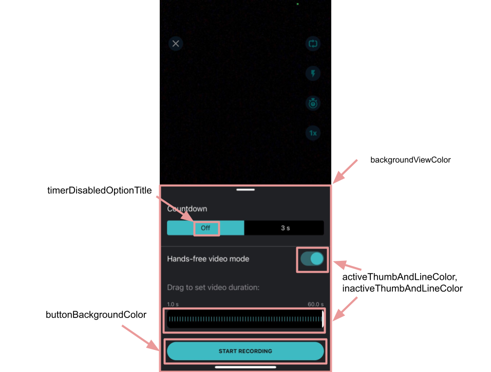
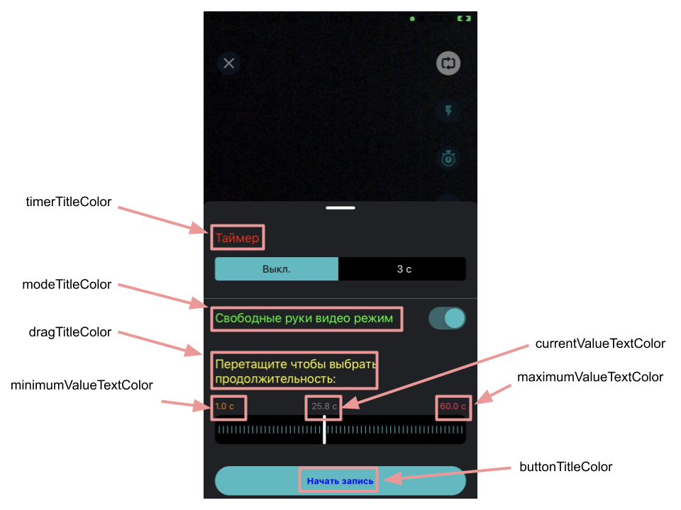
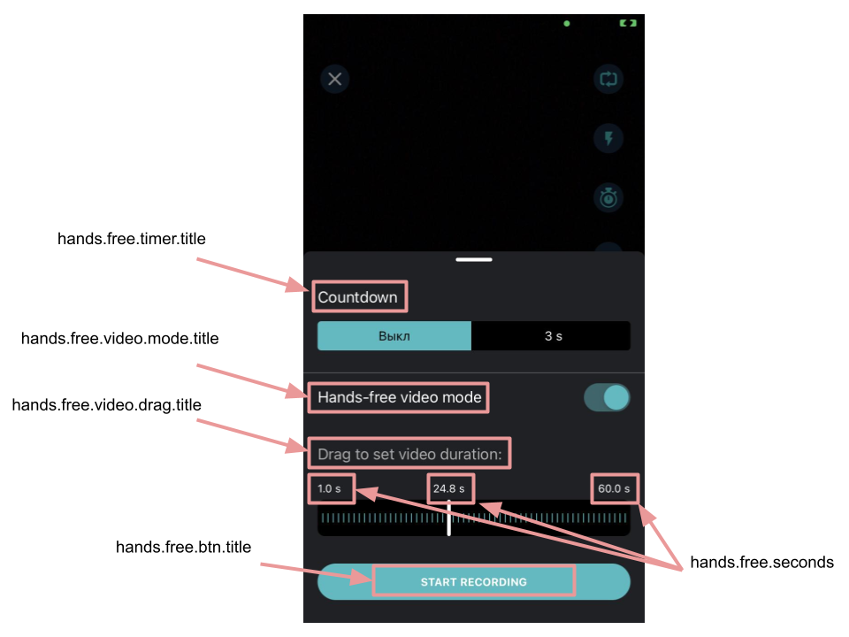
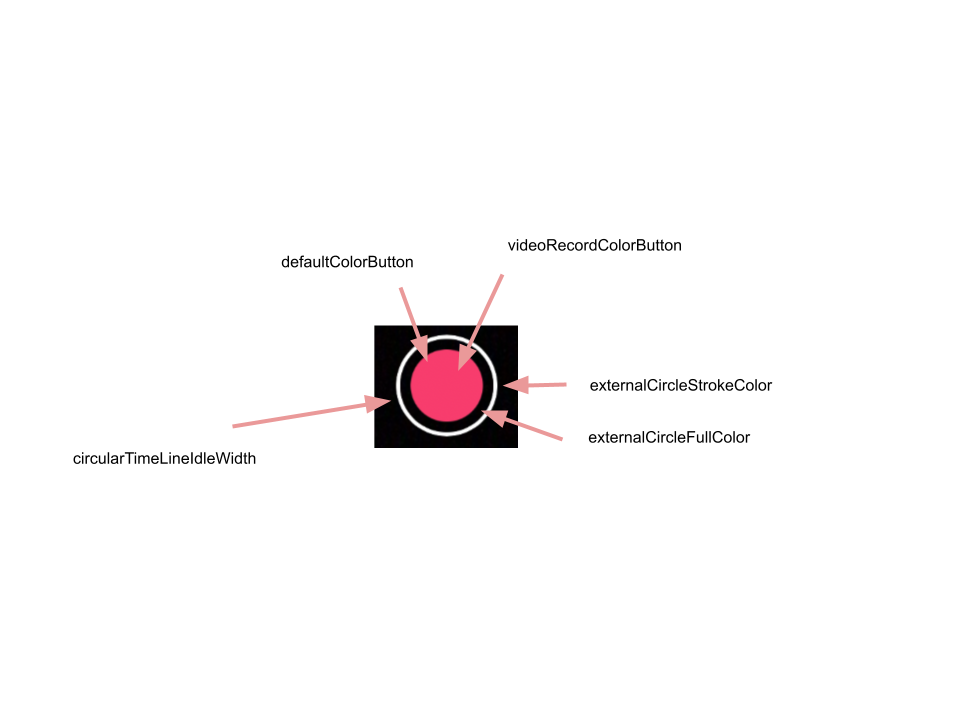

# Video recording integration guide

- [Quality details](#Quality-details)
- [Implement configurations](#Implement-configurations)
- [Configure microphone state](#Configure-microphone-state)
- [Configure recording modes](#Configure-recording-modes)
- [Configure timer](#Configure-timer)
- [Configure hands free](#Configure-hands-free)
- [Configure record button appearance](#Configure-record-button-appearance)
- [Picture in picture](#Picture-in-picture)
- [Configure camera screen appearance](#Configure-camera-screen-appearance)

## Quality details
Subsequent table describes video quality details used for video recording in various resolutions with h264 codec.
If h265(HEVC) codec is used for recording video the values listed below will be reduced by approximately 15%.

| Recording speed | 360p(360 x 640) | 480p(480 x 854) | 540p(540 x 960) |  HD(720 x 1280) | FHD(1080 x 1920) |
| --------------- | --------------- | --------------- | --------------- | --------------- | ---------------- |
| 1x(Default)     | 1000             | 2500            | 3000            | 5000            | 8000             |
| 0.5x            | 1000             | 2500            | 3000            | 5000            | 8000             |
| 2x              | 1000             | 2500            | 3000            | 5000            | 8000             |
| 3x              | 1000             | 2500            | 3000            | 5000            | 8000             |  

## Implement configurations
```VideoEditorConfig``` is the core class used for customizing all features in Video Editor SDK.
The class includes many internal config classes that are very useful if you want to create your custom experience.  

The SDK includes default implementations for all configuration classes however you can customize them
and provide your own implementations to meet your requirements in [VideoEditorModule](../Example/Example/VideoEditorModule.swift#L50).  

```RecorderConfiguration``` is the main configuration class in ```VideoEditorConfig``` and is used for video recording functionality.

| Property |               Values                | Description |
| ------------- |:-----------------------------------:| :------------- |
| videoResolution |    VideoResolutionConfiguration     | defines resolution configuration for video recording
| loopAudioWhileRecording |      Bool; Default  ```true```      | defines if audio used in video recording should be looped
| isDynamicMusicTitle |      Bool; Default ```false```      | defines if the music title on the screen changes when new track is applied
| isDefaultFrontCamera |      Bool; Default ```false```      | set ```true``` if you want to open camera in front mode
| useHEVCCodecIfPossible |      Bool; Default ```true```       | enables H265 codec for recording if it is available on the device
| isPhotoSequenceAnimationEnabled |      Bool; Default ```false```      | Should use animation for photo sequences
| isAudioRateEqualsVideoSpeed |      Bool; Default ```false```      | Applies selected by the user video speed to audio
| isGalleryButtonHidden |      Bool; Default ```false```      | defines if gallery button located at bottom-right should be hidden. ```true``` will hide the button. 
| supportMultiRecords |      Bool; Default ```true```       | defines if the user can record multiple video files

Please [check out](../Example/Example/VideoEditorModule.swift#L870) how to set up custom video resolution for video recording.  

Next very handy config class os ```VideoEditorDurationConfig``` that is responsible for customizing video recording durations.
:exclamation: Important    
All values are in seconds.

| Property |                           Values                            | Description |
| ------------- |:-----------------------------------------------------------:| :------------- |
| maximumVideoDuration |            TimeInterval > 0; Default ```120.0```            | the maximum allowed video duration
| videoDurations | [TimeInterval] not empty; Default  ```[60.0, 30.0, 15.0]``` | array of durations allowed to record video. The user sees a certain button and can change duration by tap. For example,  ```60.0``` means that the user can record multiple video sources with total duration no more than ```60.0``` seconds.
| minimumDurationFromCamera |             TimeInterval > 0; Default ```3.0```             | the minimum allowed video duration required to proceed and open next screen
| minimumDurationFromGallery |             TimeInterval > 0; Default ```0.3```             | the minimum allowed video duration displayed on gallery
| minimumVideoDuration |             TimeInterval > 0; Default ```1.0```             | the minimum allowed video source duration that can be recorded on camera
| minimumTrimmedPartDuration |             TimeInterval > 0; Default ```0.3```             | minimum video source duration that is allowed to trim
| slideshowDuration |             TimeInterval > 0; Default ```0.3```             | slideshow video duration produced by image

In this example, the maximum video recording duration is set to 30 seconds.
```swift
var config = VideoEditorConfig()
config.videoDurationConfiguration.maximumVideoDuration = 30.0
```

And ```FeatureConfiguration``` that helps to customize use of some specific features on camera screen where 
video recording happen.

| Property |          Values           | Description |
| ------------- |:-------------------------:| :------------- |
| isDoubleTapForToggleCameraEnabled | Bool; Default ```false``` | enable switchicng between front and back camera facing by double tap on camera screen
| isMuteCameraAudioEnabled | Bool; Default ```false``` | indicates if mute microphone button is visible on camera screen   
| isSpeedBarEnabled | Bool; Default ```true```  | enables speed selection bar. If bar is disabled speed recording will iterativly switched by tapping
| openAutomaticallyPIPSettingsDropdown | Bool; Default ```false``` | if this property enabled the pip settings drop down view will be presented after opening camera screen


## Configure microphone state
Class ```RecorderConfiguration``` includes ```muteMicrophoneForPIP``` property you can use to mute sound in PIP mode. Default value is ```true```.

```swift
var config = VideoEditorConfig()
config.recorderConfiguration.muteMicrophoneForPIP = false
```

## Configure recording modes
Recording includes 3 modes for recording content implemented in ```captureButtonModes``` in ```RecorderConfiguration``` class.
- ```Photo```
- ```Video```
- ```Photo``` and ```Video```; **Default**

In this example, recording mode is set to ```Video``` only.
```swift
var config = VideoEditorConfig()
config.recorderConfiguration.captureButtonModes = [.video]
```

## Configure timer
This feature allows to take a picture or record a video after some delay.  

```TimerConfiguration``` is the main class used in  ```RecorderConfiguration``` to customize timer functionality.
Implement ```TimerConfiguration.options``` property to provide custom list of timer options.  

In this example, the timer uses 2 options - 3 seconds and 5 seconds delay before to start recording.
Please check out [implementation](../Example/Example/VideoEditorModule.swift#L998) in the sample.
```swift
var config = VideoEditorConfig()
config.recorderConfiguration.timerConfiguration.options = [
  TimerOptionConfiguration(
    button: ImageButtonConfiguration(imageConfiguration: ImageConfiguration(imageName: "camera.time_3")),
    startingTimerSeconds: 3,
    stoppingTimerSeconds: .zero,
    description: "3"
  ),
  TimerOptionConfiguration(
    button: ImageButtonConfiguration(imageConfiguration: ImageConfiguration(imageName: "camera.time_5")),
    startingTimerSeconds: 5,
    stoppingTimerSeconds: .zero,
    description: "5"
  )
]
```

Moreover, you can implement custom countdown animation for time feature as well. 
This sample includes [demo implementation](../Example/Example/Helpers/CountdownTimerViewControllerFactory.swift) 
of countdown animation that you can use and set it to [ViewControllerFactory.countdownTimerViewFactory](../Example/Example/VideoEditorModule.swift#L1113).

```diff
...
let viewControllerFactory = ViewControllerFactory()
+ viewControllerFactory.countdownTimerViewFactory = CountdownTimerViewControllerFactory()
    
videoEditorSDK = BanubaVideoEditor(
  token: AppDelegate.licenseToken,
  configuration: config,
+  externalViewControllerFactory: viewControllerFactory
)
```

## Configure hands free
Hands Free is an advanced timer feature that allows to set up delay before starting of video recording and desired duration for video recording.
The feature is enabled by default.  

Use  ```VideoEditorConfig.isHandfreeEnabled``` property to enable or disable.  
In this example, hands free is disabled.
```swift
var config = VideoEditorConfig()
config.isHandfreeEnabled = false
```

The following properties are useful to customize feature appearance.

- [selectorColor](../Example/Example/VideoEditorModule.swift#L831) - selector view color
- [selectorTextColor](../Example/Example/VideoEditorModule.swift#L832) - selector view text color
- [selectorTextFont](../Example/Example/VideoEditorModule.swift#L855) - selector view text font
- [selectorBorderWidth](../Example/Example/VideoEditorModule.swift#L856) - selector view border width
- [selectorBorderColor](../Example/Example/VideoEditorModule.swift#L857) - selector view border color
- [optionBackgroundColor](../Example/Example/VideoEditorModule.swift#L833) - timer option selection view background color
- [optionCornerRadius](../Example/Example/VideoEditorModule.swift#L834) - timer option selection view corner radius
- [optionTextColor](../Example/Example/VideoEditorModule.swift#L835) - view text color
- [optionTextFont](../Example/Example/VideoEditorModule.swift#L858) - view text font
- [backgroundColor](../Example/Example/VideoEditorModule.swift#L864) - timer option view background color
- [cornerRadius](../Example/Example/VideoEditorModule.swift#L837) - HandsFreeViewController corner radius
- [sliderCornerRadius](../Example/Example/VideoEditorModule.swift#L838) - slider corner radius
- [barCornerRadius](../Example/Example/VideoEditorModule.swift#L839) - bar corner radius
- [selectorEdgeInsets](../Example/Example/VideoEditorModule.swift#L840) - selector views edge insets
- [activeThumbAndLineColor](../Example/Example/VideoEditorModule.swift#L841) - color of the activated switch of active lines in slider
- [inactiveThumbAndLineColor](../Example/Example/VideoEditorModule.swift#L842) - color of the inactivated switch of inactive lines in slider



- [buttonCornerRadius](../Example/Example/VideoEditorModule.swift#L844) - button corner radius
- [buttonBackgroundColor](../Example/Example/VideoEditorModule.swift#L845) - button background color
- [switchOnTintColor](../Example/Example/VideoEditorModule.swift#L846) - switch background color
- [modeTitleColor](../Example/Example/VideoEditorModule.swift#L848) - mode title color
- [dragTitleColor](../Example/Example/VideoEditorModule.swift#L849) - drag title color
- [buttonTitleColor](../Example/Example/VideoEditorModule.swift#L850) - button title color
- [buttonTitleFont](../Example/Example/VideoEditorModule.swift#L860) - button title font
- [dragTitleFont](../Example/Example/VideoEditorModule.swift#L859) - drag title font
- [currentValueTextColor](../Example/Example/VideoEditorModule.swift#L851) - current value text color
- [minimumValueTextColor](../Example/Example/VideoEditorModule.swift#L852) - the minimum value text color
- [maximumValueTextColor](../Example/Example/VideoEditorModule.swift#L852) - the maximum value text color
- [currentValueTextFont](../Example/Example/VideoEditorModule.swift#L861) - current value text font
- [minimumValueTextFont](../Example/Example/VideoEditorModule.swift#L862) - the minimum value text font
- [maximumValueTextFont](../Example/Example/VideoEditorModule.swift#L863) - the maximum value text font
- [thumbLineViewBackgroundColor](../Example/Example/VideoEditorModule.swift#L864) - the thumb line view background color
- [cursorViewColor](../Example/Example/VideoEditorModule.swift#L865) - cursor view color



Below are string resources are used by default for this feature, and you can customize them.


| Key        |      Value      |   Description |
| ------------- | :----------- | :------------- |
| hands.free.timer.title | Сountdown | Timer title text
| hands.free.video.mode.title | Hands-free video mode | Mode title text
| hands.free.video.drag.title | Drag to set video duration: | Drag title text
| hands.free.btn.title | START RECORDING | Start recording button title
| hands.free.seconds | %@ s | Seconds


## Configure record button appearance

The record button is a main UI control on the camera screen which you can fully customize along with animation that is playing on tap.

You can customize default implementation of ```RecordButtonConfiguration```.
```swift
var config = VideoEditorConfig()
config.recorderConfiguration.recordButtonConfiguration.idleStrokeColor = UIColor.white.cgColor
```

All available properties of ```RecordButtonConfiguration```

| Property |          Values           | Description |
| ------------- |:-------------------------:| :------------- |
| idleStrokeColor | CGColor | Color setups record button round color for idle state
| strokeColor | CGColor | Color setups record button round color for capture state
| gradientColors | [CGColor] | Colors setup record button gradient filling colors
| circularTimeLineIdleWidth | CGFloat | Round line width for idle state
| circularTimeLineCaptureWidth | CGFloat | Round line width for record state
| normalImageName | String | Image name setups core image for idle state
| recordImageName | String | Image name setups core image for record state
| photoImageName | String | Image name setups core image for photo state
| width | CGFloat | Record button width
| height | CGFloat | Record button height
| defaultColorButton | UIColor | Setup default colorn
| videoRecordColorButton | UIColor | Setup color for video record state
| takePhotoColorButton | UIColor | Setup color for take a photo state
| externalCircleFullColor | CGColor | Setup full color for external circle
| externalCircleStrokeColor | CGColor | Setup stroke color for external circle



Implement ```RecordButtonProvider```, ```RecordButton```, ```RecordButtonDelegate``` protocols to create your custom recording button experience.

```swift
public protocol RecordButtonProvider {
  func getButton() -> RecordButton
}

public protocol RecordButton: UIView {
  var delegate: RecordButtonDelegate? { get set }
  var configuration: RecordButtonConfiguration? { get set }
  func changeViewToIdleState()
  func changeViewToRecordingState()
}

public protocol RecordButtonDelegate: AnyObject {
    var captureButtonMode: CaptureButtonViewMode { get }
  func recordButtonDidTakePhoto(_ recordButton: RecordButton)
  func recordButtonDidCancelTakePhoto(_ recordButton: RecordButton)
  func recordButtonDidStartVideoRecording(_ recordButton: RecordButton)
  func recordButtonDidStopVideoRecording(_ recordButton: RecordButton)
  func recordButtonDidZoomingVideoRecording(_ recordButton: RecordButton, recognizer: UILongPressGestureRecognizer)
}
``` 
Set new implementation of ```RecordButtonProvider``` to ```RecorderConfiguration.recordButtonProvider```.
```swift
var config = VideoEditorConfig()
config.recorderConfiguration.recordButtonProvider = ...
```

## Picture in picture

Picture in Picture or ```PIP``` is video editing technique that lets you overlay two videos in the same video.
The multi-layer editing effect is perfect for reaction videos, slideshows, product demos, and more. This feature is similar to TikTok duet feature.

<p align="center">

</p>

:exclamation: Important
The feature is disabled by default and can be enabled if the license supports it. Please ask Banuba business representatives to include the feature in your license.

The subsequent guide explains how to start and customize ```PIP```.

First, create ```VideoEditorLaunchConfig``` in [ViewController](../Example/Example/ViewController.swift#L301) 
and provide video content for the feature.

```diff
let launchConfig = VideoEditorLaunchConfig(
        entryPoint: entryPoint,
        hostController: self,
        videoItems: resultUrls,
+        pipVideoItem: resultUrls[.zero],
        animated: true
)
self.presentVideoEditor(with: launchConfig)
```

```PIP``` supports 4 modes that you can use.
- ```Floating```
- ```TopBottom```
- ```React```
- ```LeftRight```

Use ```PIPSettingsConfiguration``` to customize PIP implementation.

| Property |          Values           | Description |
| ------------- |:-------------------------:| :------------- |
| backgroundConfiguration | BackgroundConfiguration | BackgroundConfiguration setups background view style
| dragIndicatorConfiguration | RoundedButtonConfiguration | Cursor color
| titleConfiguration | TextConfiguration | Title font for controls
| layoutSettingsButtonsConfiguration | [PIPSelectableCellConfiguration] | Array of pip cell configurations


In this example, 4 supported PIP modes are set.
``` swift
var config = VideoEditorConfig()
config.pipSettingsConfiguration?.layoutSettingsButtonsConfiguration = [
  PIPSelectableCellConfiguration(identifier: .floating),
  PIPSelectableCellConfiguration(identifier: .react),
  PIPSelectableCellConfiguration(identifier: .topBottom),
  PIPSelectableCellConfiguration(identifier: .leftRight)
]
``` 

Use the following properties of ```PIPSelectableCellConfiguration``` to change PIP cell appearance.

| Property |           Values           | Description |
| ------------- |:--------------------------:| :------------- |
| identifier |   PIPPlayerLayoutSetting   | The button Identifier
| switchCellConfiguration | PIPSwitchCellConfiguration | The PIP selectable cell switch config
| cameraCellConfiguration | PIPCameraCellConfiguration | The PIP selectable cell camera config
| croppingCellConfiguration | PIPCameraCellConfiguration | The PIP selectable cell cropping config. Only for React mode.
| textConfiguration |     TextConfiguration      | The button text configuration.
| imageConfiguration |     ImageConfiguration     | The default image configuration
| borderWidth |          CGFloat           | The border width configuration
| borderColor |          CGColor           | The border color configuration
| isRoundedImageView |            Bool            | Is image view circable
| cornerRadius |          CGFloat           | The corner radius configuration
| backgroundColor |          UIColor           | The background color configuration.
| additionalButtonWidth |  CGFloat; Default is ```130```   | Additional button width.
| additionalButtonHeight |         CGFloat ; Default is ```32```         | Additional button height.


## Configure camera screen appearance
Use these configs to customize UI controls os camera screen.

- [saveButton](../Example/Example/VideoEditorModule.swift#L904) - configuration for save button
- [backButton](../Example/Example/VideoEditorModule.swift#L915) - configuration for back button
- [removeButtonImageName](../Example/Example/VideoEditorModule.swift#L916) - configuration sets up the remove button UIImage
- [additionalEffectsButtons](../Example/Example/VideoEditorModule.swift#L924) - array of button configurations used on camera screen
- [speedBarButtons](../Example/Example/VideoEditorModule.swift#L978) - configuration for speed bar buttons
- [galleryButton](../Example/Example/VideoEditorModule.swift#L984) - configuration for gallery button
- [emptyGalleryImageName](../Example/Example/VideoEditorModule.swift#L997) - configuration for a certain button shown when gallery is empty
- [regularRecordButtonPosition](../Example/Example/VideoEditorModule.swift#L1011) - value sets up the recording button position according to the screen bottom
- [leftControlsBottomOffsetFromCaptureButton](../Example/Example/VideoEditorModule.swift#L1013) - value sets up the left controls position according to the recording button bottom position
- [leftControlsLeftOffset](../Example/Example/VideoEditorModule.swift#L1014) - value sets up the left controls position according to the recording button leading edge
- [sequenceHeight](../Example/Example/VideoEditorModule.swift#L1015) - configuration for sequence bar height
- [videoCaptureButtonConfiguration](../Example/Example/VideoEditorModule.swift#L1033) - configuration for video recording button mode
- [photoCaptureButtonConfiguration](../Example/Example/VideoEditorModule.swift#L1045) - configuration for photo taking button mode
- [backroundMusicContainerConfiguration](../Example/Example/VideoEditorModule.swift#L1051) - configuration used for top centered music button
- [floatingViewSeparatedLines](../Example/Example/VideoEditorModule.swift#L1053) - defines if floating view supports two lines
- [effectSelectorContainerCornerRadius](../Example/Example/VideoEditorModule.swift#L1054) - defines effect selector container corner radius. Default is 8.0
- [preferredStatusBarStyle](../Example/Example/VideoEditorModule.swift#L1055) - configuration for status bar style.


Moreover, you can change the position for the music button.
Use ```additionalEffectsButtons``` and provide custom ```AdditionalEffectsButtonConfiguration``` with identifier  ```.sound```.
```swift
let config = VideoEditorConfig()

config.recorderConfiguration.additionalEffectsButtons = [
  AdditionalEffectsButtonConfiguration(
    identifier: .sound,
    imageConfiguration: ImageConfiguration(imageName: ""),
    selectedImageConfiguration: ImageConfiguration(imageName: ""),
    titlePosition: .bottom,
    position: .top
  ),
  ...
] 
```

Video Editor supports 3 options for positioning music button
- ```bottom``` - 
- ```center``` - 
- ```top``` -  


These string resources are used as default however you can customize them.

| Key        |      Value      |   Description |
| ------------- | :----------- | :------------- |
| Music | Music | Music selection screen title
| Delete | Delete | Audio track delete action
| Voice | Voice | Title on the screen of the voice recorder
| Yes | Yes | Used when the question is answered yes
| No | No | Used when answering a negative question
| Error | Error | Title of the message if an error occurs
| Next | Next | Move to next screen
| Publish | Publish | Publish video
| Back | Back | Return to the previous screen
| Cancel | Cancel | Ability to cancel
| BanubaVideoEditor.Settings.Later| Later | Alert action button title
| BanubaVideoEditor.Settings.Discard | Discard | Alert action button title
| Do you want to stop capturing and editing the video? | Do you want to stop capturing and editing the video? | Used in alert with Yes and No options when resetting filters.
| Do you want to reset all? | Do you want to reset all? | Used in alert with Yes and No options when resetting filters.
| Do you want to reset slideshow? | Do you want to reset slideshow? | Used in alert with Yes and No options when resetting slideshow.
| Do you want to delete the last clip? | Do you want to delete the last clip? | Used in alert with Yes and No options
| BanubaVideoEditor.NotFinishedVideoSequenceAlertQuestion | You have a new draft. Continue editing it? | Asking about continuing editing session
| First part not recorded | First part not recorded | Error message that appears when clicking the Next button in the camera when the first part of split mode is not recorded
| Mask not loaded | Mask not loaded | Error message received when trying to load a mask
| Second part is too short | Second part is too short | An error message that appears when you click the Next button in the camera, when the second part of the video in split mode is not equal in length to the first part
| Beautifier on/Beautifier off | Beautifier on/Beautifier off | Second part is too short
| Flash | Light | The light (flashlight) in the camera is on
| Too short. Please capture at least %d seconds | Too short. Please capture at least %d seconds | An error message that appears in the camera when the length of the recorded video is less than the minimum allowed duration
| Maximum %d seconds. | Maximum %d seconds. | An error message that appears in the camera if the recorded video is longer than the maximum allowed length
| Timer is off | Timer is off | Turning off the camera's auto timer
| Max length %d sec | Max length %d sec | 'Seconds' for maximum
| %d sec | %d sec | 'Seconds' for short
| Choose video | Choose video | Screen title when multi-select mode is enabled on the video gallery screen
| Choose | Choose | Name of the button in multi-select mode, which confirms the selection of user files and continues the process further
| Sound | Sound | Built-in track volume description
| Add | Add | Add extra audio track action
| %i seconds timer is on | %i seconds timer is on | Enabling the countdown timer to automatically start shooting in the camera
| Recording speed %@ | Recording speed %@ | Speed screen info
| com.banuba.recorder.sound.title | Music | Music button title
| com.banuba.recorder.beauty.title | Beauty | Beauty button title
| com.banuba.recorder.color.title | Filter | Filter button title
| com.banuba.recorder.masks.title | Masks | Masks button title
| com.banuba.recorder.toggle.title | Toggle | Toggle button title
| com.banuba.recorder.flashlight.title | Flashlight button title
| com.banuba.recorder.timer.title | Timer | Timer button title
| com.banuba.recorder.speed.title | Speed | Speed button title
| com.banuba.recorder.muteSound.title | Sound | Sound button title

