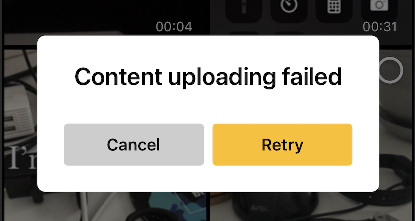

# Banuba VideoEditor SDK
## Media progress screen

```ProgressViewController``` shows progress while long asynchronous task is in progress i.e. import media from gallery or export media content. Follow this guide to customize. ProgressView. To apply customization for Gallery you have to update appropriate configuration in VideoEditorConfiguration. To apply customization for Export process refer to these lines


```ProgressViewConfiguration``` has the following parameters
```swift
/// Describes configuration for progress view used at gallery and export
public class ProgressViewConfiguration {

    /// Setups configuration for message
    public var messageConfiguration: TextConfiguration

    /// Setups configuration for tooltip message
    public var tooltipMessageConfiguration: TextConfiguration

    /// Setups cancel button text configuration
    public var cancelButtonTextConfiguration: TextButtonConfiguration

    /// Setups cancel button border configuration
    public var cancelButtonBorderConfiguration: BorderButtonConfiguration

    /// Setups cancel button background configuration
    public var cancelButtonBackgroundConfiguration: BackgroundConfiguration

    /// Background configuration
    public var backgroundConfiguration: BackgroundConfiguration

    /// Background view blur style. Default is .dark
    public var backgroundViewBlurStyle: UIBlurEffect.Style

    /// Setups progress bar color
    public var progressBarColor: UIColor

    /// Setups progress bar height. Default is 4.0
    public var progressBarHeight: CGFloat

    /// Setups progress bar corner radius. Default is 1.0
    public var progressBarCornerRadius: CGFloat
}
```  

## String resources

| Key        |      Value      |   Description |
| ------------- | :----------- | :------------- |
| com.banuba.alert.progressView.agreeButtonTitle | Retry | Retry button title in alert
| com.banuba.alert.progressView.disagreeButtonTitle | Cancel | Ability to cancel
| com.banuba.alert.progressView.importingMedia | Importing media | Message about importing media in gallery
| com.banuba.alert.progressView.exportingVideo | Exporting video | Exporting video message
| com.banuba.alert.progressView.tooltipMessage | Please, don't lock your screen or switch to other apps | Tooltip message for a user
| com.banuba.alert.progressView.exportVideoInterrupted | Export interrupted | Message about error interrupting export process

Failed async operation alert

