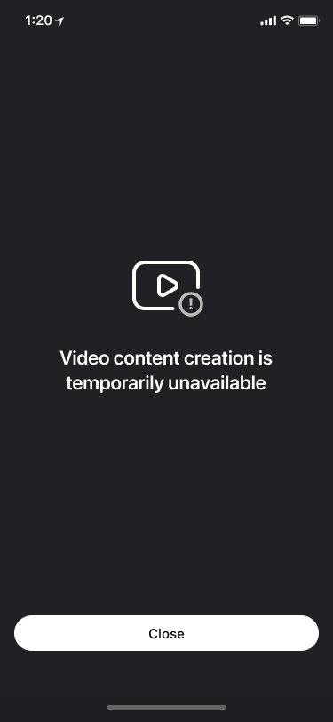

# Quickstart Guide

- [Prerequisites](#Prerequisites)
- [Concepts](#Concepts)
- [Add dependencies](#Add-dependencies)
- [Add resources](#Add-resources)
- [Add module](#Add-module)
- [Implement export](#Implement-export)
- [Launch](#Launch)
- [Advanced integration](#Advanced-integration)
- [FAQ](#FAQ)
- [Dependencies and licenses](#Dependencies-and-licenses)
- [Releases](#Releases)

## Prerequisites
Complete [Installation](../README.md#Installation) before to proceed.

## Concepts
- Export - the process of making video in video editor.
- Slideshow - the feature that allows to create short video from single or multiple images.
- PIP - short Picture-in-Picture feature.
- Trimmer - trimmer screen where the user can trim, merge, change aspects
- Editor - editor the screen where the user can manage effects and audio. Normally the next screen after trimmer.

## Add dependencies
There are 2 options to get iOS Video Editor SDK dependencies
1. [CocoaPods](https://cocoapods.org)
2. [SwiftPackageManager](https://developer.apple.com/documentation/swift_packages)

### SPM
Learn [SPM Getting Started Guide](https://developer.apple.com/documentation/swift_packages/adding_package_dependencies_to_your_app) if you are new in SPM.

The integration with SPM is in [spm branch](https://github.com/Banuba/ve-sdk-ios-integration-sample/tree/spm)

Complete the following steps to get Video Editor SDK dependencies using SPM.

1. Add a [spm link](https://github.com/Banuba/spm) to the collection of packages
2. Open ```App project```  and navigate to ```Swift Packages``` tab.
<p align="center">
&nbsp;
</p>
2. Tap ```plus``` button and type package collections repo url.
<p align="center">
&nbsp;
</p>
3. Choose ```Exact Version``` release version and type newest SDK version.
<p align="center">
&nbsp;
</p>
4. Tap ```Add Package``` button.
The lists with all available modules will appear in the displayed window. 

Please mark the boxes for the modules you want to install and click the ```Add Package``` button.
<p align="center">
&nbsp;
</p>
5. Download the latest module version.

### CocoaPods
Learn [CocoaPods Getting Started Guide](https://guides.cocoapods.org/using/getting-started.html) if you are new in CocoaPods.

:exclamation: Important  
It is required to have CocoaPods version ```1.9.0``` or newer.
Please check your versiob=n ```pod --version``` and upgrade.

The List of required Video Editor dependencies is in [Podfile](../Example/Podfile).

Complete the following steps to get Video Editor SDK dependencies using CocoaPods.
1. Install CocoaPods using Homebrew
   ```sh
   brew install cocoapods 
   ```
2. Initialize pods in your project folder
   ```sh
   pod init
   ```
3. Install Video Editor SDK pods
   ```sh
   pod install
   ```
4. Open ```Example.xcworkspace``` in Xcode and run the project.

## Add resources
Video Editor SDK uses a lot of resources required for running.  
Please make sure all these resources are provided in your project.
1. [luts](../Example/Example/luts) - the folder where all color effects are stored.
2. [ColorEffectsPreview](../Example/Example/Assets.xcassets/ColorEffectsPreview) - preview images of color effects
3. [Effects%20Previe](../Example/Example/Assets.xcassets/Effects%20Preview) - preview images of visual effects.
4. [Localized Strings](../Example/Example/en.lproj/Localizable.strings)

:bulb: Recommendation      
[Assets.xcassets](../Example/Example/Assets.xcassets) contains other visual resources i.e. icons that are used in 
video editor. These icons were added to the sample to customize default video editor icons.
Feel free to copy all resources from [Assets.xcassets](../Example/Example/Assets.xcassets) if they meet your requirements.

:exclamation: Important   
Default video editor icons will be used in case if you copy only [luts](../Example/Example/luts), [ColorEffectsPreview](../Example/Example/Assets.xcassets/ColorEffectsPreview) ,
[Effects%20Previe](../Example/Example/Assets.xcassets/Effects%20Preview), [Localized Strings](../Example/Example/en.lproj/Localizable.strings) resources.

## Add module
Custom behavior of Video Editor SDK in your app is implemented by using a number of configuration classes in the SDK.

First, create new class [VideoEditorModule](../Example/Example/VideoEditorModule.swift) for implementing configurations.
```swift
class VideoEditorModule {
  
}
```
Next, create ```VideoEditorConfig``` for implementing custom video editor configurations.
```swift
class VideoEditorModule {
  func createConfiguration() -> VideoEditorConfig {
      var config = VideoEditorConfig()
      ...
      return config
  }
}
```

## Implement export
Video Editor can export multiple media files to meet your requirements.  
Create instance of ```ExportConfiguration``` and provide ```Array<ExportVideoConfiguration>``` where every ```ExportVideoConfiguration``` is a media file i.e. video or audio. 
Next, use ```BanubaVideoEditor.export``` method and pass instance of ```ExportConfiguration``` to start export.
Please check out [export implementation](../Example/Example/ViewController.swift#L131) in the sample.  

Learn [Export integration guide](guide_export.md) to know more about exporting media content features.

## Launch
Create instance of ```BanubaVideoEditor```  by using the license token.
```swift
let videoEditorSDK = BanubaVideoEditor(
      token: AppDelegate.licenseToken,
      configuration: config,
      externalViewControllerFactory: viewControllerFactory
    )
```
```videoEditorSDK``` is ```nil``` when the license token is incorrect i.e. empty, truncated.
If ```videoEditorSDK``` is not ```nil``` you can proceed and start video editor.

Next, we strongly recommend checking your license state before staring video editor
```swift
videoEditorSDK?.getLicenseState(completion: { [weak self] isValid in
      if isValid {
        print("✅ License is active, all good")
      } else {
        print("❌ License is either revoked or expired")
      }
      ...
      completion(isValid)
    })
```
:exclamation: Video content unavailable screen will appear if you start Video Editor SDK with revoked or expired license.
<p align="center">

</p>

The following [implementation](../Example/Example/ViewController.swift#L50) starts Video Editor from camera screen.
```swift
 let cameraLaunchConfig = VideoEditorLaunchConfig(
        entryPoint: .camera,
        hostController: self,
        musicTrack: nil, // Paste a music track as a track preset at the camera screen to record video with music
        animated: true
)

self.videoEditorSDK?.presentVideoEditor(
    withLaunchConfiguration: cameraLaunchConfig,
    completion: nil
)
```

Video Editor supports multiple launch methods described in [this guide](advanced_integration.md#Launch-methods).

## Advanced integration
Video editor has built in UI/UX experience and provides a number of customizations you can use to meet your requirements.

**AVAILABLE**  
:white_check_mark: Use your branded icons. [See details](advanced_integration.md#Configure-screens)  
:white_check_mark: Use you branded colors. [See details](advanced_integration.md#Configure-screens)  
:white_check_mark: Change text styles i.e. font, color. [See details](advanced_integration.md#Configure-screens)  
:white_check_mark: Localize and change text resources. Default locale is :us:  
:white_check_mark: Make content you want i.e. a number of video with different resolutions  and durations, an audio file. [See details](#Configure-export-flow)  
:white_check_mark: Masks and filters order. [See details](advanced_integration.md#Configure-masks-video-effects-and-filters-order)

NOT AVAILABLE  
:x: Change layout  
:x: Change order of screens after entry point

Learn [Advanced integration guide](advanced_integration.md) to know more about features and customizations.

## FAQ
Visit [FAQ](faq.md) if you are experiencing any issues with an integration.

## Dependencies and licenses
1. [Banuba Face AR SDK](https://www.banuba.com/facear-sdk/face-filters) ```Optional```.
2. Foundation
3. AV Foundation
4. UI Kit
5. AV Kit
6. Core media
7. Core video
8. Core graphics
9. GL Kit
10. Photos
11. OpenGLES
12. MetalKit
13. SystemConfiguration
14. OSLog
15. GLProgram
16. MediaPlayer
17. Accelerate

[See all dependencies and licenses](3rd_party_licences.md)

## Releases 
[1.25.0](https://www.notion.so/vebanuba/1-25-0-c164f6893eda4ad99d8c02a7566f7f45)    
[1.25.1](https://www.notion.so/vebanuba/1-25-1-393368bbe1ab4c0dbf480a8c30ac5904)  
[1.25.2](https://www.notion.so/vebanuba/1-25-2-937992cc6249447b81a4ca218a4ef097)  
[1.26.0](https://www.notion.so/vebanuba/1-26-0-5e65daee7e8c41e2bebbf4d8a50e1cc4)    
[1.26.1](https://www.notion.so/vebanuba/1-26-1-0edacf053a88499cbb51e6f065274dd3)   
[1.26.2](https://www.notion.so/vebanuba/1-26-2-2aa271695c974ac7b90799a0b2a108d9)   
[1.26.3](https://www.notion.so/vebanuba/1-26-3-8c4fb0d732eb4f2582b3aaeab28ef399)  
[1.26.4](https://www.notion.so/vebanuba/1-26-4-294c72f4be5944938a4e506c65435333)  
[1.26.5](https://www.notion.so/vebanuba/1-26-5-91785d18a6c64c6e86dc48ca06e3d458)
