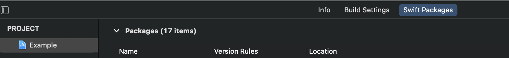
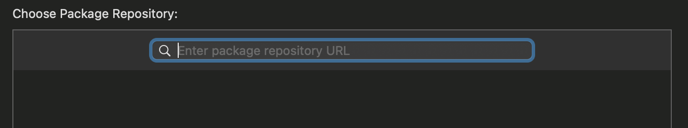
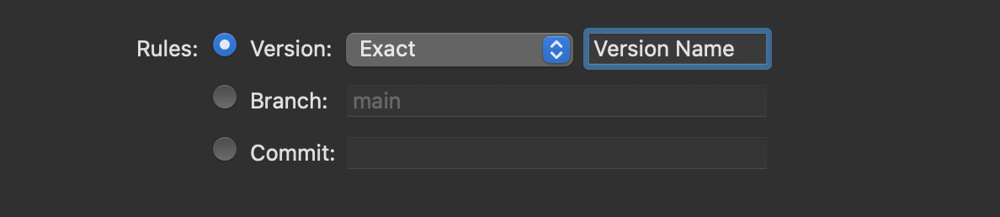
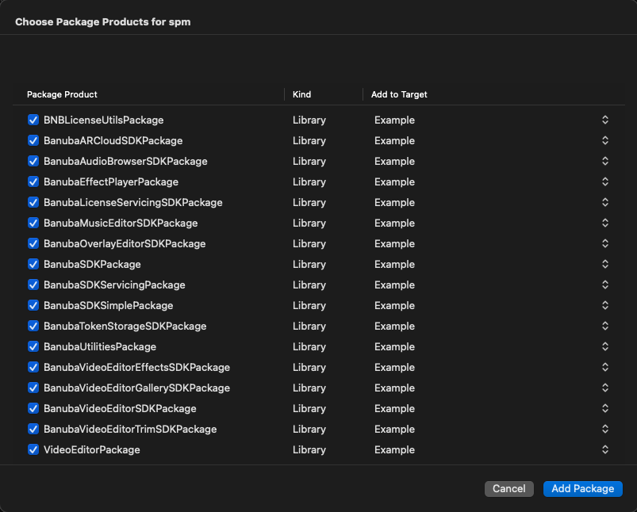

# Quickstart Guide

- [Prerequisites](#Prerequisites)
- [Concepts](#Concepts)
- [Connecting with AR cloud](#Connecting-with-AR-cloud)
- [Face AR](#Face-AR)
- [Integration](#Integration)
    + [Step 1. Setup SDK dependencies with SPM or Cocoapods](#Step-1-Setup-SDK-dependencies-with-SPM-or-Cocoapods)
        + [SwiftPackageManager](#Swift-Package-Manager)
        + [CocoaPods](#CocoaPods)
    + [Step 2. Start Video Editor from ViewController](#Step-2-Start-Video-Editor-from-ViewController)
- [Customization](#Customization)
    + [Configure export flow](#Configure-export-flow)
    + [Configure audio content](#Configure-audio-content)
    + [Configure screens](#Configure-screens)
    + [Configure masks, video effects and filters order](#Configure-masks-video-effects-and-filters-order)
    + [Configure watermark](#Configure-watermark)
    + [Configure stickers content](#Configure-stickers-content)
    + [Configure additional Video Editor SDK features](#Configure-additional-Video-Editor-SDK-features)
    + [Icons](#Icons)
    + [Localization](#Localization)
- [Advanced integration](#Advanced-integration)
- [FAQ](#FAQ.md)
- [Dependencies and licenses](#Dependencies-and-licenses)
- [Releases](#Releases)

## Prerequisites
:exclamation: The license token **IS REQUIRED** to use Video Editor SDK in your app.  
Please check [Installation](../README.md#Installation) out guide if the license token is not set.  
Use the license token to [start Video Editor](#Step-2-Start-Video-Editor-from-ViewController)

## Concepts
- Export - the process of making video in video editor.
- Slideshow - the feature that allows to create short video from single or multiple images.
- PIP - short Picture-in-Picture feature.
- Trimmer - trimmer screen where the user can trim, merge, change aspects
- Editor - editor the screen where the user can manage effects and audio. Normally the next screen after trimmer.

## Camera recording video quality params
To be able to use your own quality parametrs please follow this [guide](video_resolution_configuration.md).

| Recording speed | 360p(360 x 640) | 480p(480 x 854) | 540p(540 x 960) |  HD(720 x 1280) | FHD(1080 x 1920) |
| --------------- | --------------- | --------------- | --------------- | --------------- | ---------------- |
| 1x(Default)     | 800             | 2000            | 2000            | 4000            | 6400             |
| 0.5x            | 800             | 2000            | 2000            | 4000            | 6400             |
| 2x              | 800             | 2000            | 2000            | 4000            | 6400             |
| 3x              | 800             | 2000            | 2000            | 4000            | 6400             |  

## Export video quality params
Video Editor SDK classifies every device by its performance capabilities and uses the most suitable quality params for the exported video.

Nevertheless it is possible to customize it with `ExportVideoConfiguration`. Just put a required video quality into `ExportVideoInfo(resolution)` constructor. To be able to use your own quality parametrs please follow this [guide](video_resolution_configuration.md).

See the **default bitrate (kbps)** for exported video (without audio) in the table below:
| 360p(360 x 640) | 480p(480 x 854) | 540p(540 x 960) | HD(720 x 1280) | FHD(1080 x 1920) |
| --------------- | --------------- | ---------------- | -------------- | ---------------- |
|              800|             2000|              2000|            4000|              6400|

## Connecting with AR cloud

To decrease the app size, you can connect with our servers and pull AR filters from there. The effects will be downloaded whenever a user needs them. Please check out [step-by-step guide](ar_cloud.md) guide to configure AR Cloud in the Video Editor SDK.

### Face AR

Face AR SDK is optional for the video editor SDK and would be disabled if it is not included in your token. If you don't use Face AR SDK make the following changes in ```Podfile``` to remove it:

```diff
-  pod 'BanubaEffectPlayer', '1.24.0'
-  pod 'BanubaSDK', '1.24.0'
+  pod 'BanubaSDKSimple', '1.24.0'
```

## Integration

:exclamation: **Important:** Do not forget to copy all the resources that the sample contains, such as the **luts folder and etc**.

### Step 1. Setup SDK dependencies with SPM or Cocoapods

The easiest ways to integrate the Video Editor SDK in your mobile app are through [CocoaPods](https://cocoapods.org) or [SwiftPackageManager](https://developer.apple.com/documentation/swift_packages). If you haven't used this dependency managers before, see the [Cocoapods Getting Started Guide](https://guides.cocoapods.org/using/getting-started.html) and [SPM Getting Started Guide](https://developer.apple.com/documentation/swift_packages/adding_package_dependencies_to_your_app).

### Swift Package Manager

Important: Sample intergration of SPM and VideoEditor is in [spm branch](https://github.com/Banuba/ve-sdk-ios-integration-sample/tree/spm)

Please add a [link](https://github.com/Banuba/spm) to the collection of packages:

1. Open App project -> navigate to SwiftPackages tab.
<p align="center">
&nbsp;
</p>
2. Tap 'plus' button -> type package collections repo url.
<p align="center">
&nbsp;
</p>
3. Choose 'Exact Version' release version -> type newest SDK version.
<p align="center">
&nbsp;
</p>
4. Tap 'Add Package' button.
The lists with all available modules will appear in the displayed window. 

Please check the boxes for the modules you need to install and click the 'Add Package' button.
<p align="center">
&nbsp;
</p>
5. Download the latest module version.

### CocoaPods

Important: Make sure that you have CocoaPods version >= 1.9.0 installed. Check your CocoaPods version using this command ```pod --version```

Please, refer to the example of [Podfile](/Example/Podfile) lines which you need to add.

1. Make sure to have CocoaPods installed, e.g. via Homebrew:
   ```sh
   brew install cocoapods 
   ```
2. Initialize pods in your project folder (if you didn't do it before).
   ```sh
   pod init
   ```
3. Install the Video Editor SDK for the provided Xcode workspace with:
   ```sh
   pod install
   ```
4. Open Example.xcworkspace with Xcode and run the project.

### Step 2. Start Video Editor from ViewController

``` swift
import BanubaVideoEditorSDK

class ViewController: UIViewController {

  private var videoEditorSDK: BanubaVideoEditor?

  override func viewDidLoad() {
    super.viewDidLoad()
    
    initVideoEditor()
  }

  override func viewDidAppear(_ animated: Bool) {
    super.viewDidAppear(animated)

    let launchConfig = VideoEditorLaunchConfig(
      entryPoint: .camera,
      hostController: self,
      animated: true
    )
    videoEditorSDK?.presentVideoEditor(
      withLaunchConfiguration: launchConfig,
      completion: nil
    )
  }
  
  private func initVideoEditor() {
    let configuration = VideoEditorConfig()
    videoEditorSDK = BanubaVideoEditor(
      token: "place client token here",
      configuration: configuration,
      externalViewControllerFactory: nil
    )
    videoEditorSDK?.delegate = self
  }
}

// MARK: - Handle Video Editor lifecycle
extension ViewController: BanubaVideoEditorDelegate {
  func videoEditorDidCancel(_ videoEditor: BanubaVideoEditor) {
    videoEditor.dismissVideoEditor(animated: true, completion: nil)
  }
  
  func videoEditorDone(_ videoEditor: BanubaVideoEditor) {
    videoEditor.dismissVideoEditor(animated: true, completion: nil)
  }
}

```  

The Video Editor has one entry point:

``` swift
/// Modally presents Video editor's  view controller with pre-defined configuration
  /// - Parameters:
  ///   - configuration: contains configurations for launching Video editor's screen
  ///   - completion: The block to execute after the presentation finishes.
func presentVideoEditor(
  withLaunchConfiguration configuration: VideoEditorLaunchConfig,
  completion: (() -> Void)?
)
```  

`VideoEditorLaunchConfig` contains the following fields:
``` swift
/// The video editor launch configuration
@objc public class VideoEditorLaunchConfig: NSObject {
  /// Setups VE start screen.
  public var entryPoint: PresentEventOptions.EntryPoint
  /// The view controller to display over.
  public var hostController: UIViewController
  /// An array with urls to videos located on a phone.
  public var videoItems: [URL]?
  /// Drafted launch config
  public var draftedLaunchConfig: DraftedLaunchConfig?
  /// A url to video located on a phone.
  public var pipVideoItem: URL?
  /// Music track which will be played on camera recording.
  public var musicTrack: MediaTrack?
  /// Pass true to animate the presentation.
  public var animated: Bool
  
  /// Describes config from drafts launching
  public struct DraftedLaunchConfig {
    /// Drafted video sequence
    public var draftedVideoSequence: VideoSequence
    /// Drafts feature config
    public var draftsConfig: DraftsFeatureConfig
    // MARK: - Init
    public init(
      draftedVideoSequence: VideoSequence,
      draftsConfig: DraftsFeatureConfig
    ) {
      ...
    }
  }
  
  // MARK: - Init
  public init(
    entryPoint: PresentEventOptions.EntryPoint,
    hostController: UIViewController,
    videoItems: [URL]? = nil,
    pipVideoItem: URL? = nil,
    draftedLaunchConfig: DraftedLaunchConfig? = nil,
    musicTrack: MediaTrack? = nil,
    animated: Bool
  ) {
    ...
  }
}

/// EntryPoint describes what kind of entry point is used in video editor navigation flow
public enum EntryPoint: String, Codable {
  case camera
  case pip
  case trimmer
  case editor
  case drafts
}
``` 

## Customization

### Configure export flow

To export video after the editing is complete use these method:

``` swift
  /// Export several configurable video
  /// - Parameters:
  ///   - configuration: contains configurations for exporting videos such as file url,
  ///    watermark and video quality and etc.
  ///   - exportProgress: callback of current export progress.
  ///   - completion: completion: (success, error, exportCoverImages), execute on background thread.
  public func export(
    using configuration: ExportConfiguration,
    exportProgress: ((TimeInterval) -> Void)?,
    completion: @escaping ((_ success: Bool, _ error: Error?, _ exportCoverImages: ExportCoverImages?)->Void)
  )
```  
See the sample export video flow [here](/Example/Example/ViewController.swift#L166). You can find the detailed video export features [here](export_flow.md).

### Configure audio content

Banuba Video Editor SDK can trim audio tracks, merge them, and apply them to a video. It doesn't include music or sounds. However, it can be integrated with [Mubert](https://mubert.com/) and get music from it (requires additional contract with them). Moreover, the users can add audio files from internal memory (downloaded library) from the phone.

Integrating audio content is simple. See this [guide](audio_content.md#step-1).

### Configure screens

Each screen can be modified to your liking. You can change icons, colors, text and its font, button titles, and much more.

Note that layouts and screen order can't be changed. You can, however, [ask](https://www.banuba.com/faq/kb-tickets/new) us to customize the mobile video editor UI as a separate contract.

Below see the list of screens with links to their detailed description and notes on modifying them

1. [Camera screen](camera_styles.md)
1. [Editor screen](editor_styles.md)
1. [Trim screens](trim_styles.md)
1. [Overlay screens](overlayEditor_styles.md)
1. [Music editor screen](musicEditor_styles.md)
1. [Gallery screen](gallery_styles.md)
1. [Alert screens](alert_styles.md)
1. [Cover screen](cover_style.md)
1. [Hands Free screen](handsFree_styles.md)
1. [Audio Browser screen](audioBrowser.md)
1. [Picture in picture](pip_configuration.md)

The SDK allows overriding icons, colors, typefaces and many more configuration entities. Every SDK screen has its own set of styles.

### Configure masks, video effects and filters order

The SDK allows to reorder masks and filters in the way you need. To achieve this use the property ```preferredLutsOrder``` and ```preferredMasksOrder```

``` swift
 let config = VideoEditorConfig()
 
 // Sorting for the record screen
 config.recorderConfiguration.recorderEffectsConfiguration.preferredLutsOrder = [
   "egypt",
   "norway",
   "japan"
   ...
 ]
 
 config.recorderConfiguration.recorderEffectsConfiguration.preferredMasksOrder = [
   "XYScanner",
   "Background"
   ...
 ]
 
 // Sorting for the post processing screen
 config.filterConfiguration.preferredLutsOrder = [
   "byers",
   "sunset",
   "vinyl"
   ...
 ]
 
 config.filterConfiguration.preferredMasksOrder = [
   "XYScanner",
   "Background"
   ...
 ]
 
 config.filterConfiguration.preferredVideoEffectOrderAndSet = [
  VisualEffectApplicatorType.acid,
  VisualEffectApplicatorType.dvCam
  ...
]
 
``` 

### Configure watermark

You can add a branded image that would appear on videos that users export.

To do so, create and configure the WatermarkConfiguration structure, then add it to the ExportVideoConfiguration entity.

See this [example](/Example/Example/ViewController.swift#L184) for details.

### Configure stickers content

Stickers are interactive objects (gif images) that can be added to the video recording to add more fun for users.

By default [**Giphy API**](https://developers.giphy.com/docs/api/) is used to load stickers. All you need is just to pass your personal Giphy Api Key into **giphyAPIKey** parameter in GifPickerConfiguration entity.

GIPHY doesn't charge for their content. The one thing they do require is attribution. Also, there is no commercial aspect to the current version of the product (no advertisements, etc.) To use it, please, [add "Search GIPHY" text attribution](overlayEditor_styles.md#string-resources) to the search bar.

### Configure the record button
The record button is a main control on the camera screen which you can fully customize along with animations playing on tap.

First of all look at [RecordButtonConfiguration](record_button_configuration.md) entity which you can customize in [Camera screen configuration quide](camera_styles.md). If it still not suits your needs you can create your own view for more information look [here](record_button_provider.md)

### Configure media content

AI Video Editor SDK is provided with its own solution for media content (i.e. images and videos) selection - the gallery screen. To use it as a part of SDK just add the ```BanubaVideoEditorGallerySDK``` pod to your podfile:
```diff
target 'Example' do
  pod 'BanubaVideoEditorSDK'
  ...
+  pod 'BanubaVideoEditorGallerySDK', '1.23.0'
}
```
The gallery provided by the SDK is fully customizable according to [this guide](gallery_styles.md).

Also there is an option to use **your own implementation of the gallery**. This is available according to this [step-by-step guide](configure_external_gallery.md).

### Configure additional Video Editor SDK features

1. [Transition effects](transitions_styles.md)

### Icons

Any icon in the mobile video editor SDK can be replaced. This is how:

1. Load custom images to the Assets catalog
2. Locate the screen with an icon you want to change in the [VideoEditorConfig](/Example/Example/ViewController.swift#L97) entity
3. Find the specific element and override it with the resource name or use UIImage, if available.

For [example](/Example/Example/Extension/RecorderConfiguration.swift#L80), this is how you change a mask icon on the camera screen.

### Localization

Any text in the mobile video editor SDK can be changed. To edit text resources, download the file with strings [here](/Example/Example/en.lproj/Localizable.strings), change whatever you need, and put the new file into your app.

Don't change the keys (values on the left), only the values on the right. Otherwise, the button names and other texts will not show.

## Analytics

The SDK generates simple metadata analytics in JSON file that you can use in your application.
You need to make sure that analytics collection is enabled in your token.

After export, the analytics as a row is available in the entity:
```swift
let analytics: String? = videoEditorSDK?.metadata?.analyticsMetadataJSON
```
Output example:
```JSON
{
  "export_duration": 18.613733167,
  "export_success": true,
  "camera_effects": [
    "mask:Beauty",
    "mask:HairGradient_Avocado",
    "neon.png"
  ],
  "video_resolutions": [
    "default854x480"
  ],
  "os_version": "12.4.7",
  "video_count": 1,
  "post_processing_effects": [
    "101",
    "202",
    "mask:2_5D_HeadphoneMusic"
  ],
  "token": "commercial",
  "video_duration": 19.433333333333334,
  "sdk_version": "1.22.0",
  "video_sources": [
    {
      "startTime": "0.0",
      "title": "3CE046B1-9308-44A5-8AC4-E14B5C273F1D",
      "endTime": "3.0",
      "type": "camera"
    },
    {
      "startTime": "3.0",
      "title": "1120F49A-F04C-49BF-B586-0307897B9E74",
      "endTime": "12.8",
      "type": "gallery"
    },
    {
      "startTime": "12.8",
      "title": "82A8C971-04D0-4677-BA3C-61DD2EFB6BAD",
      "endTime": "15.8",
      "type": "camera"
    },
    {
      "startTime": "15.8",
      "title": "D1B9EC82-02BB-4052-B97E-1CFA3489BC3B",
      "endTime": "18.458333333333336",
      "type": "camera"
    }
  ]
}
```

## Advanced integration
Video editor has built in UI/UX experience and provides a number of customizations you can use to meet your requirements.

**AVAILABLE**  
:white_check_mark: Use your branded icons. [See details](#Configure-screens)  
:white_check_mark: Use you branded colors. [See details](#Configure-screens)  
:white_check_mark: Change text styles i.e. font, color. [See details](#Configure-screens)  
:white_check_mark: Localize and change text resources. Default locale is :us:  
:white_check_mark: Make content you want i.e. a number of video with different resolutions  and durations, an audio file. [See details](#Configure-export-flow)  
:white_check_mark: Masks and filters order. [See details](#Configure-masks-video-effects-and-filters-order)

NOT AVAILABLE  
:x: Change layout  
:x: Change order of screens after entry point

Learn [Advanced integration guide](advanced_integration.md) to know more about features and customizations.

## FAQ
Visit [FAQ](faq.md) if you are experiencing any issues with an integration.

## Dependencies and licenses
1. [Banuba Face AR SDK](https://www.banuba.com/facear-sdk/face-filters) ```Optional```.
2. Foundation
3. AV Foundation
4. UI Kit
5. AV Kit
6. Core media
7. Core video
8. Core graphics
9. GL Kit
10. Photos
11. OpenGLES
12. MetalKit
13. SystemConfiguration
14. OSLog
15. GLProgram
16. MediaPlayer
17. Accelerate

[See all dependencies and licenses](3rd_party_licences.md)

## Releases 
[1.25.0](https://www.notion.so/vebanuba/1-25-0-c164f6893eda4ad99d8c02a7566f7f45)    
[1.25.1](https://www.notion.so/vebanuba/1-25-1-393368bbe1ab4c0dbf480a8c30ac5904)  
[1.25.2](https://www.notion.so/vebanuba/1-25-2-937992cc6249447b81a4ca218a4ef097)  
[1.26.0](https://www.notion.so/vebanuba/1-26-0-5e65daee7e8c41e2bebbf4d8a50e1cc4)    
[1.26.1](https://www.notion.so/vebanuba/1-26-1-0edacf053a88499cbb51e6f065274dd3)   
[1.26.2](https://www.notion.so/vebanuba/1-26-2-2aa271695c974ac7b90799a0b2a108d9)   
[1.26.3](https://www.notion.so/vebanuba/1-26-3-8c4fb0d732eb4f2582b3aaeab28ef399)  
[1.26.4](https://www.notion.so/vebanuba/1-26-4-294c72f4be5944938a4e506c65435333)  
[1.26.5](https://www.notion.so/vebanuba/1-26-5-91785d18a6c64c6e86dc48ca06e3d458)
