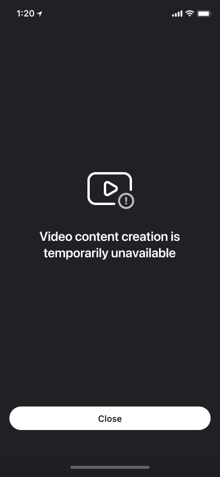

# Quickstart Guide

- [Installation](#Installation)
- [Info.plist Updates](#Info.plist-Updates)
- [Localization](#Localization)
- [Video Editor Module Setup](#Video-Editor-Module-Setup)
- [Launch](#Launch)
- [Implement export](#Implement-export)
- [Advanced integration](#Advanced-integration)

## Installation

### CocoaPods
:exclamation: Important
CocoaPods version 1.12.1 or newer is required. Check your version with pod --version and upgrade if needed.

To integrate the Video Editor SDK via CocoaPods:

1. Install CocoaPods (if not already installed) using Homebrew:

```sh
brew install cocoapods
```

2. Initialize CocoaPods in your project folder:
```sh
pod init
```

3. Add sources and pods to your Podfile:

```ruby
source 'https://cdn.cocoapods.org/'
source 'https://github.com/Banuba/specs.git'
source 'https://github.com/sdk-banuba/banuba-sdk-podspecs.git'

banuba_sdk_version = '1.50.1'

pod 'BanubaVideoEditorSDK', banuba_sdk_version
pod 'BanubaSDKSimple', banuba_sdk_version
pod 'BanubaSDK', banuba_sdk_version
pod 'BanubaARCloudSDK', banuba_sdk_version      # optional
pod 'BanubaAudioBrowserSDK', banuba_sdk_version # optional
```
4. Install the pods:

```sh
pod install --repo-update
```

5. Open the generated ```.xcworkspace``` in Xcode and run the project.

:exclamation: Info
For more details, refer to the [CocoaPods installation guide](https://docs.banuba.com/ve-pe-sdk/docs/ios/cocapods-installation).

### SPM

SPM integration is available in the [spm branch](https://github.com/Banuba/ve-sdk-ios-integration-sample/tree/spm).

To integrate the Video Editor SDK via SPM:

1. Open your App project and go to the Swift Packages tab.

2. Click the + button and add the required packages using the URLs:
https://github.com/Banuba/BanubaVideoEditorSDK-iOS
https://github.com/Banuba/BanubaSDK-iOS

3. Select Exact Version and enter the latest SDK version.

4. Choose the required modules and click Add Package.

:exclamation: Info
For more details, refer to the [SPM installation guide](https://docs.banuba.com/ve-pe-sdk/docs/ios/spm-installation).

## Info.plist Updates

Add the iOS permissions required by the SDK (camera, microphone, photo library, media library) to your [Info.plist](../example/ios/Runner/Info.plist):

```xml
<key>NSAppleMusicUsageDescription</key>
<string>This app requires access to the media library</string>
<key>NSCameraUsageDescription</key>
<string>This app requires access to the camera.</string>
<key>NSMicrophoneUsageDescription</key>
<string>This app requires access to the microphone.</string>
<key>NSPhotoLibraryUsageDescription</key>
<string>This app requires access to the photo library.</string>
```

## Localization

Add [English Localized Strings](../Example/Example/en.lproj/Localizable.strings) file to the project.

## Video Editor Module Setup
Custom behavior of Video Editor SDK in your app is implemented by using a number of configuration classes in the SDK.

First, create new class [VideoEditorModule](../Example/Example/VideoEditorModule.swift) for implementing configurations.
```swift
class VideoEditorModule {
  
}
```
Next, create ```VideoEditorConfig``` for implementing custom video editor configurations.
```swift
class VideoEditorModule {
  func createConfiguration() -> VideoEditorConfig {
      var config = VideoEditorConfig()
      ...
      return config
  }
}
```

## Launch
Create instance of ```BanubaVideoEditor```  by using the license token.
```swift
let videoEditorSDK = BanubaVideoEditor(
      token: AppDelegate.licenseToken,
      configuration: config,
      externalViewControllerFactory: viewControllerFactory
    )
```
```videoEditorSDK``` is ```nil``` when the license token is incorrect i.e. empty, truncated.
If ```videoEditorSDK``` is not ```nil``` you can proceed and start video editor.

Check your license state before starting video editor: 
```swift
videoEditorSDK?.getLicenseState(completion: { [weak self] isValid in
      if isValid {
        print("✅ License is active, all good")
      } else {
        print("❌ License is either revoked or expired")
      }
      ...
      completion(isValid)
    })
```
:exclamation: Video content unavailable screen will appear if you start Video Editor SDK with revoked or expired license.
<p align="center">

</p>

The [implementation](../Example/Example/ViewController.swift#L45) below starts Video Editor from camera screen.
```swift
 let cameraLaunchConfig = VideoEditorLaunchConfig(
        entryPoint: .camera,
        hostController: self,
        musicTrack: nil, // Paste a music track as a track preset at the camera screen to record video with music
        animated: true
)

videoEditorModule.presentVideoEditor(with: cameraLaunchConfig)
```

## Implement export

The Video Editor SDK can export multiple files at once.
To set up export:

1. Make an ExportConfiguration object. Add one or more ExportVideoConfiguration objects to it. Each one stands for a video or audio file.

2. Call BanubaVideoEditor.export() and pass your ExportConfiguration to start.

Check the [export implementation](../Example/Example/ViewController.swift#L250) in the sample.

Read the [Export integration guide](https://docs.banuba.com/ve-pe-sdk/docs/ios/guide_export) for more details.

## Advanced integration

Explore [advanced setup and customization](https://docs.banuba.com/ve-pe-sdk/docs/ios/adv-integration-overview/) in our documentation.