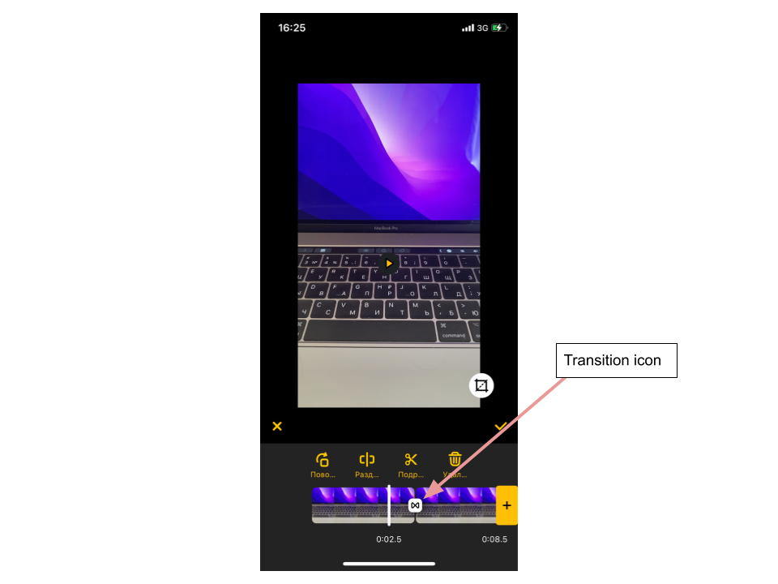

# Transition effects

 ## Overview

 Transitions are visual effects applying to the segue between two videos.

 ## Enabling/Disabling transitions

 Transitions are provided with AI Video Editor SDK **by default**.

 To disable or enable transitions set the flag ```useTransitions``` inside FeatureConfiguration class into false or true respectively. 
 
 ``` swift
  /// Allows you to use transition effects between videos
  /// Defaults is true
  public var useTransitions: Bool
 ```
 
 Example:
 
 ``` swift
 let config = VideoEditorConfig()
 config.featureConfiguration.useTransitions = true
 ```

 ## Transition icon view

 Every applied transition presented on the trimmer screen by the transition icon on videos edges:

 

 As a part of the trimmer timeline, styling attributes of transition icons are placed in `TrimTimeLineConfiguration` entity with `transitionIcons` dictionary property:

Transitions icons property is following dictionary `[TransitionType: TransitionActionConfiguration]`.

`TransitionActionConfiguration` struct:
``` swift
  /// Image configuration
  let imageConfiguration: ImageConfiguration
  /// Icon size
  let height: CGFloat
  /// Clicable icon width
  let clicableWidth: CGFloat
  /// Background color
  let backgroundColor: UIColor
  /// Icon corner radius
  let cornerRadius: CGFloat
  /// Shadow color
  let shadowColor: UIColor
```

 **The picture on the transition icon depends on the applied transition effect.** Customization of every transition effect is decribed below. 

 ## Selectable transition views

 For transitions preview and selection there is a helper ui screen on the trimmer. 

 To customize this screen there are following attributes in the `VideoEditorConfig` entity with `transitionsConfiguration` property:

 ``` swift
  /// Setups image for cancel button
  public var cancelButton: ImageButtonConfiguration
  /// Setups image for done button
  public var doneButton: ImageButtonConfiguration
  /// Setups background color for screen
  public var backgroundConfiguration: BackgroundConfiguration
  /// Setups background color for controls view
  public var backgroundControlsViewColor: UIColor
  /// Setups effects
  public var effects: [EffectListItemConfiguration]
  /// Setups default need effect from
  public var defaultEffect: EffectListItemConfiguration.`Type`
  /// Setups the primary aspect. Hides aspects button if it's value is not nil.
  /// Default is nil.
  public var primaryAspect: AspectRatio?
 ```

 ## Customizing transition effects

 There are 10 transition effects available to use within AI Video Editor SDK. Additional "normal" effect is provided to leave the segue between videos without any transition effect.

 Every transition effect has its own **string identifier** with `TransitionType` entiry: 

``` swift
public enum TransitionType: String, Codable, CaseIterable {
  /// without transition effect
  case normal
  /// Whip Down transition type
  case whipDown
  /// Whip Up transition type
  case whipUp
  /// Whip Right transition type
  case whipRight
  /// Whip Left transition type
  case whipLeft
  /// Scroll Down transition type
  case scrollDown
  /// Scroll Up transition type
  case scrollUp
  /// Scroll right transition type
  case scrollRight
  /// Scroll left transition type
  case scrollLeft
  /// Spin right transition type
  case spinRight
  /// Fade  transition type
  case fade
}
```

 The identifier is used in naming of the ios resources related to every transition effect icon.

 Timeline icons could be setupped from `EffectsListConfiguration` entity with `effects` property:
 
 ``` swift
 public struct EffectsListConfiguration {
  ...
  /// Setups effects
  public var effects: [EffectListItemConfiguration]
  ...
}
```

`EffectListItemConfiguration` has the following structure:

``` swift
public struct EffectListItemConfiguration {
  public enum `Type`: Equatable {
    case aspect(AspectRatio)
    case transition(TransitionType)
  }
  /// Setup effect type
  public var effect: EffectListItemConfiguration.`Type`
  /// Setup icon for effect
  public var icon: ImageConfiguration?
  /// Setup title for effect
  public var title: TextConfiguration
  /// Setup width for effect cell
  public var width: CGFloat
  /// Setup height for effect cell
  public var height: CGFloat
  /// Setup selection color for border and text
  public var selectedColor: UIColor
  
  /// Aspect сonfiguration init
  /// - Parameters:
  ///   - effect: Setup effect type
  ///   - icon: Setup icon UIImage for effect cell
  ///   - title: Setup title for effect
  ///   - width: Setup width for effect cell
  ///   - height: Setup height for effect cell
  ///   - selectedColor: Setup selection color for border and text
  public init(
    effect: EffectListItemConfiguration.`Type`,
    icon: ImageConfiguration?,
    title: TextConfiguration,
    width: CGFloat,
    height: CGFloat,
    selectedColor: UIColor
  ) {
    self.effect = effect
    self.icon = icon
    self.title = title
    self.width = width
    self.height = height
    self.selectedColor = selectedColor
  }
}
```
To be able to change titles, please override localized string with following keys:

``` swift
/* Transitions title for cells*/
"com.banuba.videoEditor.transition.none" = "None";
"com.banuba.videoEditor.transition.whipDown" = "Whip down";
"com.banuba.videoEditor.transition.whipUp" = "Whip up";
"com.banuba.videoEditor.transition.whipRight" = "Whip right";
"com.banuba.videoEditor.transition.whipLeft" = "Whip left";
"com.banuba.videoEditor.transition.scrollDown" = "Scroll down";
"com.banuba.videoEditor.transition.scrollUp" = "Scroll up";
"com.banuba.videoEditor.transition.scrollRight" = "Scroll right";
"com.banuba.videoEditor.transition.scrollLeft" = "Scroll left";
"com.banuba.videoEditor.transition.spinRight" = "Spin";
"com.banuba.videoEditor.transition.fade" = "Fade";

/* Transition disabled alert message */
"com.banuba.videoEditor.transition.disabledToastMessage" = "The clip must be longer than 1 sec to apply transition.";
```

 **Important Note!** 

 Transition effects are not being played if the closest video (either to the left or to the right of transition icon) is very short.
