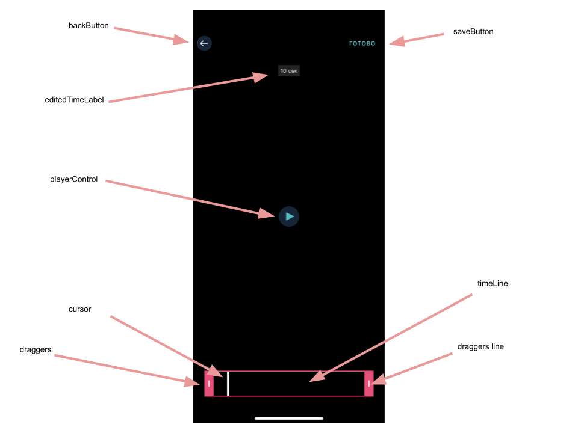
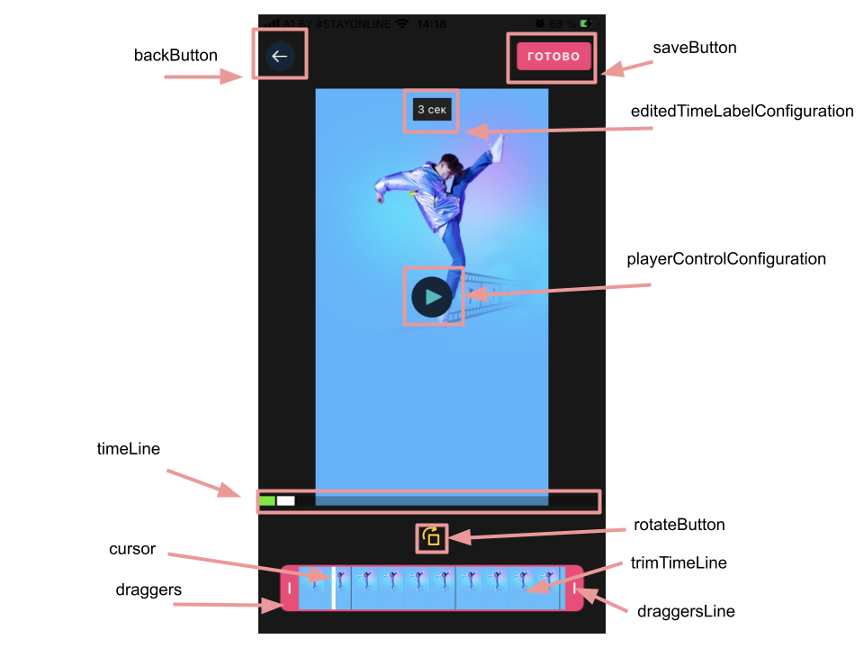
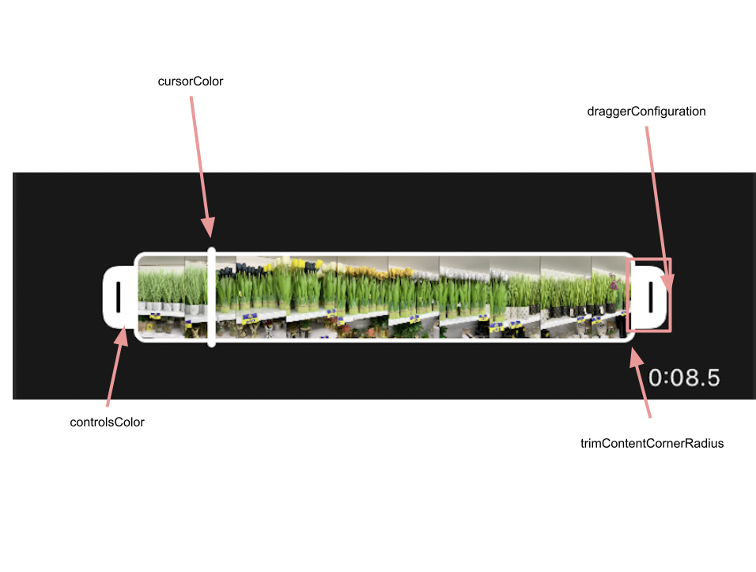

# Banuba VideoEditor SDK
## Single trim screen styles  

- [saveButton: SaveButtonConfiguration](/Example/Example/Extension/TrimConfiguration.swift#L5)

SaveButtonConfiguration setups save button style

- [backButton: BackButtonConfiguration](/Example/Example/Extension/TrimConfiguration.swift#L6)

BackButtonConfiguration setups save button style

- [rotateButton: ImageButtonConfiguration?](/Example/Example/Extension/TrimConfiguration.swift#L7)

ImageButtonConfiguration setups rotate button style

- [throbber: SmallActivityIndicatorConfiguration](/Example/Example/Extension/TrimConfiguration.swift#L8)

SmallActivityIndicatorConfiguration setups throbber style

- [trimTimeLineConfiguration: TrimTimeLineConfiguration](/Example/Example/Extension/TrimConfiguration.swift#L9)

TrimTimeLineConfiguration setups single time line bar style and options

- [trimTimeLineHeight: CGFloat](/Example/Example/Extension/TrimConfiguration.swift#L10)

Time line height

- [playerControlConfiguration: PlayerControlConfiguration](/Example/Example/Extension/TrimConfiguration.swift#L11)

PlayerControlConfiguration setups play/pause button style

- [backgroundConfiguration: BackgroundConfiguration](/Example/Example/Extension/TrimConfiguration.swift#L12)

BackgroundConfiguration setups background view style

- [screenNameConfiguration: ScreenNameConfiguration](/Example/Example/Extension/TrimConfiguration.swift#L13)

ScreenNameConfiguration setups screen title style

- [editedTimeLabelConfiguration: TimeLabelConfiguration](/Example/Example/Extension/TrimConfiguration.swift#L14)

 TimeLabelConfiguration setups current duration view style
  
  

## Multi trim screen styles  

- [saveButton: SaveButtonConfiguration](/Example/Example/Extension/TrimConfiguration.swift#L22)

SaveButtonConfiguration setups save button style

- [backButton: BackButtonConfiguration](/Example/Example/Extension/TrimConfiguration.swift#L23)

BackButtonConfiguration setups save button style

- [rotateButton: ImageButtonConfiguration?](/Example/Example/Extension/TrimConfiguration.swift#L24)

ImageButtonConfiguration setups rotate button style

- [timeLimeConfiguration: TimeLineConfiguration](/Example/Example/Extension/TrimConfiguration.swift#L25)

TimeLineConfiguration setups multi time line bar style and options

- [trimTimeLineConfiguration: TrimTimeLineConfiguration](/Example/Example/Extension/TrimConfiguration.swift#L26)

TrimTimeLineConfiguration setups single time line bar style and options

- [trimTimeLineHeight: CGFloat](/Example/Example/Extension/TrimConfiguration.swift#L27)

Time line height

- [playerControlConfiguration: PlayerControlConfiguration](/Example/Example/Extension/TrimConfiguration.swift#L28)

PlayerControlConfiguration setups play/pause button style

- [backgroundConfiguration: BackgroundConfiguration](/Example/Example/Extension/TrimConfiguration.swift#L29)

BackgroundConfiguration setups background view style

- [bottomViewBackgroundConfiguration: BackgroundConfiguration](/Example/Example/Extension/TrimConfiguration.swift#L30)

BackgroundConfiguration setups bottom background view style

- [screenNameConfiguration: ScreenNameConfiguration](/Example/Example/Extension/TrimConfiguration.swift#L31)

ScreenNameConfiguration setups screen title style

- [trimSequenceEdgeInsets: UIEdgeInsets](/Example/Example/Extension/TrimConfiguration.swift#L32)

Trim sequence edge insets

- [trimSequenceHeight: CGFloat](/Example/Example/Extension/TrimConfiguration.swift#L33)

Trim sequence height

- [editedTimeLabelConfiguration: TimeLabelConfiguration](/Example/Example/Extension/TrimConfiguration.swift#L34)

TimeLabelConfiguration setups current duration view style

## Trim video parts screen styles  

- [videoResolutionConfiguration: VideoResolutionConfiguration](/Example/Example/Extension/TrimConfiguration.swift#L42)

VideoResolutionConfiguration setups editor options for rendering video

- [activityIndicatorConfiguration: SmallActivityIndicatorConfiguration](/Example/Example/Extension/TrimConfiguration.swift#L63)

SmallActivityIndicatorConfiguration setups activity indicator style

- [deleteGalleryVideoPartButtonConfiguration: ImageButtonConfiguration](/Example/Example/Extension/TrimConfiguration.swift#L64)

ImageButtonConfiguration setups delete video part button style

- [galleryVideoPartsConfiguration: GalleryVideoPartsConfiguration](/Example/Example/Extension/TrimConfiguration.swift#L65)

GalleryVideoPartsConfiguration setups video parts styles

- [backButtonConfiguration: BackButtonConfiguration](/Example/Example/Extension/TrimConfiguration.swift#L66)

BackButtonConfiguration setups back button style

- [nextButtonConfiguration: SaveButtonConfiguration](/Example/Example/Extension/TrimConfiguration.swift#L67)

BackButtonConfiguration setups next button style

- [deleteToolTipLabel: TextConfiguration](/Example/Example/Extension/TrimConfiguration.swift#L68)

TextConfiguration setups delete video part button style

- [playerControlConfiguration: PlayerControlConfiguration](/Example/Example/Extension/TrimConfiguration.swift#L69)

PlayerControlConfiguration setups play/pause button style

- [videoPartsBackgroundConfiguration: BackgroundConfiguration](/Example/Example/Extension/TrimConfiguration.swift#L70)

BackgroundConfiguration setups video parts background style

- [backgroundConfiguration: BackgroundConfiguration](/Example/Example/Extension/TrimConfiguration.swift#L71)

BackgroundConfiguration setups background style

- [screenNameConfiguration: ScreenNameConfiguration](/Example/Example/Extension/TrimConfiguration.swift#L72)

ScreenNameConfiguration setups screen title style

- [editedTimeLabelConfiguration: TimeLabelConfiguration](/Example/Example/Extension/TrimConfiguration.swift#L73)

TimeLabelConfiguration setups current duration view style

