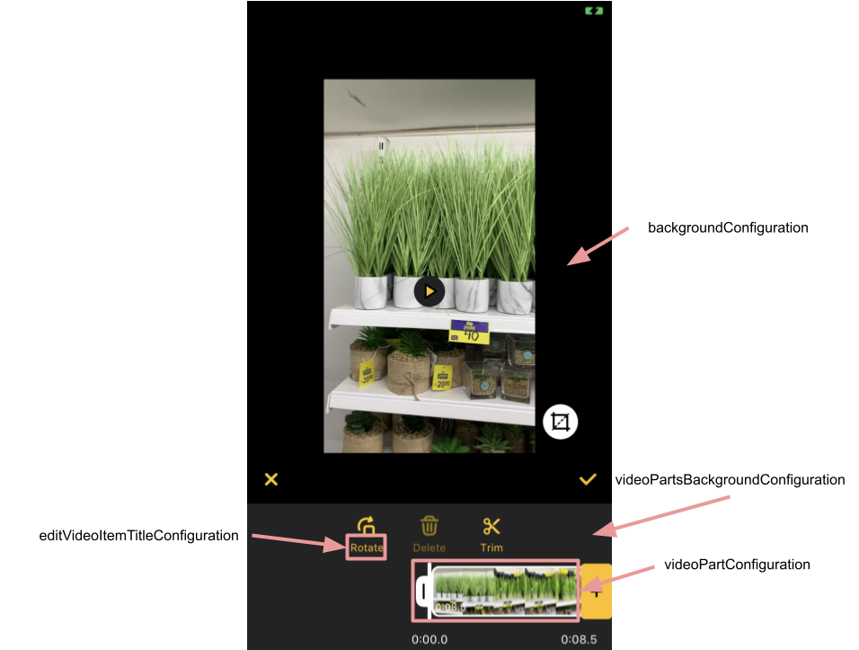
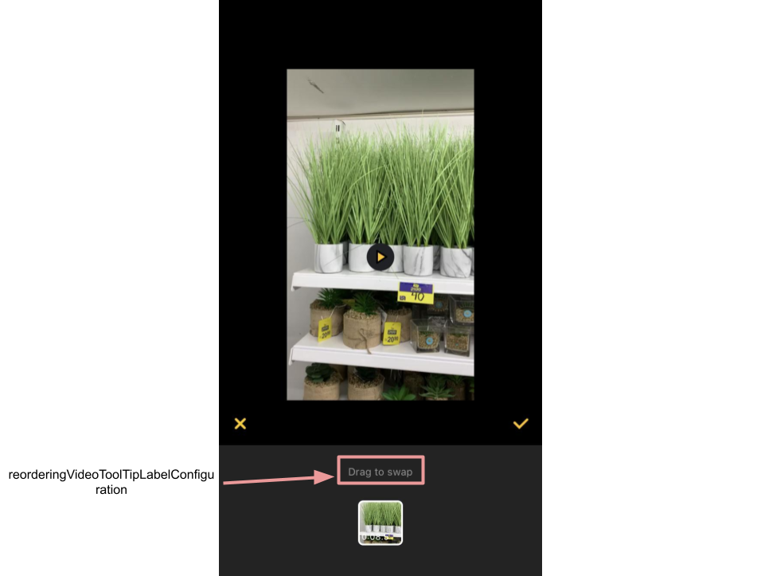
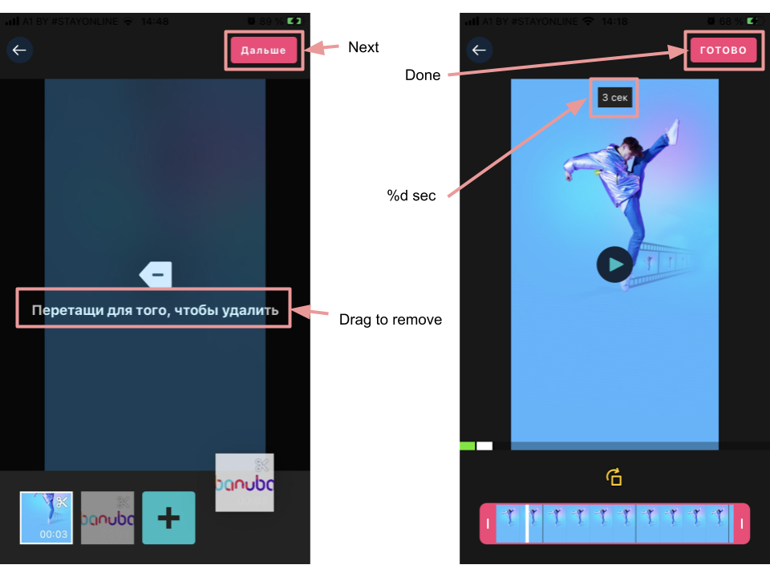

# Banuba VideoEditor SDK
## Single trim screen styles  

- [saveButton: ImageButtonConfiguration](/Example/Example/Extension/TrimConfiguration.swift#L8)

ImageButtonConfiguration setups save button style

- [backButton: ImageButtonConfiguration](/Example/Example/Extension/TrimConfiguration.swift#L14)

ImageButtonConfiguration setups save button style

- [trimTimeLineConfiguration: TrimTimeLineConfiguration?](/Example/Example/Extension/TrimConfiguration.swift#L19)

TrimTimeLineConfiguration setups single time line bar style and options

- [trimTimeLineHeight: CGFloat](/Example/Example/Extension/TrimConfiguration.swift#L23)

Time line height

- [playerControlConfiguration: PlayerControlConfiguration](/Example/Example/Extension/TrimConfiguration.swift#L26)

PlayerControlConfiguration setups play/pause button style

- [backgroundConfiguration: BackgroundConfiguration](/Example/Example/Extension/TrimConfiguration.swift#L25)

BackgroundConfiguration setups background view style

- [screenNameConfiguration: ScreenNameConfiguration](/Example/Example/Extension/TrimConfiguration.swift#L37)

ScreenNameConfiguration setups screen title style

- [timeLabelsConfiguration: TextConfiguration](/Example/Example/Extension/TrimConfiguration.swift#L38)

TextConfiguration setups time labels text style
  
  

## Multi trim screen styles  

- [videoResolutionConfiguration: VideoResolutionConfiguration](/Example/Example/Extension/TrimConfiguration.swift#L50)

VideoResolutionConfiguration setups editor options for rendering video

- [backButtonConfiguration: ImageButtonConfiguration](/Example/Example/Extension/TrimConfiguration.swift#L56)

BackButtonConfiguration setups back button style

- [nextButtonConfiguration: ImageButtonConfiguration?](/Example/Example/Extension/TrimConfiguration.swift#L61)

BackButtonConfiguration setups next button style

- [playerControlConfiguration: PlayerControlConfiguration](/Example/Example/Extension/TrimConfiguration.swift#L75)

PlayerControlConfiguration setups play/pause button style

- [videoPartsBackgroundConfiguration: BackgroundConfiguration](/Example/Example/Extension/TrimConfiguration.swift#L139)

BackgroundConfiguration setups video parts background style

- [backgroundConfiguration: BackgroundConfiguration](/Example/Example/Extension/TrimConfiguration.swift#L79)

BackgroundConfiguration setups background view style

- [screenNameConfiguration: ScreenNameConfiguration](/Example/Example/Extension/TrimConfiguration.swift#L81)

ScreenNameConfiguration setups screen title style

- [aspectsButton: ImageButtonConfiguration](/Example/Example/Extension/TrimConfiguration.swift#L142)

ImageButtonConfiguration setups aspects button style

- [timeLabelsConfiguration: TextConfiguration](/Example/Example/Extension/TrimConfiguration.swift#L38)

TextConfiguration setups time labels text style

- [editVideoItemTitleConfiguration: TextConfiguration](/Example/Example/Extension/TrimConfiguration.swift#L38)

TextConfiguration setups edit video control item label configuration

- [editVideoItems: TrimVideoCompositionEditItem](/Example/Example/Extension/TrimConfiguration.swift#L38)

TrimVideoCompositionEditItem] setups available edit video control items

- [addGalleryVideoButtonBackgroundConfiguration: BackgroundConfiguration](/Example/Example/Extension/TrimConfiguration.swift#L38)

BackgroundConfiguration setups add gallery video button style

- [addGalleryVideoImageButtonConfiguration: ImageButtonConfiguration](/Example/Example/Extension/TrimConfiguration.swift#L38)

ImageButtonConfiguration setups icon in add gallery video button

- [videoPartConfiguration: TrimVideoPartConfiguration](/Example/Example/Extension/TrimConfiguration.swift#L38)

TrimVideoPartConfiguration setups video part configuration

- [reorderingVideoToolTipLabelConfiguration: TextConfiguration](/Example/Example/Extension/TrimConfiguration.swift#L38)

TextConfiguration setups video parts reordering tool tip text style

- [trimTimeLineConfiguration: TrimTimeLineConfiguration](/Example/Example/Extension/TrimConfiguration.swift#L66)

TrimTimeLineConfiguration setups single time line bar style and options

- [timelinePointsPerSecond: CGFloat](/Example/Example/Extension/TrimConfiguration.swift#L38)

Setups points per second on timeline. Default is 45.0





## Trim time line screen styles  

- controlsColor: UIColor

Controls color

- cursorColor: UIColor

Cursor color

- borderWidth: CGFloat

Setups border width

- trimContentCornerRadius: CGFloat

Trim content cornerRadius

- timelineTopBottomInset: CGFloat

Time line inset

- videoResolution: VideoResolutionConfiguration

VideoResolutionConfiguration setups trim options for rendering video

- draggerConfiguration: DraggerConfiguration

Dragger configuration setup draggers style


## String resources



| Key        |      Value      |   Description |
| ------------- | :----------- | :------------- |
| Drag to remove | Drag to remove | Hint on how to remove a piece of video
| %d sec | %d sec | 'Seconds' for short
| Done | Done | Finish button title
| Next | Next | Move to next screen

## Disable trim screen

For now, it's possible to turn off the trimmer screen after the camera screen.

The trimmer screen will still be accessible after importing media files from the gallery.

To disable it just change the property ```supportsTrimRecordedVideo``` to ```false``` in ```FeatureConfiguration``` entity.

``` swift
func createVideoEditorConfig() -> VideoEditorConfig {
  var config = VideoEditorConfig()
  ...
  // Default is false
  config.featureConfiguration.supportsTrimRecorderVideo = true
  ...
  return config
}

```
